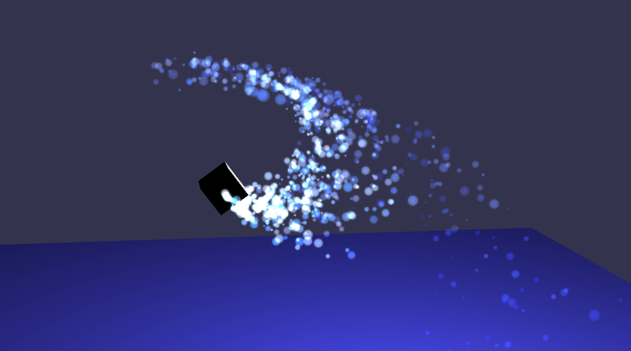
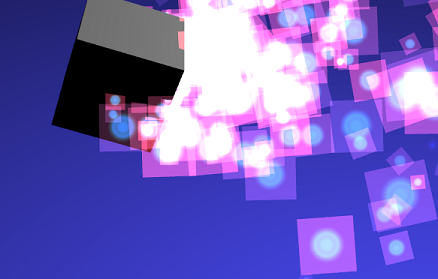

## 粒子 Particles

本章将讨论 BabylonJS 中的粒子系统。粒子通常是一些小的精灵图，用于模拟难以复制的现象，例如：火焰、烟雾、水或者抽象的视觉效果，类似魔法闪光、仙尘。这些效果都是通过在一个区域不断的发射粒子来实现的，自从 Babylon 3.2 版本开始，新增了特殊的例子发射器，可以约束例子在一定的形状范围内，例如立方体、球体或者圆锥体。当然，我们也能写自定义函数来控制粒子和发射区域。

GPU 粒子是粒子家族的新成员，可以在支持 GPU 粒子的浏览器下使用，可以大大提高粒子的性能，性能越高，能够同时存在屏幕上的粒子就越多，效果就越炫酷。


## 创建粒子

### 粒子系统 ParticleSystem

想要表演上例的魔法特技，我们首先要创建一个 ParticleSystem 对象：

```javascript
var particleSystem = new BABYLON.ParticleSystem('particles', 2000, scene);
```

第二个参数表示粒子系统的粒子容量，即同时存在于 3d 空间中的粒子数量，超出的话多余粒子会主动消失。粒子系统还需要设置一个纹理，以便于粒子能够可见，此外，我们还需要设置粒子发射器的位置以及粒子从起点开始延伸的范围。

我们也可以使用粒子助手 ParticleHelper 来创建默认配置的粒子系统: **BABYLON.ParticleHelper.CreateDefault(emitter)** 。

设置完成后，我们可以启动粒子系统：

```javascript
particleSystem.start();
```

如果要停止粒子发射：

```javascript
particleSystem.stop();
```

如果想要延时启动粒子系统，可以设置 **particleSystem.startDelay = 3000** ，这个值以毫秒作为单位。

你也能用另一种方法来延时启动粒子系统，**particleSystem.start(3000)** ，如果也设置了 **startDelay** 属性，则前者会覆盖后者的属性。

请注意，如果使用 **stop** 方法来停止粒子系统时，新的粒子将不会产生，但是已经发射出的粒子还会存在一段时间，具体时间根据设置来决定。假如我们想要立即清空粒子系统所有的已发射粒子，则可以调用 **reset** 方法，即 **particleSystem.reset()**。

我们还可以设置粒子系统的运行时间，设置后粒子系统将在规定的时间内自动停止，但是就想上面说到的，粒子系统停止后，新粒子不产生，但已经产生的粒子会持续一段时间。自动停止的代码如下：

```javascript
particleSystem.targetStopDuration = 5;
```

一旦停止了粒子系统，我们还可以设置 disposeOnStop 的属性为 true，来自动销毁它。这对于创建一个 一次性粒子系统 非常有用，可以与 targetStopDuration 属性来配合实现。

```javascript
particleSystem.disposeOnStop = true;
```

### 粒子预热

从 Babylon.js v3.3 版本开始，我们可以指定一个预热周期，以确保粒子系统在开始渲染以前，就直接达到某个渲染状态。因为粒子根据发射速率和速度等原因，有一个持续增多的过程，假如我们想省略掉中间过程，直接看到粒子达到最大容量时的状态，这个预热周期非常有用。

为了设置预热周期，我们需要设置两个属性：

-   system.preWarmCycles: 获取或设置一个值，是指在首次渲染之前必须执行多少个循环（或帧）（必须在启动粒子系统之前设置该值）。 默认值为 0（即无预热）。
-   system.preWarmStepOffset: 获取或设置一个值，是指在预热模式下使用的 时间步长 乘数（默认为 1 倍），可以理解为一个加速度，如果我们要预热 2000 个循环（帧），这就可能会出现一个延时，所以我们设置为 100 倍，那么就会用 20 个循环的时间达到渲染 2000 个循环的效果。

我们可以这样设置预热周期：

```javascript
system.preWarmCycles = 100;
system.preWarmStepOffset = 5;
system.start();
```

以上代码将执行 100 次粒子循环，并且以平时 5 倍的速度来进行渲染。越想要更多的循环，粒子系统启动得越慢，所以我们需要设置一个步长来减少循环的时间。但是请记住，假如粒子的生命周期小于时间步长，那么太大的 时间步长 preWarmStepOffset 会带来问题。

### 粒子纹理

采用一个纹理到粒子中，如下图所示：


可以设置 sparticleTexture 属性：

```javascript
particleSystem.particleTexture = new BABYLON.Texture('PATH TO IMAGE', scene);
```

我们还可以应用蒙版到纹理上，让改变纹理的颜色或者透明度：

```javascript
particleSystem.textureMask = new BABYLON.Color4(0.1, 0.8, 0.8, 1.0);
```

产生的效果如下图所示：



如果想发射出多个不同的粒子纹理，那么可以用多个粒子系统来实现，粒子系统可以指定相同的发射对象，这样就像同一个例子系统发射出来的效果。

### 粒子发射

粒子发射器可以指定一个点 vector3，也可以指定一个物体，这时候物体的位置就作为发射器的位置。

```javascript
particleSystem.emitter = new BABYLON.Vector3(-1, 2, 3);

var source = BABYLON.Mesh.CreateBox('source', 1.0, scene);
particleSystem.emitter = source; //设置emitter发射器
```

### 粒子局部空间 local space

如果发射器设置为了物体，则可以通过设置 **particleSystem.isLocal = true** 来让粒子在生成在物体的局部空间中（所以旋转和位移能够改变整个粒子系统的发射方向）。

### 世界中心偏移

我们能够为粒子设置一个相对世界坐标的位置偏移：

```javascript
particleSystem.worldOffset = new BABYLON.Vector3(100, 20, -453);
```

### 位置和分布

## 粒子系统配置微调

下面我们将开始学习如何调整粒子的一些设置，例如：生命周期、体积、颜色，以及粒子的发射速率、方向、重力等等。而且我们还可以通过这些设置，影响粒子的旋转、移动速度，还能让粒子组成一个特定形状。

### 生命周期 Lifetime

个粒子在从发射出来到消失，这段时间就是一个粒子的生命周期，单位是秒。在生命周期的末尾，粒子会消失，然后粒子系统会重新发射出新的粒子，以此不断往复来形成不间断的粒子效果。而且更进一步，生命周期也可以被设置为随机时间，在一个最大和最小值之间随机变动。

```javascript
// Life time of each particle (random between...)
particleSystem.minLifeTime = 0.3;
particleSystem.maxLifeTime = 1.5;
```

从 Babylon.js v3.3 版本开始，我们能定义粒子系统的停止时间，也就是说可以同时启动多个粒子系统，然后让它们在不同时间停止发射，以此来实现很多特殊效果。我们可以设置 system.targetStopDuration = 0.5 ，表示粒子系统 0.5 秒后停止发射，设置了 targetStopDuration 后我们就可以定义粒子生命周期的渐变时间了：

```javascript
particleSystem.addLifeTimeGradient(0, 0.5);
particleSystem.addLifeTimeGradient(1, 0);
```

addLifeTimeGradient 第一个参数定义渐变位置（0 表示粒子系统开始，1 表示粒子系统停止）。第二个参数是粒子寿命，单位是秒。上述代码意味着在粒子系统开始发射时，粒子将接收设置为 0.5 的 LifeTime 生命时间。当系统接近 targetStopDuration 设置的停止时间时，发射出的粒子将会设置 LifeTime 寿命接近于 0。

请注意一定要设置 targetStopDuration，不然粒子系统无法自动停止，也就不存在粒子系统的存在时间这个说法

还可以通过为每个渐变提供两个值来定义更复杂的构造：

```javascript
particleSystem.addLifeTimeGradient(0, 0.5, 0.8); //第1个渐变时间
particleSystem.addLifeTimeGradient(0.5, 0.3, 0.7); //第2个渐变时间
particleSystem.addLifeTimeGradient(1.0, 0, 0.1); //第3个渐变时间
```

上述代码多出了第三个参数，这表示当达到渐变位置时，将在两个值之间，也就是第二和第三个参数随机选择粒子的 LifeTime 寿命。

要删除 TimeGradient 渐变，可以调用 particleSystem.removeLifeTimeGradient（0.5），这表示删除了第 2 个渐变时间。

### 体积大小 Size

粒子的大小也能够被设置为在给定范围内随机变化。

```javascript
// Size of each particle (random between...)
particleSystem.minSize = 0.1;
particleSystem.maxSize = 0.5;
```

上面的代码会等比例的缩放粒子，加入你想让粒子在宽高两个方向进行不同的随机改变，则可以使用 ScaleX/Y 方法：

```javascript
// Scale of each particle (random between...)
particleSystem.minScaleX = 0.1;
particleSystem.maxScaleX = 0.5;

particleSystem.minScaleY = 0.2;
particleSystem.maxScaleY = 0.4;
```

从 Babylon.js v3.3 开始，我们还可以让粒子根据生命周期来进行大小渐变。
要添加大小渐变，只需调用以下代码：

```javascript
particleSystem.addSizeGradient(0, 0.5);
```

上面的例子中，第一个参数定义渐变位置（0 表示粒子刚被发射出来，而 1 表示粒子消失）。第二个参数表示粒子的大小，上面的例子就表示粒子以 0.5 的体积发射出来，并在最终消失时达到 3 的体积。建议至少为 0 和 1 都各自定义一个渐变：

```javascript
particleSystem.addSizeGradient(0, 0.5);
particleSystem.addSizeGradient(1.0, 3);
```

关于 addSizeGradient，我们能够添加多次，只要第一个参数在 0-1 之间就可以任意添加。

还可以通过为每个渐变提供两个值来定义更复杂的构造：

```javascript
particleSystem.addSizeGradient(0, 0.5, 0.8);
particleSystem.addSizeGradient(1.0, 3, 4);
```

在这种情况下，当达到渐变值时，将在第二和第三两个值之间随机选择粒子的大小。

要删除渐变，可以调用 particleSystem.removeSizeGradient（0.5）。

当我们改变粒子体积的时候，可以对 Pivot 支点进行移动（也称为变换中心），默认粒子的缩放是根据中心点进行，也可以当粒子从上方或者下方进行缩放，改变 Pivot 支点位置的方法如下所示：

```javascript
particleSystem.translationPivot = new BABYLON.Vector2(0, -0.5); // In this case the scale will come from the bottom of the particle
```

### 粒子颜色 Particle Colors

粒子系统可以设置三个颜色，其中两个颜色在粒子存在期间组合显示（或混合），第三个颜色在粒子消失之前呈现。设置方法如下：

```javascript
particleSystem.color1 = new BABYLON.Color4(0.7, 0.8, 1.0, 1.0);
particleSystem.color2 = new BABYLON.Color4(0.2, 0.5, 1.0, 1.0);
particleSystem.colorDead = new BABYLON.Color4(0, 0, 0.2, 0.0);
```

从 Babylon.js v3.3 开始，我们可以定义颜色渐变，定义之后 color1, color2 和 colorDead 三个属性值将失效。

添加颜色渐变的代码如下所示：

```javascript
particleSystem.addColorGradient(0, new BABYLON.Color4(1, 1, 1, 0));
```

上面的例子中，第一个参数定义渐变位置（0 表示粒子刚被发射出来，而 1 表示粒子消失）。第二个参数表示粒子的颜色，上面的例子就表示粒子发射时呈现白色。建议至少为 0 和 1 都各自定义一个渐变：

```javascript
particleSystem.addColorGradient(0, new BABYLON.Color4(1, 1, 1, 0));
particleSystem.addColorGradient(1.0, new BABYLON.Color4(1, 1, 1, 1));
```

可以根据需要添加任意数量的渐变，只要渐变值在 0 到 1 之间即可。

还可以通过为每个渐变提供两种颜色来定义更复杂的结构：

```javascript
particleSystem.addColorGradient(0, new BABYLON.Color4(1, 1, 1, 0), new BABYLON.Color4(1, 0, 1, 0));
particleSystem.addColorGradient(1.0, new BABYLON.Color4(1, 1, 1, 1), new BABYLON.Color4(1, 0, 1, 1));
```

上述代码表示，在达到渐变条件时，将在第二和第三个参数之间随机选择粒子的颜色。

使用 particleSystem.removeColorGradient(0.5).方法来移除颜色渐变。

### 混合模式 blending

粒子与场景的颜色混合有多种方式，使用 blendMode 来进行设置。

```javascript
particleSystem.blendMode = BABYLON.ParticleSystem.BLENDMODE_ONEONE;

particleSystem.blendMode = BABYLON.ParticleSystem.BLENDMODE_STANDARD;
```

-   BLENDMODE_ONEONE-直接添加颜色，忽略透明度 alpha 的影响；
-   BLENDMODE_STANDARD-添加颜色并考虑粒子的透明度 alpha 影响（即：场景颜色*（1-alpha）+ 粒子颜色* alpha）
-   BLENDMODE_ADD-添加颜色，但只考虑粒子颜色的透明度 alpha（即：场景颜色+粒子颜色\* alpha）。
-   BLENDMODE_MULTIPLY-将颜色相乘并加上（1-alpha）（即 color \* particleColor + 1-alpha）。
-   BLENDMODE_MULTIPLYADD-用 BLENDMODE_MULTIPLY 模式处理，然后再使用 BLENDMODE_ADD 模式渲染两次。

### 发射频率 Rates

发射频率决定了粒子每秒被发出的数量，数字越大，发射出的例子越多，看来越密集，就像一团粒子云。当粒子死亡消失时，新的例子再被发出，以此循环往复。如果粒子的生命周期足够长，并且发送速率足够快，那么会出现粒子系统间歇性发射粒子的现象。


```javascript
particleSystem.emitRate = 1000;
```

通过设置 manualEmitCount 属性，来停止持续的发射粒子。

```javascript
particleSystem.manualEmitCount = 300; //发射粒子达到300个后停止发射。
```

以上代码设置了 manualEmitCount=300 后，粒子系统发射 300 个粒子就会自动停止。

### 发射方向 Direction

可以为粒子系统指定 2 个发射方向，如果仅指定一个方向，粒子将沿给定的大致方向随机传播。 当给出两个方向时，粒子通常将在两个方向内行进。

```javascript
particleSystem.direction1 = new BABYLON.Vector3(-7, 8, 3);
particleSystem.direction2 = new BABYLON.Vector3(7, 8, -3);
```

发射方向也会受到重力 gravity 属性的影响。

### 重力 Gravity

粒子系统可以设置重力属性，例如：设置 Y 方向的重力值为负，则粒子将慢慢沿着 Y 方向下降。

```javascript
//设置所有粒子的重力（不一定向下，可以设定XYZ方向）
particleSystem.gravity = new BABYLON.Vector3(0, -9.81, 0);
```

### 旋转相关 Rotation

...
