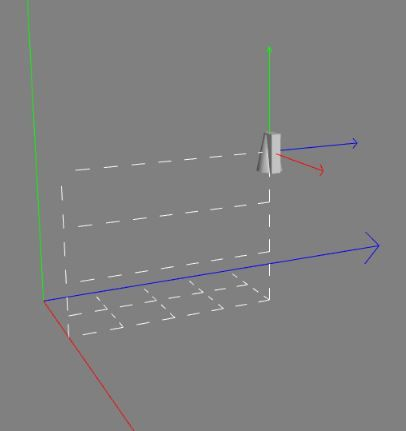
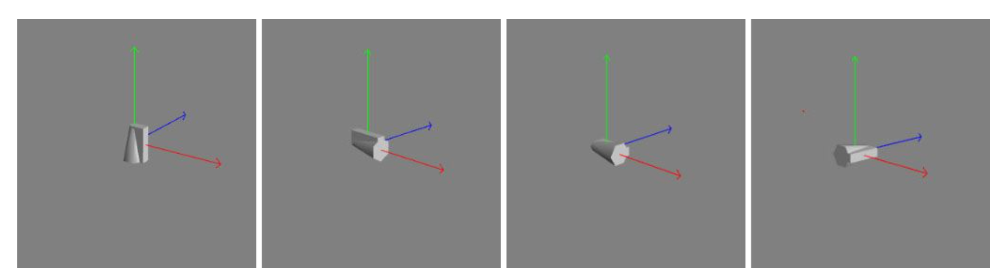
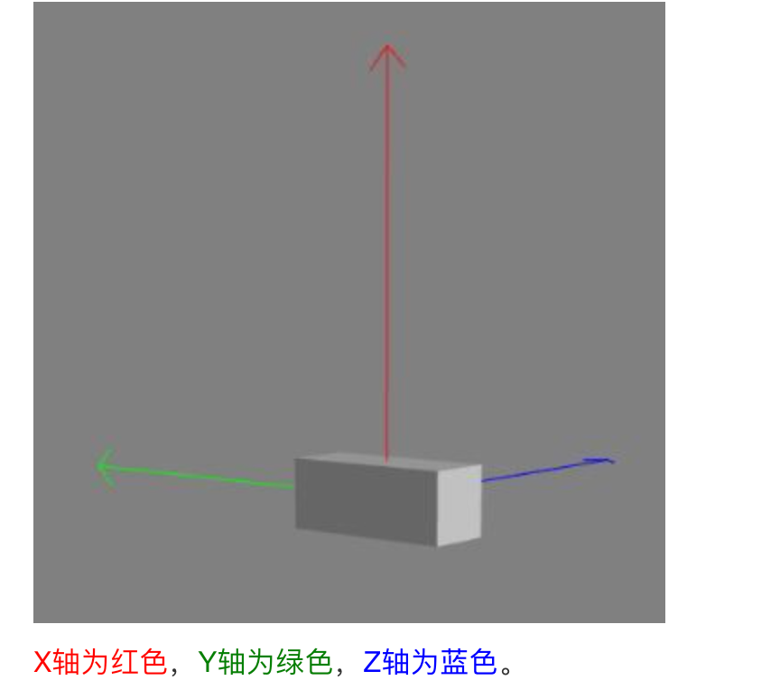

## 坐标参照系

Babylon.js 使用了两种 坐标参照系 ，即世界坐标系 world 和局部坐标系 local。

世界坐标系可以理解为：全局坐标系。世界坐标系的原点位置任何时候都是(0, 0, 0)不会被改变，而局部坐标系会随着物体位置、旋转、缩放的改变而改变。

例如：一个物体的初始位置是(0, 0, 0)，它世界坐标系和局部坐标系就都是(0, 0, 0)，当这个物体移动到位置(0, 10, 0)的时候，也就是向上移动了 10 的距离，这个时候它世界坐标系还是(0, 0, 0)和局部坐标系是(0, 10, 0)。

## 位置 position

在创建一个物体后，默认旋转角度为 0，缩放比例为 1，所以实验体的位置也显示在世界坐标的原点(0, 0, 0)，而且世界坐标轴和局部坐标轴此时是重合在一起的。例如：


位置 Position 参照世界坐标轴来放置实验体，使用的是三维向量 vector3 (x, y, z)，局部坐标轴随着实验体的移动而移动。

```javascript
//常规设置
pilot.position = new BABYLON.Vector3(2, 3, 4);

//或者，独立设置
pilot.position.x = 2;
pilot.position.y = 3;
pilot.position.z = 4;
```

虽然局部坐标轴的位置发生了变化，但是它和世界坐标轴的方向是一致的。



## 旋转 Rotation

在 Babylon.js 中对物体设置旋转的代码如下：

```javascript
//常规设置
pilot.rotation = new BABYLON.Vector3(alpha, beta, gamma);

//或者，独立设置
pilot.rotation.x = alpha; //围绕X轴旋转
pilot.rotation.y = beta; //围绕Y轴旋转
pilot.rotation.z = gamma; //围绕Z轴旋转
```

以上代码中的 alpha, beta, and gamma 是以弧度作为单位的，也就是说与我们平时所说的角度不一样，例如 360°，有一个换算公式：

1° = π /180 弧度

可能的疑问：上面代码中分别设置了 alpha, beta, gamma，针对了 X、Y、Z 三个轴，而且之前又说了旋转操作的先后顺序和使用的坐标系会影响最终方向，那么你会问了“代码中的旋转操作设置了 alpha、beta、gamma，那它们三个分别使用了世界坐标系还是局部坐标系？应用的顺序如何？”

其实对于 Babylon.js 中旋转，以下两个准则得出的结果都是一样的：

### 准则 1-局部坐标系

对于局部坐标，物体以中心为原点并沿着其局部坐标轴进行旋转，旋转的顺序为 Y、X、Z。如果我们按照三个不同方向正对着观察物体的旋转，那么它们的旋转方向都是逆时针。

下图中按照顺序展示了执行旋转操作后实验体的方位:

-   图 1.初始状态、
-   图 2. 绕着局部坐标系 Y 轴旋转 π/2 弧度、
-   图 3. 围绕局部坐标系 X 轴旋转 π/2 弧度、图 4. 围绕局部坐标系 Z 轴旋转了 π/2 弧度。
    

### 准则 2-世界坐标系

又称为全局坐标系，与准则 1 的局部坐标相比，按照世界坐标对物体进行旋转：旋转中心点没有变，但是旋转轴线变了。

对于世界坐标，物体以中心为原点保持和之前一样，沿着与世界坐标轴进行旋转，旋转的顺序为 Z、X、Y。如果我们按照三个不同方向正对着观察物体的旋转，那么它们的旋转方向都是逆时针。

下图中按照顺序展示了执行旋转操作后实验体的方位:

-   图 1.初始状态
-   图 2. 绕着世界坐标系 Z 轴旋转 π/2 弧度
-   图 3. 围绕局部坐标系 X 轴旋转 π/2 弧度
-   图 4. 围绕局部坐标系 Y 轴旋转了 π/2 弧度
    

### 总结

无论以何种方式进行旋转，最后的结果始终是相同的。 以下代码产生的结果都相同：

```javascript
pilot.rotation = new BABYLON.Vector3(alpha, beta, gamma);

pilot.rotation.x = alpha;
pilot.rotation.y = beta;
pilot.rotation.z = gamma;

pilot.rotation.z = gamma;
pilot.rotation.x = alpha;
pilot.rotation.y = beta;

pilot.rotation.y = beta;
pilot.rotation.z = gamma;
pilot.rotation.x = alpha;
```

## 一系列的旋转操作

### addRotation 方法

使用场景：进行一系列的旋转操作，例如先围绕 x 轴旋转，再围绕 y 轴旋转，最后围绕 z 轴旋转

它可以进行链式调用，接受 3 个弧度参数值，分别对应 X、Y、Z 三个坐标轴。用法如下所示：

```javascript
mesh.addRotation(Math.PI / 2, 0, 0)
    .addRotation(0, Math.PI / 2, 0)
    .addRotation(0, 0, Math.PI / 2);
```

以下的图例，用 addRotation 展示旋转案例，还是以实验体作为参照

-   图 1、初始状态，无旋转；
-   图 2、绕局部 X 轴旋转 π/ 2；
-   图 3、再绕着局部 Y 轴旋转 π/ 2；
-   图 4、最后绕着局部 Z 轴旋转 π/ 2。
    
    图中较小的轴表示世界轴的方向，就是线中间有个小点，各位要仔细看。

### RotationQuaternions 方法

还有一种旋转方法，那就是用 [rotationQuaternions](https://endoc.cnbabylon.com/resources/rotation_conventions#quaternions) 方法直接操作四元数 Quaternions ，这个方法很抽象、很难，但好处就是接近底层，让你随意发挥。但是需要注意，这种方法和之前介绍的方法是不能同时使用到一个物体上的。

## 缩放 Scaling

缩放相对来说比较简单，不存在需要处理世界坐标的问题，我们只需要按照如下方法来沿着局部坐标 X、Y、Z 轴进行旋转即可。

```javascript
//常规设置
mesh.scaling = new BABYLON.Vector3(scale_x, scale_y, scale_z);

//或者，独立设置
mesh.scaling.x = 5;
mesh.scaling.y = 5;
mesh.scaling.z = 5;
```

下图显示了围绕 z 轴旋转并沿局部 y 轴缩放的一个立方体:


