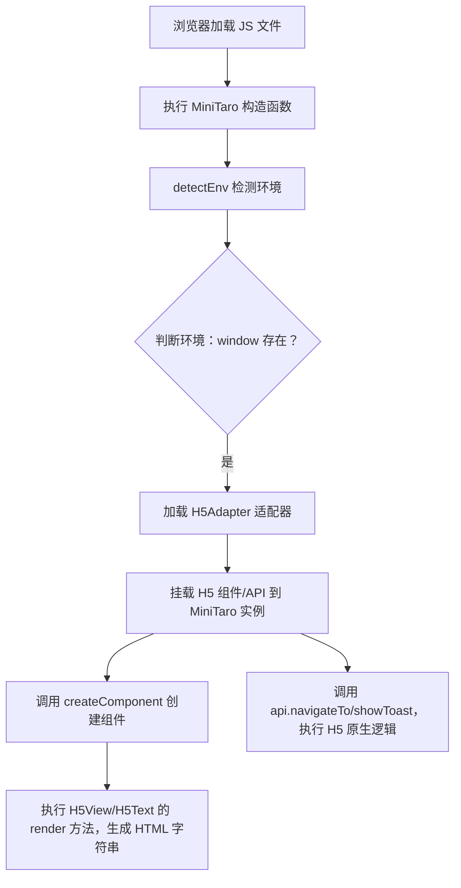
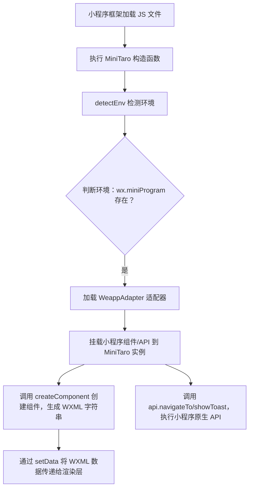

### 一、H5 环境的运行流程

H5 环境的核心是**浏览器解析执行 JS + DOM 渲染**，MiniTaro 在 H5 中运行完全依赖浏览器的原生能力，无需额外编译/转换。

#### 1. 完整运行步骤（结合代码）



#### 2. 实际执行过程（可直接在浏览器控制台验证）

我们把之前的代码复制到 Chrome/Firefox 浏览器的**开发者工具 → Console 面板**，逐行看执行结果：

##### 步骤 1：环境检测

```javascript
// MiniTaro 初始化时，detectEnv 执行
detectEnv() {
  if (typeof wx !== 'undefined' && wx.miniProgram) { // 浏览器中 wx 不存在
    return 'weapp';
  } else if (typeof window !== 'undefined') { // 浏览器中 window 存在
    return 'h5'; // 最终返回 h5
  }
}
```

##### 步骤 2：加载 H5 适配器

MiniTaro 的 `init` 方法会加载 `H5Adapter`，此时：

-   `taro.components.View` → 指向 `H5View` 类（渲染为 `<div>`）
-   `taro.components.Text` → 指向 `H5Text` 类（渲染为 `<span>`）
-   `taro.api.navigateTo` → 指向 H5 版的跳转逻辑（`window.location.href`）
-   `taro.api.showToast` → 指向 H5 版的提示逻辑（`alert`）

##### 步骤 3：组件渲染 & API 调用

执行示例代码后：

```javascript
// 组件渲染结果（控制台输出）
组件渲染结果: <div {"className":"container"}><span>Hello Mini Taro</span></div>

// API 调用结果
【H5】跳转到: /pages/home // 控制台打印
【H5】提示: 运行时适配成功！ // 弹出 alert 弹窗
```

##### 步骤 4（扩展）：真实 H5 项目中的渲染

如果要把生成的 HTML 渲染到页面，只需加一行代码：

```javascript
// 将组件渲染结果插入到页面 body 中
document.body.innerHTML = view.render();
```

此时浏览器会解析 `<div class="container"><span>Hello Mini Taro</span></div>`，并渲染到页面上。

---

### 二、原生小程序（以微信小程序为例）的运行流程

原生小程序的运行环境和浏览器完全不同：它有自己的 **JS 引擎（JSCore）** 和 **渲染层**，代码需要遵循小程序的“双线程”规范，MiniTaro 在这里的核心是适配小程序的原生组件/API 调用规则。

#### 1. 小程序的核心运行规则（前置知识）

-   小程序分为 **逻辑层（JS 线程）** 和 **渲染层（WebView 线程）**，逻辑层负责执行 JS，渲染层负责渲染 WXML/WXSS；
-   逻辑层无法直接操作 DOM，只能通过 `setData` 将数据传递给渲染层；
-   所有 API 必须调用小程序原生 API（如 `wx.navigateTo`、`wx.showToast`）。

#### 2. MiniTaro 在小程序中的运行步骤



#### 3. 实际执行过程（需在小程序开发者工具中验证）

##### 步骤 1：准备小程序运行环境

1. 新建微信小程序项目，在 `pages/index/index.js` 中粘贴我们的 MiniTaro 代码；
2. 小程序启动时，全局会自动挂载 `wx` 对象（包含 `wx.miniProgram`、`wx.navigateTo` 等）。

##### 步骤 2：环境检测

```javascript
detectEnv() {
  if (typeof wx !== 'undefined' && wx.miniProgram) { // 小程序中 wx 存在
    return 'weapp'; // 最终返回 weapp
  }
}
```

##### 步骤 3：加载小程序适配器

MiniTaro 的 `init` 方法加载 `WeappAdapter`，此时：

-   `taro.components.View` → 指向 `WeappView` 类（渲染为 `<view>`）
-   `taro.components.Text` → 指向 `WeappText` 类（渲染为 `<text>`）
-   `taro.api.navigateTo` → 指向小程序版跳转逻辑（实际调用 `wx.navigateTo`）
-   `taro.api.showToast` → 指向小程序版提示逻辑（实际调用 `wx.showToast`）

##### 步骤 4：组件渲染 & API 调用

在小程序 `index.js` 的 `onLoad` 生命周期中执行示例代码：

```javascript
Page({
    onLoad() {
        const taro = new MiniTaro();
        // 创建组件
        const view = taro.createComponent('View', {
            className: 'container',
            children: taro
                .createComponent('Text', { children: 'Hello Mini Taro' })
                .render(),
        });
        console.log('组件渲染结果:', view.render()); // 输出 WXML 字符串
        // 调用 API
        taro.api.navigateTo('/pages/home'); // 调用 wx.navigateTo
        taro.api.showToast('运行时适配成功！'); // 调用 wx.showToast
    },
});
```

执行结果：

```javascript
// 控制台输出
组件渲染结果: <view {"className":"container"}><text>Hello Mini Taro</text></view>
【微信小程序】跳转到: /pages/home
【微信小程序】提示: 运行时适配成功！

// 小程序界面效果
- 底部弹出原生的 toast 提示框；
- 若配置了 /pages/home 页面，会跳转到该页面。
```

##### 步骤 5（扩展）：真实小程序项目中的渲染

小程序需要将生成的 WXML 字符串通过 `setData` 传递到渲染层：

```javascript
Page({
    onLoad() {
        const taro = new MiniTaro();
        const view = taro.createComponent('View', {
            className: 'container',
            children: taro
                .createComponent('Text', { children: 'Hello Mini Taro' })
                .render(),
        });
        // 将 WXML 数据传递给渲染层
        this.setData({
            renderContent: view.render(),
        });
    },
});
```

然后在 `index.wxml` 中接收并渲染：

```xml
<rich-text nodes="{{renderContent}}"></rich-text>
```

此时小程序渲染层会解析 `<view class="container"><text>Hello Mini Taro</text></view>` 并展示。

---

### 三、Taro3 真实项目的补充说明

我们的 MiniTaro 是极简版，Taro3 实际运行时还做了这些优化：

1. **编译时预处理**：Taro3 会将 React/Vue 代码编译为小程序可识别的结构（如将 JSX 编译为 WXML 模板），而非运行时生成字符串；
2. **虚拟 DOM 适配**：在 H5 中复用 React/Vue 的虚拟 DOM，在小程序中模拟虚拟 DOM 并映射到小程序的 `setData`；
3. **生命周期适配**：将 React/Vue 的生命周期映射为小程序的 Page/Component 生命周期（如 `componentDidMount` → `onReady`）；
4. **性能优化**：小程序中优化 `setData` 的调用频率，避免频繁通信导致卡顿。

### 总结

1. **H5 运行核心**：依赖浏览器原生能力，MiniTaro/Taro3 只需将抽象接口映射为 DOM 操作 + 浏览器 API，直接在 JS 线程执行并渲染；
2. **小程序运行核心**：适配小程序“双线程”模型，抽象接口映射为小程序原生组件（WXML）和 API，逻辑层执行 JS 后通过 `setData` 传递给渲染层；
3. **统一逻辑**：无论 H5 还是小程序，核心都是“环境检测 → 加载对应适配器 → 抽象接口映射为端原生能力”，这也是 Taro3 跨端的本质。
