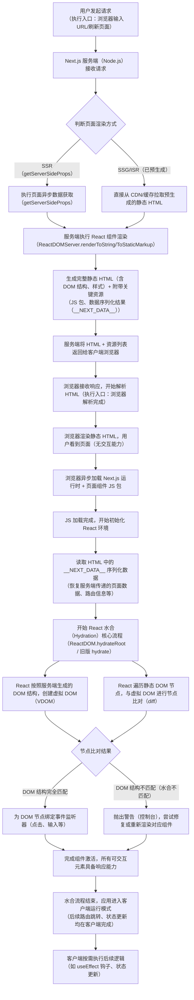

## 一、Mermaid 流程图（从执行入口到水合完成）

我们以**最典型的 SSR 渲染流程**（执行入口最完整，覆盖核心水合逻辑）为例，绘制流程图：

## 二、关键步骤详细解释（对应流程图，理解核心）

1.  **服务端前置准备（为水合打基础）**

    -   服务端的核心任务不是水合，而是**生成“可被水合”的静态 HTML 和序列化数据**。
    -   重点是 `__NEXT_DATA__`：这是 Next.js 嵌入在 HTML 中的全局变量，会序列化页面数据（如 `getServerSideProps` 返回的 `props`）、路由信息、组件元数据等——水合时客户端无需重新请求数据，直接读取该变量即可恢复组件状态，这是 Next.js 水合高效的关键。
    -   服务端渲染的 HTML 结构必须与客户端 React 组件渲染的结构一致，否则会出现**水合不匹配警告**，严重时会导致交互异常。

2.  **客户端静态渲染（水合前的“展示阶段”）**

    -   浏览器拿到 HTML 后，会先快速渲染静态内容，让用户“早看到”（提升首屏体验），这个阶段没有任何交互能力，因为 JS 还没加载/执行，DOM 只是“死节点”。

3.  **水合核心（激活静态 DOM）**

    -   **初始化 React 环境**：加载 Next.js 封装的 React 运行时，为后续组件激活做准备。
    -   **读取 **NEXT_DATA\*\*\*\*：恢复服务端传递的数据，避免客户端重复请求，保证数据一致性。
    -   **虚拟 DOM 与真实 DOM 比对**：React 不会重新生成 DOM（否则就失去了静态 HTML 的首屏优势），而是通过 diff 算法比对“服务端生成的真实 DOM”和“客户端组件生成的虚拟 DOM”，确保结构一致。
    -   **绑定事件监听器**：这是水合最核心的“激活”动作——静态 HTML 没有事件绑定，水合完成后，React 会为对应的 DOM 节点绑定 `onClick`、`onChange` 等事件，页面从此具备交互能力。

4.  **水合异常与后续运行**
    -   水合不匹配的常见原因：服务端与客户端环境差异（如服务端有 `window`/`document` 操作、数据返回不一致、组件条件渲染逻辑差异）。
    -   水合完成后，应用完全交给客户端 React 管理，后续的路由跳转（`next/link`）、状态更新（`useState`）、副作用执行（`useEffect`）都和纯 React 应用一致。

### 四、补充：Next.js 水合的优化点（额外拓展，加深理解）

1.  **选择性水合（Selective Hydration）**：Next.js 基于 React 18 支持该特性，不再按顺序从头到尾水合，而是优先水合用户可能交互的组件（如按钮、输入框），提升交互体验。
2.  **禁用不必要的水合**：对于纯展示型组件，可以使用 `next/dynamic` 配置 `ssr: false` 或 `suppressHydrationWarning={true}` 跳过水合或隐藏不匹配警告。
3.  **避免客户端独有代码在水合阶段执行**：如 `window` 相关操作，应放在 `useEffect` 中（水合完成后才执行），避免水合不匹配。

### 总结

1.  Next.js 水合的**执行入口是客户端浏览器解析完 HTML 并加载完对应 JS 包后**，核心是“激活”静态 HTML，赋予其交互能力。
2.  水合的关键前提是**服务端传递的静态 HTML 和 **NEXT_DATA** 序列化数据**，保证客户端与服务端的 DOM 结构、数据一致。
3.  核心流程是：加载 JS 运行时 → 读取序列化数据 → 虚拟 DOM 与真实 DOM 比对 → 绑定事件监听器 → 完成组件激活，进入客户端运行模式。
