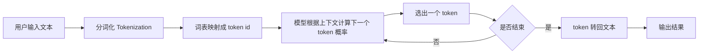

# 大模型工作流程

## 一句话总结

大模型处理文本的基本流程可以简单理解为：**先把文字切成模型能识别的 token，再根据上下文一步步预测下一个 token，最后再转回人能读懂的文字**。

## 流程图



## 1. 分词化、词表映射

模型不能直接理解“自然语言句子”，它先要把文本变成一串 token。

这里的 token 不一定等于“一个汉字”或“一个单词”，它可能是：

-   一个字
-   一个词
-   一个词的一部分
-   一个标点

分词之后，模型还会把每个 token 映射成词表中的编号，也就是 token id。

例如这句话：

```text
今天天气不错
```

可能会被处理成：

```text
["今天", "天气", "不错"] -> [125, 892, 431]
```

你可以把它理解成：**先把文字翻译成模型内部能处理的“编号语言”**。

## 2. 大语言模型生成文本的过程

当输入变成 token id 后，模型并不是一次性把整段答案全部想出来，而是：

1. 先看当前上下文
2. 预测“下一个 token 最可能是什么”
3. 选出一个 token
4. 把新 token 接到原上下文后面
5. 再继续预测下一个 token
6. 重复这个过程，直到结束

也就是说，大模型本质上是在做：

> **根据前面的内容，持续预测下一个 token。**

例如用户输入：

```text
中国的首都是
```

模型可能会这样一步步生成：

```text
中国的首都是 -> 北京 -> 北京。 -> 北京。它是...
```

每一步它都会基于“当前已经有的内容”重新判断下一个 token 的概率。

## 3. 一个最小过程示例

假设用户输入：

```text
1 + 1 =
```

简化后的流程可以理解成：

```text
输入文本
-> 分词
-> 转成 token id
-> 模型预测下一个 token 可能是 "2"
-> 追加 "2"
-> 继续判断是否结束
-> 输出 "1 + 1 = 2"
```

## 4. 极简总结

-   **分词化**：把文本拆成 token
-   **词表映射**：把 token 转成模型内部编号
-   **生成过程**：模型按顺序一个一个预测下一个 token
-   **最终输出**：再把 token 还原成我们看到的文字

一句话记忆：

> 大模型不是“整段生成”，而是“看前文，猜下一个 token，再不断重复”。
