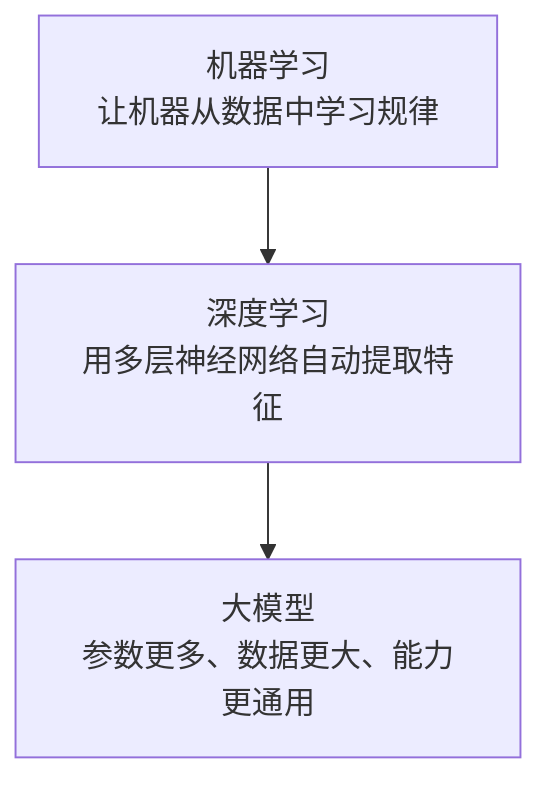

# 机器学习、深度学习与大模型

## 一句话结论

机器学习、深度学习、大模型是**包含关系**：`机器学习 > 深度学习 > 大模型`，不是三个并列概念。

## 关系图

## 学习目标

阅读完本文后，应能回答下面 3 个问题：

1. 机器学习、深度学习、大模型之间是什么关系？
2. 深度学习相比传统机器学习，核心变化是什么？
3. 大模型为什么被看作深度学习的进一步扩大与通用化？

## 核心定义

| 概念     | 定义                                                                           | 关键词                       |
| -------- | ------------------------------------------------------------------------------ | ---------------------------- |
| 机器学习 | 让机器从数据中学习规律，而不是由人手工写死全部规则。                           | 数据驱动、学习规律           |
| 深度学习 | 使用多层神经网络完成学习任务的机器学习方法。                                   | 神经网络、自动提取特征       |
| 大模型   | 在深度学习基础上，使用更大模型参数、更多训练数据、更多算力训练出来的通用模型。 | 海量参数、海量数据、通用能力 |

## 1. 什么是机器学习

机器学习的核心是：**给机器数据和结果，让机器自己总结判断规则**。

### 最小示例

任务：区分猫和狗。

输入给模型的数据：

-   大量猫和狗的图片
-   每张图片对应的正确标签

模型学习后，面对一张新图片，可以输出：

-   这是猫
-   这是狗

### 主要特点

-   依赖数据，而不是完全依赖人工写规则。
-   传统机器学习通常需要人工挑选特征，如颜色、纹理、边缘、形状等。
-   模型结构相对较浅，任务通常更专用。

## 2. 什么是深度学习

深度学习是机器学习的一个重要分支，本质上是：**用多层神经网络自动学习特征**。

### 理解“多层”的关键

深度学习并不是直接从“像素”一下跳到“结果”，而是逐层抽象。

以“识别杯子”为例：

| 层级   | 学到的信息   | 示例                     |
| ------ | ------------ | ------------------------ |
| 底层   | 基础视觉特征 | 点、线、边缘、亮斑、曲线 |
| 中层   | 局部结构     | 圆形、弧线、轮廓         |
| 高层   | 完整对象     | 杯身、把手、杯子         |
| 更高层 | 语义理解     | 这是一个可以装水的杯子   |

### 关键区别

传统机器学习常常需要人先告诉模型“该看什么特征”；深度学习更强调模型**自己从原始数据中逐层提取特征**。

## 3. 什么是大模型

大模型可以理解为：**规模被显著放大的深度学习模型**。

它通常具备以下特征：

-   网络更深，结构更复杂。
-   参数量更大，往往达到数十亿到数千亿级别。
-   训练数据更多，通常覆盖互联网级别文本、图像、语音等数据。
-   通用性更强，不只解决单一任务，而是能迁移到多类任务。

### 典型能力

相较于只完成单任务的模型，大模型通常可以同时处理：

-   对话问答
-   文本写作
-   代码生成
-   翻译与总结
-   推理与分析
-   图像生成或多模态理解

## 4. 三者的区别

| 对比维度     | 机器学习           | 深度学习             | 大模型                             |
| ------------ | ------------------ | -------------------- | ---------------------------------- |
| 关系位置     | 总类概念           | 机器学习的子集       | 深度学习中的大规模模型             |
| 特征获取方式 | 常依赖人工设计特征 | 自动学习特征         | 自动学习特征，并扩大到更强通用能力 |
| 模型规模     | 通常较小           | 较大                 | 非常大                             |
| 数据需求     | 中等               | 较多                 | 海量                               |
| 典型任务     | 分类、预测、推荐   | 视觉、语音、自然语言 | 聊天、写作、代码、推理、多模态     |
| 通用性       | 较弱               | 中等                 | 较强                               |

## 5. 用一个类比快速记忆

可以把三者理解成下面的层级：

-   **机器学习**像“水果”这一大类。
-   **深度学习**像“苹果”，是水果中的一种。
-   **大模型**像“超大号苹果”，仍然属于苹果，但体量更大、能力更强。

这个类比的重点不是“大小”，而是帮助记住它们的**从属关系**。

## 6. 容易混淆的地方

### 误区 1：机器学习、深度学习、大模型是并列关系

不是。它们是逐层包含关系。

### 误区 2：大模型不是机器学习

不是。大模型仍然属于机器学习体系，只是它属于更靠后的“深度学习大规模化”阶段。

### 误区 3：深度学习和大模型完全一样

也不是。深度学习是方法类别，大模型是其中“规模更大、能力更通用”的一类模型。

## 7. 面试或复习时可以这样回答

> 机器学习是让机器从数据中学习规律的总称；深度学习是机器学习中的一种方法，核心是多层神经网络自动提取特征；大模型则是在深度学习基础上，通过更大的参数规模、更多数据和更强算力训练出来的通用模型。三者不是并列关系，而是包含关系。

## 8. 极简总结

1. **机器学习**：让机器从数据中学习规律。
2. **深度学习**：用多层神经网络自动学习特征。
3. **大模型**：规模更大、能力更通用的深度学习模型。
