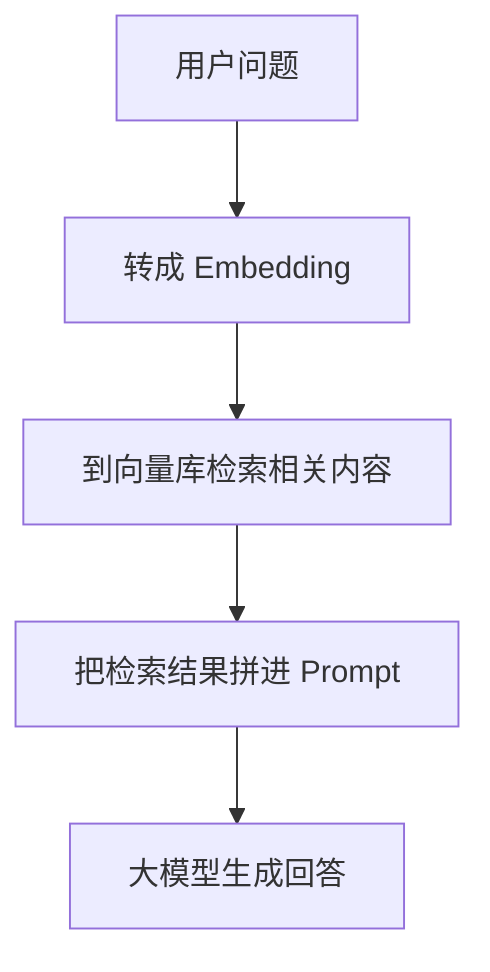

# 模型微调和 RAG 的区别和使用场景

## 一句话总结

微调和 RAG 都是在增强大模型能力，但它们解决的问题不一样：

-   **微调**：把能力“训练进模型里”
-   **RAG**：把外部知识“在回答时查给模型看”

## 1. 什么是模型微调

模型微调（Fine-tuning）是指：**在一个已经预训练好的大模型基础上，再用特定数据继续训练**，让它在某个方向表现更好。

微调后，改变的是模型内部参数，因此能力会更“内化”。

### 微调主要解决什么问题

-   让模型学会某种固定回答风格
-   让模型更懂某个垂直领域
-   让模型更擅长某类任务
-   让输出格式更稳定

### 举例理解

比如一个通用大模型什么都懂一点，但你想让它：

-   更像客服助手说话
-   更懂法律文书
-   更擅长按固定 JSON 格式输出

这时就可以考虑微调。

## 2. 什么是 RAG

RAG 是 **Retrieval-Augmented Generation**，中文通常叫**检索增强生成**。

它的核心思路不是重新训练模型，而是：

1. 先从外部知识库里检索相关内容
2. 再把这些内容连同用户问题一起交给大模型
3. 最后由模型基于检索结果生成回答

### RAG 的关键流程

### 为什么 RAG 依赖 Embedding

因为 RAG 不是简单做关键词匹配，而更强调**语义检索**。

例如用户问：

> 公司报销差旅费需要哪些材料？

知识库里可能写的是：

> 出差费用报销应提交车票、住宿发票和审批单。

虽然用户提问和原文不完全一样，但 embedding 可以把它们映射到语义接近的位置，从而更容易检索到相关内容。

## 3. 微调和 RAG 的核心区别

| 维度           | 微调                         | RAG                            |
| -------------- | ---------------------------- | ------------------------------ |
| 本质           | 继续训练模型                 | 给模型外挂知识检索能力         |
| 改动位置       | 改模型参数                   | 不改模型参数，改输入上下文     |
| 主要目标       | 改能力、改风格、改任务表现   | 补知识、提时效性、降幻觉       |
| 是否依赖知识库 | 不一定                       | 通常需要                       |
| 更新知识成本   | 高，需要重新训练             | 低，更新文档即可               |
| 适合内容       | 稳定能力、固定格式、领域习惯 | 经常变化的文档、制度、业务知识 |
| 典型风险       | 训练成本高、数据要求高       | 检索不准会影响回答质量         |

## 4. 什么时候适合用微调

适合微调的场景通常是：**你想改变模型“怎么回答”或者“擅长什么”**。

### 常见场景

1. 固定输出格式  
   例如希望模型稳定输出某种 JSON、表单、分类标签。

2. 垂直领域表达习惯  
   例如医疗、法律、金融等领域，有固定术语和回答方式。

3. 品牌语气或角色风格  
   例如把模型训练成更像企业客服、销售顾问、内部助手。

4. 专项任务增强  
   例如代码补全、工单分类、意图识别、结构化抽取。

### 微调的优点

-   能把特定能力学进模型
-   输出风格更稳定
-   对固定任务往往效果更好

### 微调的缺点

-   训练成本更高
-   需要高质量数据集
-   知识更新不灵活
-   不适合频繁变化的业务文档

## 5. 什么时候适合用 RAG

适合 RAG 的场景通常是：**你想让模型回答时参考最新、最具体、最私有的资料**。

### 常见场景

1. 企业知识库问答  
   比如员工手册、制度规范、产品文档、FAQ。

2. 文档助手  
   比如对合同、论文、技术文档进行问答和摘要。

3. 时效性强的信息  
   比如最新政策、价格、库存、公告、项目进度。

4. 私有数据接入  
   比如企业内部资料不能直接出现在通用模型预训练数据中。

### RAG 的优点

-   不需要重新训练模型
-   更新知识快，更新文档即可
-   能引用外部依据，降低幻觉
-   更适合接企业私有知识

### RAG 的缺点

-   检索链路更复杂
-   向量库、切分策略、召回质量都会影响效果
-   如果检索错了，回答也会跟着偏

## 6. 实际项目里怎么选

可以先记一个简单判断：

-   **想让模型更会做某件事** -> 优先考虑微调
-   **想让模型知道某些最新资料** -> 优先考虑 RAG

很多实际项目里，两者也会一起用：

1. 先用微调让模型学会行业表达、输出格式、任务习惯
2. 再用 RAG 给它接企业知识库和最新文档

也就是：

> 微调负责“能力内化”，RAG 负责“知识外挂”。

## 7. 极简总结

-   **神经网络**：大模型的底层学习结构
-   **NLP**：让机器理解和处理语言
-   **Embedding**：把语义内容转成向量，支撑语义检索
-   **微调**：继续训练模型，强化能力、风格、任务表现
-   **RAG**：检索外部知识，再结合大模型生成回答

一句话收尾：

> 微调更适合“把能力练进模型”，RAG 更适合“把知识接给模型”；而 embedding 则是 RAG 能做语义检索的重要基础。
