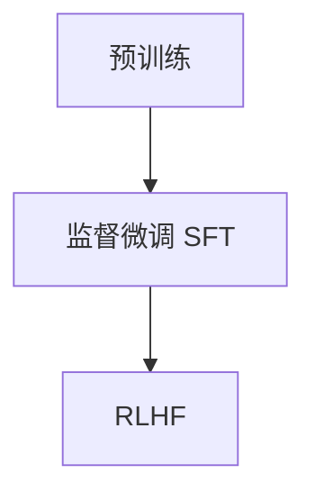

# 预训练、监督微调、RLHF 等概念

## 一句话理解

大模型常见训练流程可以粗略理解为三步：

1. **预训练**：先学大量通用知识
2. **监督微调（SFT）**：再学怎么按要求回答
3. **RLHF**：最后根据人的反馈继续优化

## 1. 预训练是什么

预训练就是：**先让模型“读很多资料”**。

这些资料通常来自海量文本、代码、网页等数据。模型在这个阶段主要学习：

-   语言规律
-   常见知识
-   词和词之间的关系
-   什么内容更可能接在后面

可以把它理解成：先把一个人培养成“知道很多东西的人”。

## 2. 监督微调是什么

监督微调（SFT）就是：**用标准问答样本教模型怎么更像助手一样回答**。

训练时会给模型很多“问题 + 理想答案”的例子，让它学习：

-   用户提问后应该怎么答
-   回答怎么更清楚
-   格式怎么更稳定
-   语气怎么更自然

可以把它理解成：给一个已经有基础知识的人做岗位培训，让他更会做事。

## 3. RLHF 是什么

RLHF 的全称是：**基于人类反馈的强化学习**。

它的核心思想是：**让人来告诉模型，什么回答更好**。

比如同一个问题有两个回答，人来判断：

-   哪个更有帮助
-   哪个更安全
-   哪个更自然
-   哪个更符合人的偏好

模型再根据这些反馈继续优化。

可以把它理解成：老师或主管不断纠偏，让模型越来越会“讨人喜欢地回答问题”。

## 4. 三者的关系

它们通常是前后衔接的关系：

也可以简单记成：

-   **预训练**：学知识
-   **SFT**：学答题
-   **RLHF**：学把题答得更让人满意

## 5. 极简总结

-   **预训练**：让模型先有知识
-   **监督微调**：让模型更会按要求回答
-   **RLHF**：让模型回答更符合人类偏好

一句话总结：

> 预训练让模型“知道很多”，监督微调让模型“更会回答”，RLHF 让模型“回答得更像人喜欢的样子”。
