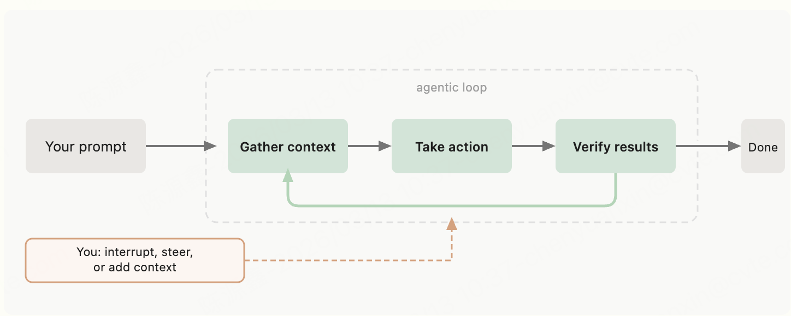
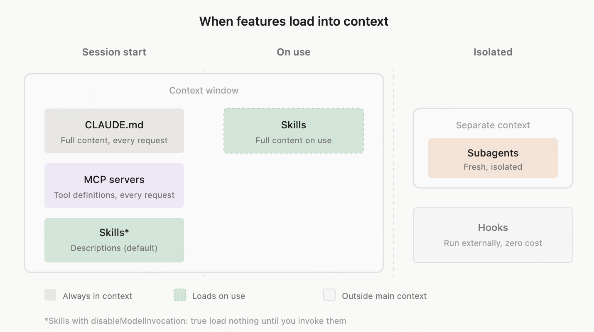

## 工作原理

## skills、subagent、cladude.md、hooks

### 区别

| 维度     | Skills                                   | Subagent                         | CLAUDE.md                                       | Hooks                                                      |
| -------- | ---------------------------------------- | -------------------------------- | ----------------------------------------------- | ---------------------------------------------------------- |
| 本质     | 可复用的 Markdown 指令模板               | 拥有独立上下文的专用 AI 子代理   | 项目级持久化配置文件                            | 生命周期自动触发的 Shell 命令                              |
| 触发方式 | 手动斜杠命令 `/skill-name` 或自动检测    | 由主代理按需派生                 | 每次会话启动时自动加载                          | 在特定生命周期事件时自动执行                               |
| 存放位置 | `~/.claude/skills/` 或 `.claude/skills/` | 内置 + 自定义配置                | 项目根目录 `CLAUDE.md` 或 `~/.claude/CLAUDE.md` | settings 配置文件                                          |
| 核心作用 | 消除重复提示词，封装复杂工作流           | 隔离上下文、控制成本、专业化分工 | 提供项目约定、编码规范等持久上下文              | 自动化流程（格式化、校验、注入上下文等）                   |
| 生命周期 | 调用时加载，执行完即结束                 | 独立上下文窗口，任务完成后销毁   | 会话全程生效                                    | 事件驱动（SessionStart / PreToolUse / PostToolUse / Stop） |

### 协作关系

