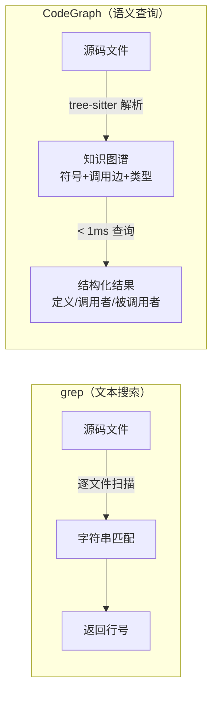
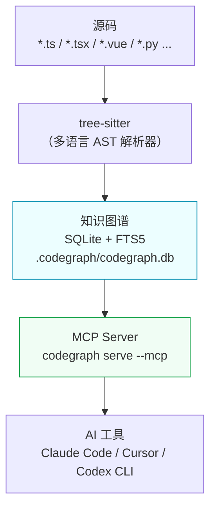

# CodeGraph 实战分享

> **一句话总结：** CodeGraph 是 AI 代码助手的「语义搜索引擎」—— 让 AI 不再用 grep 一遍遍扫文件，而是直接查询预建的代码知识图谱。

---

## 痛点场景：AI 代码助手的搜索瓶颈

你让 AI 帮你追踪调用链，然后看着它反复 搜索→读文件→再搜索：

```
User：找出所有调用 getSignParams 的函数，追踪完整调用链

AI  ：好的，我来搜索...
      [grep -r "getSignParams" ...]         ⏱ 第1轮  搜索
      [read_file sign-params.ts]            ⏱ 第2轮  读文件确认
      [grep -r "requestWithSign" ...]       ⏱ 第3轮  搜索上层调用者
      [read_file request-with-sign.ts]      ⏱ 第4轮  读文件确认
      [ls packages/request/src/]            ⏱ 第5轮  看目录结构
      [grep -r "requestFxSign" ...]         ⏱ 第6轮  继续追踪
      ...
      总计：18 轮工具调用，173.5s，$0.33
```

问题不在 AI 能力，而在工具选错了：



| 维度 | grep | CodeGraph |
|------|------|-----------|
| 看到的是 | 字符串 | AST 符号（函数、类、变量） |
| 注释/字符串字面量 | 误报 | 自动过滤 |
| 别名导入 (`import { X as Y }`) | 漏报 | 自动追踪 |
| 调用链追踪 | 人工多轮 | 1 次调用返回完整链路 |
| 每次查询耗时 | 秒级（全量扫描） | < 1ms（索引查询） |

---

## 工作原理



核心流程：

1. **建索引**：`codegraph init -i` 用 tree-sitter 解析全部源码，提取符号、调用关系、导入导出，存入 SQLite
2. **增量更新**：文件变更时 OS 事件监听自动触发，~2s 静默窗口后增量 sync
3. **查询**：AI 通过 MCP 协议调用 `codegraph_*` 工具，< 1ms 返回结构化结果

---

## 工具家族速览

| 工具 | 用途 | 典型提问 |
|------|------|----------|
| `codegraph_context` | 为任务一次性收集入口 + 相关符号 + 源码 | 「我要重构登录流程，给我相关代码」 |
| `codegraph_trace` | 追踪 X→Y 完整调用路径，穿透回调/动态派发 | 「请求如何从 controller 到数据库？」 |
| `codegraph_search` | 按名称找符号定义 | 「`getSignParams` 定义在哪？」 |
| `codegraph_callers` | 谁调用了这个函数 | 「哪些地方用到了 `getMCache`？」 |
| `codegraph_callees` | 这个函数调用了谁 | 「`useOrder` 内部依赖哪些函数？」 |
| `codegraph_impact` | 改这个会影响什么 | 「修改 `UserStore` 接口，影响范围？」 |
| `codegraph_explore` | 同时查看多个符号源码 | 「展示 auth 相关的核心函数」 |
| `codegraph_node` | 获取单个符号详细信息（签名/注释） | 「`getSignParams` 的参数和返回值」 |
| `codegraph_files` | 查看项目文件结构 | 「`packages/request/` 下有哪些文件？」 |
| `codegraph_status` | 索引健康状态 | 「当前索引了多少文件/符号？」 |

### 选工具决策树

```
我想……
│
├─ 找符号定义        → codegraph_search
├─ 谁调用了它        → codegraph_callers
├─ 它调用了谁        → codegraph_callees
├─ 改它会影响什么    → codegraph_impact
├─ X 如何到达 Y      → codegraph_trace
├─ 为任务收集上下文  → codegraph_context  ← 不知道用哪个时，先用这个
├─ 看多个符号源码    → codegraph_explore
├─ 看单个符号详情    → codegraph_node
├─ 看目录结构        → codegraph_files
└─ 检查索引状态      → codegraph_status
```

---

## 实测数据

完整的 A/B 对比测试报告（含耗时、成本、Token、回答质量对照）：

👉 [CodeGraph 有效性验证报告](./report.html)

---

## 5 分钟快速上手

### Step 1：安装

```bash
# macOS / Linux
curl -fsSL https://raw.githubusercontent.com/colbymchenry/codegraph/main/install.sh | sh

# 或用 npx
npx @colbymchenry/codegraph
```

### Step 2：初始化项目索引

```bash
cd your-project
codegraph init -i

# 首次约 1-2 min（大型项目）
# 生成 .codegraph/codegraph.db
```

### Step 3：重启 AI 工具

重启 Claude Code / Cursor / Codex CLI，MCP server 自动加载。验证：

```bash
codegraph serve --mcp
# 看到 "CodeGraph MCP server running" 即可
```

之后文件变更会自动增量更新索引，无需手动操作。

---

## 注意事项 & 局限性

1. **简单文本查找场景，grep 可能更划算。** Q4（LazyImage 组件使用查询）中，WITHOUT 版本只用 2 轮、$0.07 就完成了，WITH 版本反而用了 3 轮、$0.15 —— 对于「搜索一个组件名在哪些文件出现」这种直球问题，grep 足够且更便宜。

2. **CodeGraph 的优势场景：**
   - 需要追踪**调用链**（谁调用了谁、多层依赖）
   - 需要做**影响分析**（改 X 会波及哪些模块）
   - 需要理解**架构关系**（多个函数如何协作）
   - 符号存在**别名导入**或**同名定义**

3. **索引延迟：** 文件变更后有 ~2s 的静默窗口才触发增量更新，刚写完代码立刻查询可能拿到旧数据。

4. **首次建索引耗时：** 大型 monorepo 首次 `codegraph init -i` 需要 1-2 分钟，之后都是增量更新。
