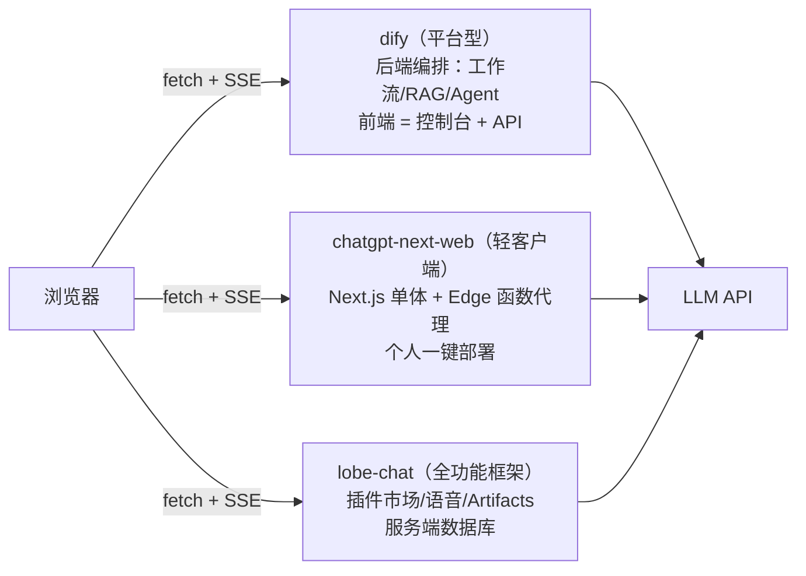

# dify · chatgpt-next-web · lobe-chat 三大开源项目

> **一句话结论：** 三者是 AI 对话前端的三种形态——**dify 是平台型**（编排逻辑在后端，业务前端只是 API 消费者）、**chatgpt-next-web 是轻客户端**（一键部署的聊天壳）、**lobe-chat 是全功能框架**（插件/语音/数据库）。

## 一张图看懂「谁在哪一层」



## 差异对比表（面试直接背）

| 维度 | dify | chatgpt-next-web（NextChat） | lobe-chat |
| --- | --- | --- | --- |
| 定位 | LLM 应用**开发平台** | 一键部署的**轻量聊天客户端** | 生产级 **AI 聊天框架** |
| 核心抽象 | 应用 / 工作流 / 知识库 | 会话 / Mask（预设） | 会话 / Agent 角色 / 插件 |
| 编排能力在哪 | **后端**（React Flow 画布只是控制台） | 无 | 前端为主 + function calling |
| 扩展机制 | 后端加节点/插件 | Mask（prompt 预设） | 插件市场（function calling） |
| 会话历史 | 服务端（`conversation_id`） | **客户端全量 messages 上传** | 服务端（DB + 登录） |
| 数据存储 | 服务端（DB + 向量库） | 浏览器 localStorage | 服务端 Postgres（近期版本强制） |
| 部署成本 | 重（Python 后端全家桶） | 轻（Vercel 一键 / Docker） | 中（需要数据库） |

> 会话历史那行是高频追问：**企业标准是服务端持有**（多端同步、上下文裁剪/RAG 注入、防伪造历史）；客户端全量上传只适合「数据不出本地」的个人工具——lobe-chat v2 砍掉浏览器本地模式就是这个趋势的实证。

## 三个项目分别是什么

### dify —— 给「不会写代码的人」搭 AI 应用的平台

提示词编排、RAG 知识库、工作流全在它的后端完成。业务前端不碰编排，只调它的 HTTP API（`/v1/chat-messages`，SSE 事件协议比裸 OpenAI 丰富——`node_finished` 帧可以驱动「检索中→生成中」进度条）。**适合：公司统一 AI 平台，各业务线前端做消费端。**

### chatgpt-next-web —— 20 分钟拥有一个自己的 ChatGPT 页面

Next.js 单体应用，Vercel 一键部署。值得学的三个点：Edge Runtime API Route 代理（**Key 不落前端**的教科书）、Mask 预设（system prompt + 参数打包成可分享 JSON）、上下文超限时自动摘要压缩。会话存 localStorage。**适合：个人/小团队快速要个能用聊天页，或当轻客户端源码精读材料。**

### lobe-chat —— 功能完整的成品 AI 产品

插件系统是 function calling 的工程化范本：市场里的「插件」= manifest（描述 + OpenAPI schema），模型靠描述决定何时调用、前端靠 schema 发请求。另有 Agent 角色市场、TTS/ASR、Artifacts 沙箱预览。**适合：做对外的完整 AI 产品，在它基础上改。**

> **版本现状（2026-08）**：仓库已更名 `lobehub/lobehub`，且**任何近期版本都要 Postgres**——浏览器本地模式整个移除了（tag `v1.159.0` 内部版本实为 2.1.11，1.x 是连续小版本不是「1.0 时代」）。

## 怎么选（使用场景速查）

```
公司已有 dify 平台   → 前端只做消费端：聊天面板 + SSE 渲染 + 后端代理，成本最低
内部工具要个问答页   → chatgpt-next-web 级别，一键部署完事
做对外的完整 AI 产品 → lobe-chat 起步改造（插件/登录/多端同步是现成的）
```

## 深入材料（本篇不再展开）

- **三个项目本机全部跑过**（Ollama 真流式 + 本地 Postgres）：启动步骤、DevTools 观察点、踩坑记录 → [demo/README](./demo/README.md)
- 流式渲染（SSE/半包/中断/增量 Markdown）→ [AI/面试题/sse](../面试题/sse/sse%20vs%20websocket.md)、[添科智能 demo：手写 SSE 双实现](../../面经汇总/2026gap/面试/添科智能/demo/README.md)
- dify 真实项目（内部 API 流式聊天）→ [AI_Agent示例](../code/AI_Agent示例/README.md)
- RAG 前端视角 → [前端能利用rag做什么](../面试题/前端能利用rag做什么.md)；useChat/多模型 → [AI SDK](../入门基础/AI%20SDK.md)
