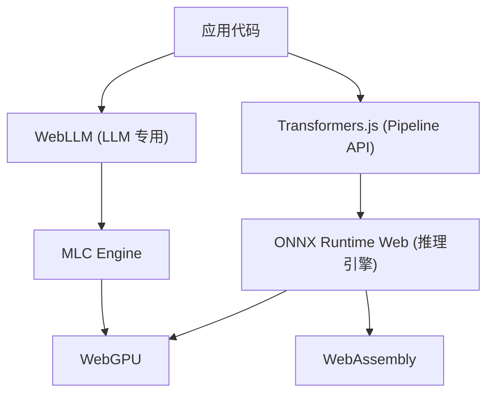
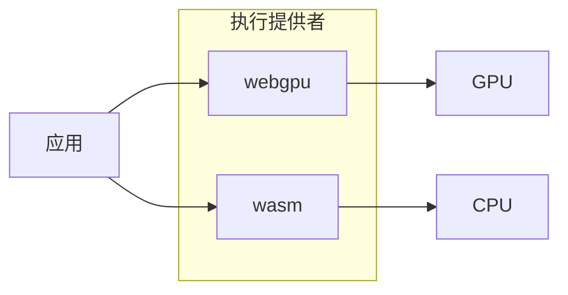
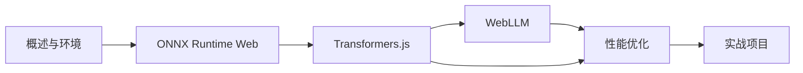

todo-待学

# 端侧 AI 概述与环境准备

端侧 AI 即在用户设备（浏览器/终端）上直接运行模型推理，无需或减少与云端 API 的往返。

---

## 一句话结论

端侧 AI 通过 WebGPU/WASM 在浏览器中跑模型，具备隐私好、可离线、低延迟等优势，本模块聚焦 **ONNX Runtime Web**、**Transformers.js**、**WebLLM** 三条技术线。

---

## 端侧 AI 全景



| 维度     | 说明                                                            |
| -------- | --------------------------------------------------------------- |
| **优势** | 隐私保护（数据不出设备）、离线可用、低延迟、无按量计费          |
| **局限** | 模型体积受限于存储与带宽、算力受设备 GPU/CPU 限制、大模型需量化 |

---

## 三大技术关系

| 技术             | 定位              | 典型用途                                  |
| ---------------- | ----------------- | ----------------------------------------- |
| ONNX Runtime Web | 底层推理引擎      | 任意 ONNX 模型、自定义推理                |
| Transformers.js  | 高层 Pipeline API | 文本/图像/语音任务、Embedding、小模型生成 |
| WebLLM           | 浏览器端 LLM      | 大模型对话、流式生成、OpenAI 兼容 API     |

-   ONNX Runtime Web 是底层；Transformers.js 基于它提供高层 API；WebLLM 使用 MLC 引擎，专注 LLM。

---

## WebGPU 与 WebAssembly 基础

-   **WebGPU**：浏览器中调用 GPU，适合大规模并行计算，全球约 70% 支持率（Chrome/Edge/Safari 等）。
-   **WebAssembly (WASM)**：可作 WebGPU 不可用时的降级方案，CPU 推理，兼容性更好、速度较慢。



---

## 开发环境搭建

**最小可运行起点：Node.js + Vite 项目。**

```bash
pnpm create vite my-ai-app --template react-ts
cd my-ai-app
pnpm config set registry https://registry.npmmirror.com
pnpm install
pnpm dev
```

**验证 WebGPU（浏览器控制台）：**

```javascript
console.log(navigator.gpu ? 'WebGPU 可用' : 'WebGPU 不可用');
```

**Chrome DevTools**：Performance 面板可录制推理过程，分析 GPU/WASM 耗时。

---

## 学习顺序建议



先学 ONNX Runtime Web 理解底层，再学 Transformers.js 掌握高层 API，然后学 WebLLM 专攻 LLM，最后通过性能优化与实战项目串联。

---

## 学习资源

-   [ONNX Runtime Web 教程](https://onnxruntime.ai/docs/tutorials/web/)
-   [Transformers.js 文档](https://huggingface.co/docs/transformers.js)
-   [WebLLM 入门](https://webllm.mlc.ai/docs/user/get_started.html)
