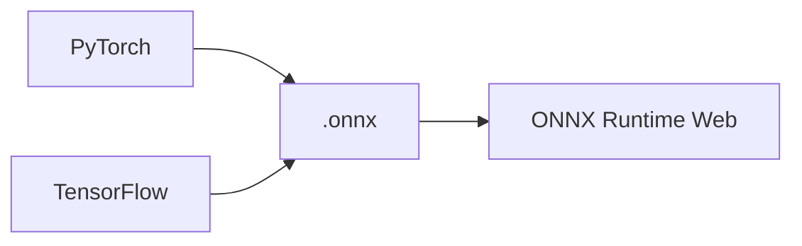

# ONNX Runtime Web

ONNX Runtime Web 是在浏览器中运行 ONNX 模型的推理引擎，支持 WebGPU 与 WASM 两种执行提供者。

---

## 一句话结论

用 `onnxruntime-web` 在浏览器中加载 ONNX 模型，通过 `InferenceSession.run()` 执行推理；优先使用 **WebGPU**，不支持时降级到 **WASM**。

---

## ONNX 模型格式与生态

- **ONNX**：开放模型格式，PyTorch、TensorFlow 等可导出为 `.onnx`。
- 导出示例（PyTorch）：`torch.onnx.export(model, dummy_input, "model.onnx", opset_version=14)`。



---

## 核心 API：Session 创建与推理

**安装：**

```bash
pnpm add onnxruntime-web
```

**WebGPU 推理最小示例：**

```typescript
import * as ort from "onnxruntime-web/webgpu";

const session = await ort.InferenceSession.create("./model.onnx", {
  executionProviders: ["webgpu"],
});

const data = new Float32Array(1 * 3 * 224 * 224); // 依模型输入形状
const feeds = {
  input: new ort.Tensor("float32", data, [1, 3, 224, 224]),
};
const results = await session.run(feeds);
const output = results[session.outputNames[0]];
```

**WASM 降级：**

```typescript
const session = await ort.InferenceSession.create("./model.onnx", {
  executionProviders: ["wasm"],
});
```

---

## 执行提供者（EP）配置

| 提供者   | 说明           | 兼容性 | 性能 |
|----------|----------------|--------|------|
| `webgpu` | 使用 GPU       | 需浏览器支持 WebGPU | 高 |
| `wasm`   | 使用 CPU/WASM  | 广泛   | 较低 |

**推荐写法：先 WebGPU，不可用时再用 WASM。**

```typescript
const eps = navigator.gpu ? ["webgpu", "wasm"] : ["wasm"];
const session = await ort.InferenceSession.create("./model.onnx", {
  executionProviders: eps,
});
```

---

## IO Binding（减少 CPU-GPU 拷贝）

将输入/输出张量绑定到 GPU，避免多次拷贝，提升性能。

```typescript
const binding = session.ioBinding;
binding.bindInput("input", gpuTensor);
binding.bindOutput("output");
session.run(binding);
const output = binding.getOutput("output");
```

适用于多轮推理、输入输出均在 GPU 上时。

---

## Graph Capture（静态形状优化）

对输入形状固定的模型，可启用 Graph Capture，减少 WebGPU 内核调度开销。

```typescript
const session = await ort.InferenceSession.create("./model.onnx", {
  executionProviders: [
    {
      name: "webgpu",
      sessionOptions: { graphCaptureMaxCached: 1 },
    },
  ],
});
```

---

## API 速查

| API | 说明 |
|-----|------|
| `ort.InferenceSession.create(url, options)` | 创建会话，支持 `executionProviders` |
| `session.run(feeds)` | 同步推理，`feeds` 为 `Record<string, Tensor>` |
| `session.runAsync(feeds)` | 异步推理 |
| `new ort.Tensor(type, data, dims)` | 构造张量 |
| `session.inputNames` / `session.outputNames` | 输入/输出名称 |

---

## 学习资源

- [ONNX Runtime Web 官方教程](https://onnxruntime.ai/docs/tutorials/web/)
- [WebGPU EP 指南](https://onnxruntime.ai/docs/tutorials/web/ep-webgpu.html)
