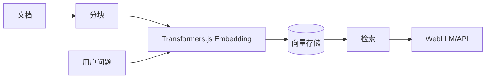

# Transformers.js

Transformers.js 在浏览器与 Node 中提供 Hugging Face 风格的 Pipeline API，底层使用 ONNX Runtime Web，支持文本、图像、语音等多类任务。

---

## 一句话结论

通过 `pipeline(task, model, { device: 'webgpu' })` 一行创建推理管道，支持分类、嵌入、NER、ASR、图像分类等；模型可缓存到 IndexedDB，并与 RAG 结合做端侧 Embedding。

---

## 安装与快速上手

```bash
pnpm add @huggingface/transformers
```

**情感分析示例：**

```typescript
import { pipeline } from "@huggingface/transformers";

const classifier = await pipeline(
  "sentiment-analysis",
  "Xenova/distilbert-base-uncased-finetuned-sst-2-english",
  { device: "webgpu" }
);
const result = await classifier("I love this!");
console.log(result); // [{ label: 'POSITIVE', score: 0.99... }]
```

---

## Pipeline 与任务类型

| 任务 | `task` 名称 | 典型用途 |
|------|--------------|----------|
| 文本分类 / 情感分析 | `sentiment-analysis` | 极性、主题分类 |
| 特征提取（嵌入） | `feature-extraction` | RAG、语义检索 |
| 命名实体识别 | `token-classification` | NER |
| 自动语音识别 | `automatic-speech-recognition` | Whisper 端侧 ASR |
| 图像分类 | `image-classification` | 单标签分类 |
| 目标检测 | `object-detection` | 多目标框 |
| 文本生成 | `text-generation` | 小模型生成 |
| 问答 | `question-answering` | 抽取式问答 |

---

## 核心任务示例

**特征提取（用于 RAG Embedding）：**

```typescript
import { pipeline } from "@huggingface/transformers";

const extractor = await pipeline(
  "feature-extraction",
  "Xenova/all-MiniLM-L6-v2",
  { device: "webgpu" }
);
const output = await extractor("Hello world", { pooling: "mean", normalize: true });
const embedding = Array.from(output.data);
```

**NER：**

```typescript
const ner = await pipeline(
  "token-classification",
  "Xenova/bert-base-NER",
  { device: "webgpu" }
);
const result = await ner("John works at Google in Paris.");
```

**图像分类：**

```typescript
const classifier = await pipeline(
  "image-classification",
  "Xenova/vit-base-patch16-224",
  { device: "webgpu" }
);
const result = await classifier(document.getElementById("img"));
```

---

## 模型加载与缓存

- 模型默认从 Hugging Face Hub 下载，浏览器环境可缓存到 **IndexedDB** 或 **Cache API**。
- 通过 `cache_dir` 与 env 配置：

```typescript
import { env } from "@huggingface/transformers";
env.useBrowserCache = true;
env.cacheDir = "/models"; // 相对路径，实际存于 IndexedDB 等
```

---

## 自定义模型与 ONNX

- 使用 Hub 上标有 `transformers.js` 的 ONNX 模型，或自行导出 ONNX 后按 Pipeline 约定命名输入/输出。
- 从本地 URL 加载：`pipeline("sentiment-analysis", "/path/to/model", { ... })`。

---

## 与 RAG 的结合点

用 Transformers.js 做**端侧 Embedding**，再配合向量存储（如内存或 IndexedDB）与检索逻辑，可实现完全前端的 RAG 检索；生成阶段可接 WebLLM 或云端 API。



---

## v4 简要说明（2026 年 2 月）

- 更好的 WebGPU 支持与默认设备选择。
- Pipeline 与模型缓存行为增强，文档以官方为准：[Transformers.js 文档](https://huggingface.co/docs/transformers.js)。

---

## 学习资源

- [Transformers.js 官方文档](https://huggingface.co/docs/transformers.js)
- [Hugging Face 模型库（transformers.js）](https://huggingface.co/models?library=transformers.js)
