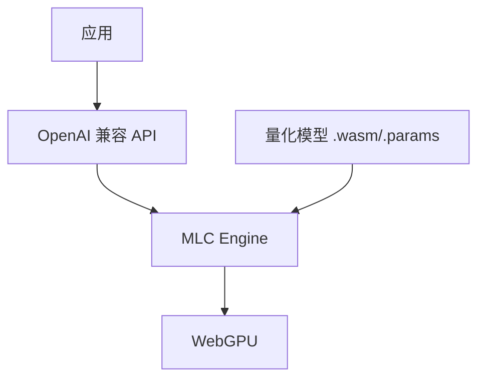

# WebLLM

WebLLM 在浏览器中运行大语言模型（LLM），基于 MLC 引擎与 WebGPU，提供 OpenAI 兼容的 API，支持流式对话、Function Calling、JSON Mode 等。

---

## 一句话结论

通过 `CreateMLCEngine(modelId, options)` 创建引擎，用 `engine.chat.completions.create({ messages, stream: true })` 做对话；支持 Llama、Phi、Gemma、Qwen 等量化模型，适合离线对话与端侧助手。

---

## 架构概览



- **MLC** 负责模型编译与运行时；**WebGPU** 负责 GPU 加速；模型以量化格式（如 q4f16_1）分发。

---

## 安装与最小示例

```bash
pnpm add @mlc-ai/web-llm
```

**流式对话：**

```typescript
import { CreateMLCEngine } from "@mlc-ai/web-llm";

const engine = await CreateMLCEngine("Llama-3.2-1B-Instruct-q4f16_1-MLC", {
  initProgressCallback: (progress) => console.log(progress),
});

const stream = await engine.chat.completions.create({
  messages: [{ role: "user", content: "你好" }],
  stream: true,
});

for await (const chunk of stream) {
  const text = chunk.choices[0]?.delta?.content ?? "";
  process.stdout.write(text);
}
```

---

## 核心 API（OpenAI 兼容）

| 能力 | 用法 |
|------|------|
| 对话补全 | `engine.chat.completions.create({ messages })` |
| 流式输出 | `stream: true`，迭代 `for await (const chunk of stream)` |
| Function Calling | 在 `tools` / `tool_choice` 中传入定义与选择策略 |
| JSON Mode | `response_format: { type: "json_object" }` |

**非流式示例：**

```typescript
const result = await engine.chat.completions.create({
  messages: [{ role: "user", content: "1+1=?" }],
  max_tokens: 64,
});
console.log(result.choices[0].message.content);
```

---

## 支持的模型与量化格式

- **模型**：Llama 3.2、Phi 3、Gemma、Mistral、Qwen 等，以 MLC 提供的量化版本为准。
- **量化格式**：如 `q4f16_1`、`q4f32_1`，数字越小体积越小、速度越快，精度略降。
- **性能参考**：Llama-3.2-1B 在 M 系列 Mac 上约 20 token/s，仅供参考。

---

## Function Calling 与 JSON Mode

**JSON Mode：**

```typescript
const res = await engine.chat.completions.create({
  messages: [{ role: "user", content: "输出一个包含 name 和 age 的 JSON" }],
  response_format: { type: "json_object" },
});
```

**Function Calling**：与 OpenAI 类似，传入 `tools` 数组和 `tool_choice`，解析 `message.tool_calls` 并回调业务逻辑后再继续对话。

---

## 学习资源

- [WebLLM 官方文档](https://webllm.mlc.ai/docs/user/get_started.html)
- [在线演示](https://chat.webllm.ai)
