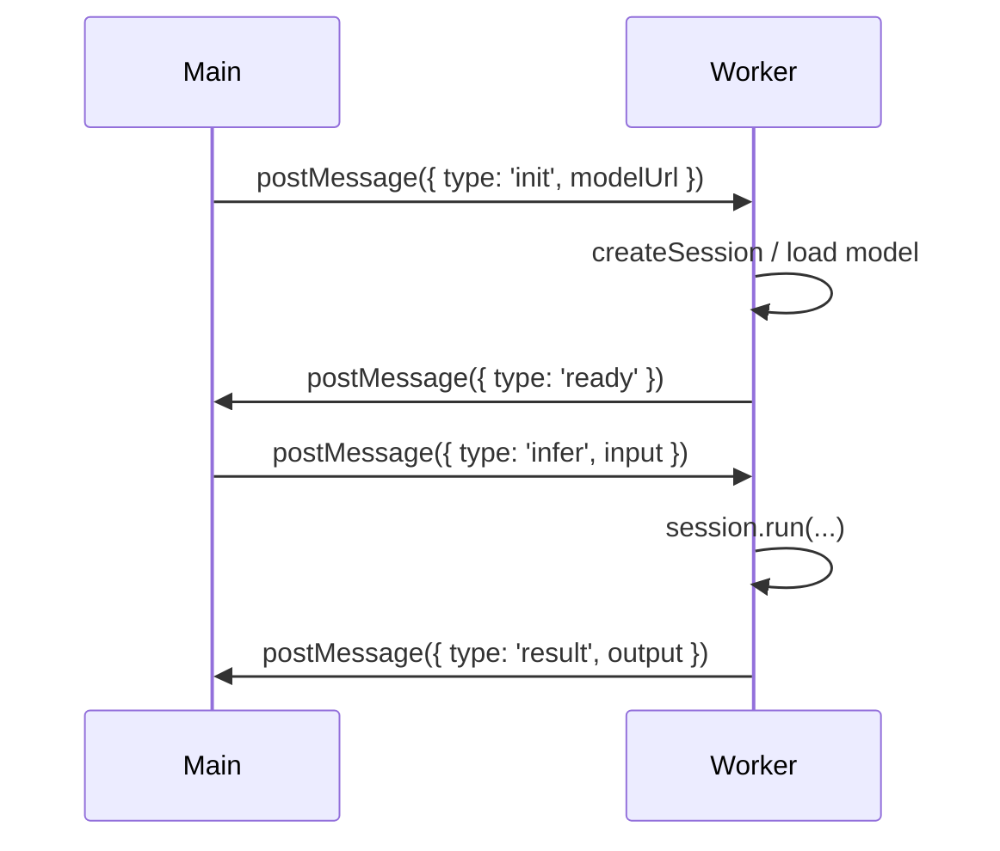
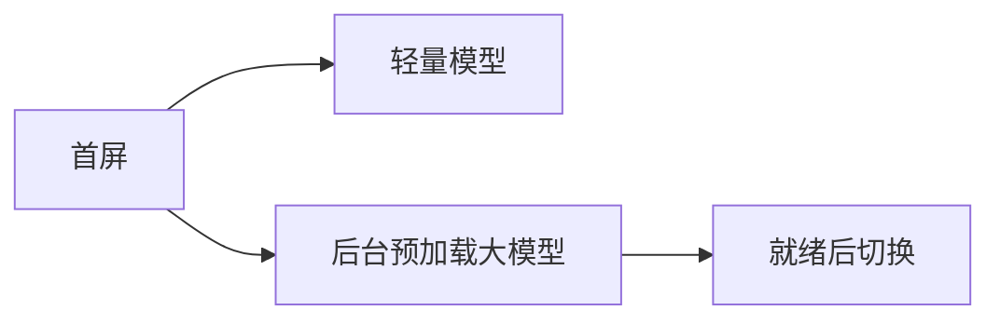

# 性能优化与工程实践

端侧推理受设备算力与内存限制，需要通过量化、Worker、缓存、降级与内存管理等手段提升体验与稳定性。

---

## 一句话结论

优先使用**量化模型**与 **WebGPU**，推理放进 **Web Worker** 避免阻塞 UI；用 **IndexedDB/Cache API** 缓存模型，并做好 **WebGPU 不可用时的 WASM 降级** 与 **内存释放**。

---

## 模型量化

| 精度 | 体积与速度 | 精度 | 典型用途 |
|------|------------|------|----------|
| FP16 | 大、慢 | 高 | 对精度要求高的任务 |
| INT8 | 中 | 中 | 分类、Embedding 折中 |
| INT4 | 小、快 | 较低 | 端侧 LLM、对话 |

- WebLLM 常用 q4f16_1 等格式；Transformers.js 使用 Hub 上已量化的 ONNX 模型。
- 选型：能接受轻微质量损失时优先 INT4/INT8，以换体积与速度。

---

## Web Workers：避免阻塞主线程

将 ONNX/Transformers.js/WebLLM 的加载与推理放到 Worker，主线程只发消息与更新 UI。



**主线程示例：**

```typescript
const worker = new Worker(new URL("./inference.worker.ts", { type: "module" }));
worker.postMessage({ type: "init", modelUrl: "/model.onnx" });
worker.onmessage = (e) => {
  if (e.data.type === "result") console.log(e.data.output);
};
worker.postMessage({ type: "infer", input: [...] });
```

**Worker 内**：按需 `import * as ort from "onnxruntime-web/webgpu"` 或 Transformers.js/WebLLM，在 `onmessage` 里执行 `create`/`run` 并 `postMessage` 回结果。

---

## 缓存策略

| 手段 | 说明 |
|------|------|
| **IndexedDB** | 存大体积模型权重，二次访问直接本地加载 |
| **Cache API** | 缓存脚本与 WASM 等静态资源 |
| **Service Worker** | 离线时仍可命中缓存，提升 PWA 体验 |

Transformers.js：`env.useBrowserCache = true` 等。  
WebLLM：通常自带缓存逻辑，模型下载一次后本地复用。

---

## 渐进式加载

- 首屏先用**轻量模型**（如小分类/小 Embedding）快速响应。
- 在后台**预加载大模型**（如 LLM），加载完成后再切换或提示用户。



---

## WebGPU 降级

检测 `navigator.gpu`，不可用时改用 WASM 或提示用户使用支持的浏览器。

```typescript
const useWebGPU = !!navigator.gpu;
const session = await ort.InferenceSession.create(url, {
  executionProviders: useWebGPU ? ["webgpu", "wasm"] : ["wasm"],
});
```

---

## 内存管理

- **模型卸载**：长时间不用时释放 Session/Engine，减少 GPU 与 WASM 内存占用。
- **张量释放**：避免在循环中重复创建大张量不释放；必要时显式置空引用或调用运行时提供的 dispose 方法。
- 大模型场景可限制并发请求数，避免多轮对话同时占用多份显存。

---

## 学习资源

- ONNX Runtime Web / Transformers.js / WebLLM 官方文档中的 Performance 与 Best Practices 章节。
