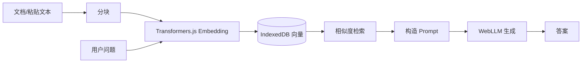

# 端侧 AI 实战项目

三个递进式项目：情感分析工具（Transformers.js）→ 离线对话助手（WebLLM）→ 端侧 RAG 系统（Transformers.js + WebLLM + IndexedDB），与项目现有 `rag/` 服务端方案形成对比。

---

## 项目一：浏览器端情感分析工具（入门）

**目标**：输入文本，实时分析情感倾向。

**技术**：Transformers.js + Vite（React/Vue 均可）。

**核心步骤**：

1. 使用 `pipeline("sentiment-analysis", model, { device: "webgpu" })` 创建分类器。
2. 输入框 onChange/onSubmit 时调用 `classifier(text)`，将结果展示在 UI。
3. 可选：将推理放入 Web Worker，避免输入时卡顿。

**最小前端示例（React）：**

```tsx
import { useState, useEffect } from "react";
import { pipeline } from "@huggingface/transformers";

export function SentimentDemo() {
  const [model, setModel] = useState(null);
  const [text, setText] = useState("");
  const [result, setResult] = useState(null);

  useEffect(() => {
    pipeline("sentiment-analysis", "Xenova/distilbert-base-uncased-finetuned-sst-2-english", {
      device: "webgpu",
    }).then(setModel);
  }, []);

  const run = async () => {
    if (!model) return;
    const out = await model(text);
    setResult(out);
  };

  return (
    <div>
      <textarea value={text} onChange={(e) => setText(e.target.value)} />
      <button onClick={run}>分析</button>
      {result && <pre>{JSON.stringify(result, null, 2)}</pre>}
    </div>
  );
}
```

**学习点**：Pipeline API、模型加载、WebGPU 加速。

---

## 项目二：离线智能对话助手（进阶）

**目标**：完全离线的 AI 对话，支持流式输出。

**技术**：WebLLM + Vue 3 / React + Vite。

**核心步骤**：

1. 使用 `CreateMLCEngine(modelId, { initProgressCallback })` 初始化引擎，在 UI 上展示下载/加载进度。
2. 调用 `engine.chat.completions.create({ messages, stream: true })`，用 `for await` 消费流，逐 token 更新界面。
3. 维护 `messages` 数组（user/assistant），实现多轮对话。

**流式展示要点**：

```typescript
let full = "";
const stream = await engine.chat.completions.create({
  messages: [{ role: "user", content: userInput }],
  stream: true,
});
for await (const chunk of stream) {
  const delta = chunk.choices[0]?.delta?.content ?? "";
  full += delta;
  setAssistantMessage(full); // 驱动 UI 更新
}
```

**学习点**：MLC 引擎、流式响应、模型下载进度、多轮 messages 管理。

---

## 项目三：端侧 RAG 知识问答系统（综合）

**目标**：完全在浏览器端运行的 RAG：文档切块 → 端侧 Embedding → 向量存储 → 检索 → 端侧 LLM 生成。

**技术**：Transformers.js（Embedding）+ WebLLM（生成）+ IndexedDB（向量存储与检索）。

**架构示意：**



**核心实现要点**：

1. **分块**：按长度或段落将文档切成 chunk，可用简单按句/按 256 token 等策略。
2. **Embedding**：`pipeline("feature-extraction", "Xenova/all-MiniLM-L6-v2", { device: "webgpu" })`，`pooling: "mean"`, `normalize: true`，得到向量列表写入 IndexedDB。
3. **检索**：用户问题同样过 Embedding，与库中向量做内积或余弦相似度，取 top-k。
4. **生成**：将 top-k 文本与问题拼成 prompt，交给 WebLLM `chat.completions.create`，流式输出答案。
5. **持久化**：向量与 meta 存 IndexedDB，下次打开可直接复用，无需重新解析文档。

**与现有 rag/ 的对比**：

| 维度 | 端侧 RAG（本项目） | 服务端 rag/ |
|------|--------------------|-------------|
| 数据与隐私 | 数据不出设备 | 需上传到服务 |
| 离线 | 支持 | 需网络 |
| 规模 | 受设备存储与算力限制 | 可扩展至大规模语料 |
| 实现 | Transformers.js + WebLLM + IDB | 服务端向量库 + API |

---

## 总览

| 项目 | 技术栈 | 能力 |
|------|--------|------|
| 情感分析工具 | Transformers.js + Vite | Pipeline、WebGPU、可选 Worker |
| 离线对话助手 | WebLLM + Vite | 流式对话、进度、多轮 |
| 端侧 RAG | Transformers.js + WebLLM + IndexedDB | Embedding、检索、生成、与 rag/ 对比 |

按顺序做完三个项目即可覆盖端侧 AI 从单任务到 RAG 的完整链路。
