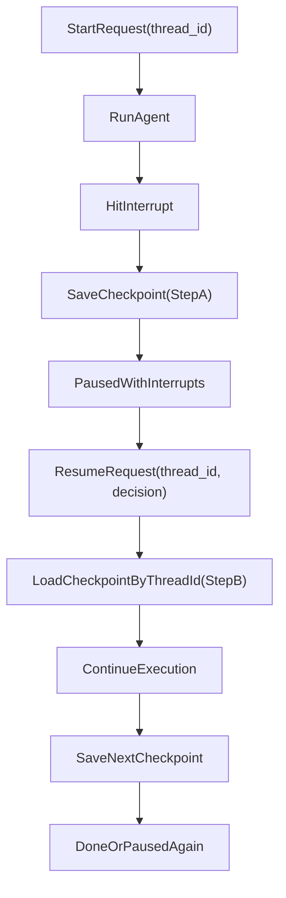
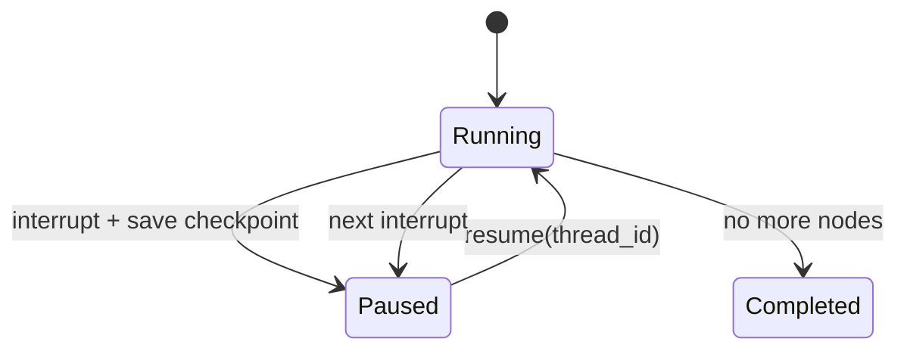

# LangChain / LangGraph 可中断（人机交互）原理（Checkpoint 主线版）

这份文档只讲一条主线，不绕弯：

`interrupt -> save_checkpoint -> resume(thread_id)`

你只要理解这条主线，就能理解 HITL 的中断恢复机制。

---

## 1. 一句话主线（先记住）

- 中断时：Agent 不继续往下跑，而是把“执行现场”写入 checkpoint。
- 恢复时：系统用 `thread_id` 找到那份 checkpoint，把 `resume` 决策喂回去，再继续执行。

换句话说：

- **中断 = 产生 checkpoint（StepA）**
- **恢复 = 消费 checkpoint（StepB）**

---

## 2. 中断时到底写了什么 checkpoint（StepA）

checkpoint 不是单纯消息列表，而是“可恢复现场快照”，通常包含：

- 线程标识：`thread_id`
- 快照标识：`checkpoint_id`、`parent_checkpoint_id`
- 当前状态：`status`（如 `paused`）
- 图状态值：`state_values`（消息、动作参数、业务状态）
- 中断载荷：`interrupts`（待审批动作）
- 下一步信息：`next_nodes`

简化示例：

```json
{
  "thread_id": "thread-001",
  "checkpoint_id": "ckpt-1002",
  "parent_checkpoint_id": "ckpt-1001",
  "status": "paused",
  "next_nodes": ["approvalNode"],
  "state_values": {
    "messages": ["..."],
    "actionName": "send_email",
    "actionArgs": { "to": "ops@example.com" }
  },
  "interrupts": [
    {
      "actionRequests": [{ "action": "send_email", "args": { "to": "ops@example.com" } }],
      "reviewConfigs": [{ "allowedDecisions": ["approve", "reject", "edit"] }]
    }
  ]
}
```

---

## 3. 恢复时如何通过 `thread_id` 找回并推进（StepB）

恢复过程本质是：

1. 收到 `resume`（approve/reject/edit）
2. 用 `thread_id` 定位最新 checkpoint
3. 把 `resume` 注入断点节点
4. 执行后续节点
5. 生成新的 checkpoint（不是覆盖旧的）

所以恢复后你会看到：

- `checkpoint_id` 变化（新版本）
- `parent_checkpoint_id` 指向旧版本
- `status` 从 `paused` 变成 `running/completed`（或再次 `paused`）
- `interrupts` 被消费清空，或被新的中断替换

---

## 4. checkpoint 前后状态对照（重点）

| 阶段 | checkpoint 关键字段变化 |
| --- | --- |
| 中断前 | `status=running`，`interrupts=[]` |
| 中断后 | `status=paused`，`interrupts=[待审批动作]`，生成新 `checkpoint_id` |
| 恢复后 | `status=running/completed`，`interrupts` 清空或更新，生成更新版 `checkpoint_id`，并记录 `parent_checkpoint_id` |

这就是你要的核心理解：  
**中断时“存现场”，恢复时“按 thread_id 找现场并继续”。**

---

## 5. 代码映射（统一标注 StepA / StepB）

### 5.1 最小骨架（StepA + StepB）

**主线位置：**
- `interrupt(...)` 属于 StepA（产生 checkpoint）
- `Command({ resume })` 属于 StepB（消费 checkpoint）

```ts
import { Command, StateGraph, interrupt } from '@langchain/langgraph';
import { MemorySaver } from '@langchain/langgraph-checkpoint';

type Decision =
  | { decision: 'approve' }
  | { decision: 'reject'; reason?: string }
  | { decision: 'edit'; args?: Record<string, unknown> };

type AgentState = {
  userInput: string;
  actionName?: string;
  actionArgs?: Record<string, unknown>;
  result?: string;
};

function approvalNode(state: AgentState): AgentState {
  const actionName = state.actionName ?? '';
  const actionArgs = state.actionArgs ?? {};
  const decision: Decision = interrupt({
    actionRequests: [{ action: actionName, args: actionArgs }],
    reviewConfigs: [{ allowedDecisions: ['approve', 'reject', 'edit'] }],
  });
  if (decision.decision === 'edit') {
    return { ...state, actionArgs: decision.args ?? actionArgs };
  }
  return state;
}

const graph = new StateGraph<AgentState>({
  channels: {
    userInput: { value: (left: string, right?: string) => right ?? left },
    actionName: { value: (left?: string, right?: string) => right ?? left },
    actionArgs: {
      value: (
        left?: Record<string, unknown>,
        right?: Record<string, unknown>
      ) => right ?? left,
    },
    result: { value: (left?: string, right?: string) => right ?? left },
  },
}).compile({ checkpointer: new MemorySaver() });

// StepA: 中断时写 checkpoint
await graph.invoke({ userInput: '发送日报' }, { configurable: { thread_id: 'thread-001' } });

// StepB: 通过 thread_id 恢复
await graph.invoke(new Command({ resume: { decision: 'approve' } }), {
  configurable: { thread_id: 'thread-001' },
});
```

### 5.2 API 恢复接口（StepB 的入口）

**主线位置：**
- `/start` 触发 StepA
- `/resume` 承接 StepB

```ts
app.post('/start', async (req, res) => {
  const threadId = String(req.body.threadId ?? '');
  const output = await graph.invoke({ userInput: req.body.input }, {
    configurable: { thread_id: threadId },
  });
  const state = await graph.getState({ configurable: { thread_id: threadId } });
  res.json({ output, interrupts: state.tasks?.[0]?.interrupts ?? [] });
});

app.post('/resume', async (req, res) => {
  const threadId = String(req.body.threadId ?? '');
  const decision = req.body.decision;
  const output = await graph.invoke(new Command({ resume: decision }), {
    configurable: { thread_id: threadId },
  });
  res.json({ output });
});
```

### 5.3 错误分支（StepB 防串线）

**主线位置：**
- StepB 前先校验“这个 thread 是否真的有可恢复 checkpoint”

```ts
async function safeResume(threadId: string, decision: { decision: 'approve' | 'reject' | 'edit' }) {
  const state = await graph.getState({ configurable: { thread_id: threadId } });
  const interrupts = state.tasks?.[0]?.interrupts ?? [];
  if (!interrupts?.length) {
    throw new Error('NO_INTERRUPT');
  }
  return graph.invoke(new Command({ resume: decision }), {
    configurable: { thread_id: threadId },
  });
}
```

---

## 6. 补充保障（为什么主线能稳定落地）

这些不是主线本体，但能防事故：

- 参数校验：`edit` 后端二次校验，避免脏参数进入执行器
- 幂等键：防重复 `resume` 导致重复副作用
- 审计日志：记录谁在何时做了什么决策

记忆方式：  
**主线保证“能恢复”，补充保障保证“恢复不出事故”。**

---

## 7. Mermaid 主线图（两张就够）

### 7.1 主流程图：StepA / StepB



### 7.2 checkpoint 状态流转图



---

## 8. 30 秒复述模板（新手记忆）

你可以直接背这段：

“LangGraph 的中断恢复本质是 checkpoint 机制。  
Agent 执行到 `interrupt` 时会把现场存成 checkpoint 并暂停。  
恢复时带上同一个 `thread_id`，系统找到该 checkpoint，把 `resume` 决策注入后继续执行，并生成下一版 checkpoint。  
所以关键不是消息列表，而是可恢复执行现场。”  

---

## 9. 快速自测（只测主线）

1. 为什么恢复必须带同一个 `thread_id`？
2. 中断后 checkpoint 至少多了哪个关键字段？
3. 恢复后为什么会产生新的 `checkpoint_id`？
4. 为什么说“checkpoint 不等于消息列表”？

如果你都能答上，说明你已经真正掌握这套原理。
