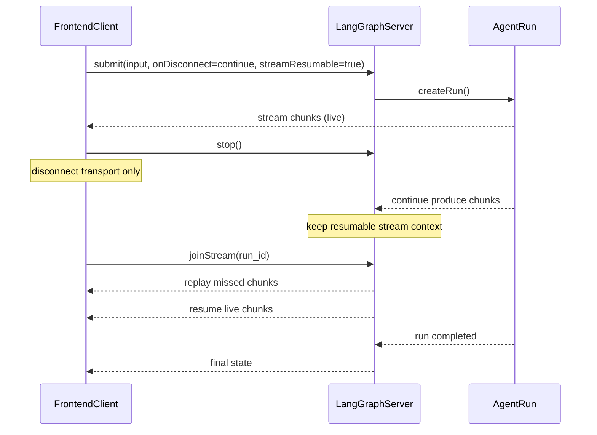
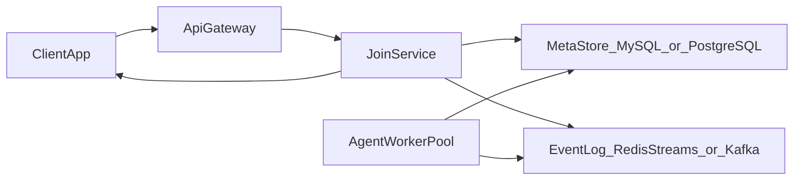
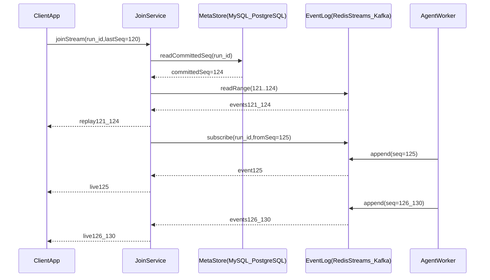

# LangChain 流中断和恢复（Join/Rejoin）底层原理

这篇只回答一个核心问题：  
**LangChain 为什么能“前端断开流”后，稍后再“接回同一条流”？**

一句话先记住：

-   `stream.stop()` 断的是**客户端连接**，不是服务端任务
-   只要提交时开启可恢复流，服务端会继续跑并保留可重连上下文
-   `stream.joinStream(runId)` 用同一个 `run_id` 把流重新接回来

---

## 1. 本文聚焦范围

本文只讲 `join/rejoin`：  
即“客户端断开流后，如何在不丢进度的前提下重新接回同一条流”。

---

## 2. 底层主线（提交 -> 断开 -> 持续执行 -> 重连）

### StepA：提交时声明“可断线继续 + 可重连”

提交消息时要带这两个选项：

-   `onDisconnect: "continue"`：客户端断开后，服务端不要取消 run
-   `streamResumable: true`：这条流可被后续 `joinStream` 重新挂载

> 只设置前者不设置后者，会出现“任务继续跑了，但你接不回这条流”的情况。

### StepB：断开时只关闭客户端消费

调用 `stream.stop()` 后：

-   前端不再接收新 chunk
-   `isLoading` 变为 `false`
-   服务端 run 继续执行（如果未完成）

本质是“消费者离线”，不是“生产者停机”。

### StepC：服务端继续产出并保存可重连上下文

在你离线期间，服务端会继续产出事件（token、message、state update）。  
可重连模式下，这些事件会保留在可恢复流上下文里，直到 run 结束或过期。

### StepD：重连时按 `run_id` 重新挂载

`joinStream(runId)` 的逻辑可以理解为：

1. 定位目标 run
2. 回放离线期间遗漏的事件
3. 切回实时推流

如果 run 已结束，通常会直接返回最终状态。

---

## 3. `run_id`、`thread_id` 到底什么关系

-   `run_id`：一次执行实例的标识（`joinStream` 直接使用它）
-   `thread_id`：会话线程标识（常用于历史、状态、checkpoint 维度）

在前端 join/rejoin 场景里，你最小闭环必须保住的是 `run_id`。  
在完整系统设计里，通常会同时保存 `thread_id`，用于失败时降级到“拉历史+重建界面”。

---

## 4. 语义边界：为什么 `stop()` 不等于 cancel

| 操作            | 影响对象   | 结果                   |
| --------------- | ---------- | ---------------------- |
| `stream.stop()` | 客户端连接 | 仅断开消费，run 可继续 |
| cancel 机制     | 服务端 run | 真正中止执行           |

如果你把 `stop()` 当成取消，会导致线上误判：  
用户以为“停了”，其实任务可能还在执行外部副作用（例如发请求、写库、调用工具）。

---

## 5. 前后端时序图（Join/Rejoin）



---

## 6. 你真正要记住的主线

`join/rejoin` 的关键价值是把“连接状态”和“任务执行状态”解耦：

1. 提交时声明可重连（`onDisconnect: "continue"` + `streamResumable: true`）
2. 断开时只停止客户端消费（`stream.stop()`）
3. 重连时按 `run_id` 回补离线增量并恢复实时流（`joinStream(run_id)`）

---

## 7. 最小可运行前端片段（TypeScript）

```ts
import { useState } from 'react';
import { useStream } from '@langchain/react';

export function JoinRejoinDemo() {
    const [savedRunId, setSavedRunId] = useState<string | null>(null);
    const [input, setInput] = useState('');

    const stream = useStream({
        apiUrl: 'http://localhost:2024',
        assistantId: 'join_rejoin',
        onCreated(run) {
            setSavedRunId(run.run_id);
            localStorage.setItem('activeRunId', run.run_id);
        },
    });

    const send = () => {
        const text = input.trim();
        if (!text) {
            return;
        }
        stream.submit(
            { messages: [{ type: 'human', content: text }] },
            {
                onDisconnect: 'continue',
                streamResumable: true,
            }
        );
        setInput('');
    };

    const rejoin = () => {
        const runId = savedRunId ?? localStorage.getItem('activeRunId');
        if (!runId) {
            return;
        }
        try {
            stream.joinStream(runId);
        } catch (error) {
            console.error('join stream failed', error);
            localStorage.removeItem('activeRunId');
            setSavedRunId(null);
        }
    };

    return {
        send,
        disconnect: () => stream.stop(),
        rejoin,
        isConnected: stream.isLoading,
        messages: stream.messages,
    };
}
```

---

## 8. 工程化最佳实践（避免线上问题）

-   始终持久化 `run_id`（内存 + `localStorage` 双写）
-   run 完成后清理 `run_id`，避免重连已结束 run
-   UI 明确展示连接状态（Connected / Disconnected）
-   重连超时要降级：拉线程历史而不是无限重试
-   对重放事件做幂等渲染（按消息 ID 去重）

---

## 9. 常见失败场景与处理建议

1. `run_id` 丢失

    - 现象：无法 `joinStream`
    - 处理：降级到 thread/history 拉取，提示用户“已恢复到最新快照”

2. run 已过期或服务重启

    - 现象：`joinStream` 报错
    - 处理：清理本地 `run_id`，重新发起一次任务或回放历史

3. 重复点击 Rejoin
    - 现象：多次并发重连导致 UI 闪动
    - 处理：加“重连中”状态锁，串行化重连动作

---

## 10. 30 秒复述模板

“Join/Rejoin 的底层不是把任务暂停，而是把客户端和服务端解耦。  
提交时声明 `onDisconnect: "continue"` 和 `streamResumable: true`，服务端在断线后继续执行并保留可恢复流。  
客户端回来后用同一个 `run_id` 调 `joinStream`，先补发离线增量，再恢复实时流。  
它解决的是传输恢复，不是任务取消。”

---

## 11. 快速自测

1. 为什么只配 `onDisconnect: "continue"` 还不够？
2. `stream.stop()` 与 cancel 的本质差异是什么？
3. `joinStream` 依赖的核心标识是什么？
4. 为什么说 join/rejoin 的本质是“连接恢复”，而不是“重新执行任务”？

---

## 12. 企业级生产方案（推荐基线）

如果是单机 demo，`run_id` 还能“碰巧”命中原进程。  
但在集群里，企业级方案的核心是：**不依赖原机器，依赖共享状态和可回放事件流**。

推荐基线：

-   接入层无状态：任意网关节点都可处理 `joinStream(run_id)`
-   元数据持久化（Store）：`run_id -> status / committedSeq / ttl / tenant`（`MySQL` 或 `PostgreSQL`，推荐 `PostgreSQL`）
-   事件日志可回放（Event）：每个 run 事件都带 `seq`（`Redis Streams` 或 `Kafka`）
-   重连双阶段：先补历史（catch-up），再跟增量（follow）
-   客户端幂等：按 `seq` 或 `eventId` 去重渲染

### 12.1 架构图（集群版）



---

## 13. 集群重连怎么保证不丢 125-130

关键不是“重连瞬间一次查库拿全”，而是“**补历史 + 订阅后续**”：

1. 客户端上报 `lastSeq`
2. 服务端读取当前 `committedSeq`
3. 回放 `(lastSeq, committedSeq]`
4. 立刻进入 follow 模式，订阅后续 `seq > committedSeq` 的新事件

这样即便 `125-130` 在重连时尚未提交，后续提交后也会实时推送到客户端。

### 13.1 时序图（catch-up + follow）



### 13.2 一致性最小规则

-   只暴露 `committedSeq` 以内事件，避免读到半写入数据
-   单 run 内 `seq` 单调递增，客户端按 `seq` 去重与重排
-   必须有终态事件（`completed/failed/cancelled`），避免“假完成”
-   重连失败要降级（拉最终状态/线程历史），不要无限重试

---

## 参考

-   LangChain 官方文档 Join & rejoin streams：<https://docs.langchain.com/oss/javascript/langchain/frontend/join-rejoin>
