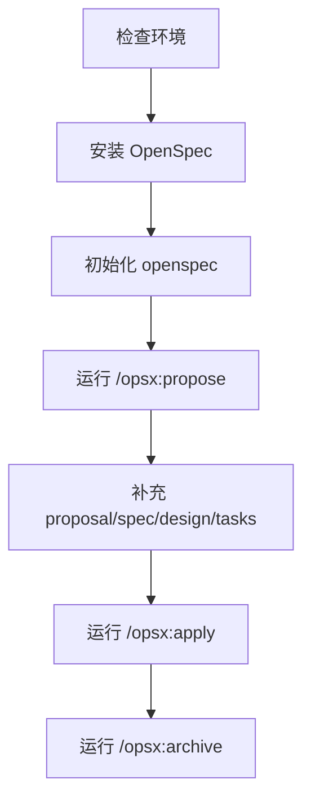
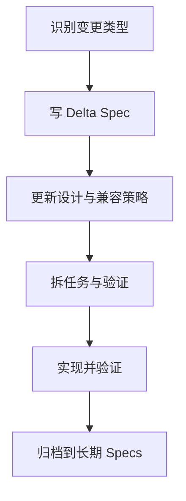

# OpenSpec 学习教程与实践案例（前端版）

## 1. OpenSpec 是什么

OpenSpec 是面向 AI 编码助手的规格驱动开发（Spec-Driven Development）框架。核心思想是：先把需求和验收标准写清楚，再让 AI 和人协作实现代码，避免“先写代码后补需求”的返工。

对前端项目来说，你可以把它理解成一套“可落地的需求工程化流程”：

-   `openspec/specs/`：当前系统行为真相源（长期维护）
-   `openspec/changes/<change-id>/`：某次变更的完整上下文（临时工作区）
-   `proposal.md`、`design.md`、`tasks.md`、`specs/*/spec.md`：从“为什么做”到“怎么做”的链路

---

## 2. 先掌握 5 个核心概念

### 2.1 Spec（规格）

Spec 描述“系统对外可观察行为”，而不是实现细节。  
典型写法是 Requirement + Scenario（Given/When/Then）。

示例（行为描述）：

-   Requirement：系统必须支持主题切换
-   Scenario：Given 用户已登录，When 用户点击主题切换按钮，Then 页面主题切换为暗色且刷新后仍保持

### 2.2 Change（变更）

一次需求迭代就是一个 Change。每个 Change 有独立目录，包含提案、设计、任务和 delta spec，便于并行开发和评审。

### 2.3 Artifact（工件）

OpenSpec 的核心工件通常是：

-   `proposal.md`：为什么做、做什么、不做什么
-   `design.md`：技术方案、边界、风险与回滚
-   `tasks.md`：可执行任务清单与验收方式
-   `specs/*/spec.md`：本次变更带来的行为增量（delta）

### 2.4 Delta Spec（增量规格）

Delta Spec 不是重写全部规格，而是明确本次变更“新增/修改/删除”了什么行为。这样评审时聚焦“变化”而非“全量文档”。

### 2.5 Scenario（场景）

Scenario 是可验证的验收条目。  
建议每个关键 Requirement 至少覆盖：

-   Happy Path（正常路径）
-   Error Path（异常路径）
-   Edge Case（边界场景）

---

## 3. 环境与最小启动

> 建议 Node.js >= 20.19.0

```bash
# 可选：使用淘宝镜像，避免安装不稳定
pnpm config set registry https://registry.npmmirror.com

# 全局安装 OpenSpec
pnpm add -g @fission-ai/openspec@latest

# 在你的项目根目录初始化
openspec init
```

初始化后关注两个目录：

```text
openspec/
├── specs/
└── changes/
```

常见工作流（核心命令）：

```text
/opsx:propose  ->  /opsx:apply  ->  /opsx:archive
```

---

## 4. 学习路径（建议 7 天）

### Day 1-2：概念与结构

-   熟悉 Spec / Change / Artifact / Delta Spec / Scenario
-   读懂一个现有 Change 的四类工件关系

### Day 3-4：命令与节奏

-   用 `/opsx:propose` 生成一次完整规划
-   用 `/opsx:apply` 将任务映射到代码
-   用 `/opsx:archive` 收口并沉淀到长期 specs

### Day 5-7：先做 1 个完整案例，再做迁移练习

-   主案例（完整）：暗色模式
-   迁移练习 1：SSE 中断与恢复
-   迁移练习 2：登录校验与持久化

## 4.1 实践前置流程（先看这个再做案例）

一句话结论：案例里的 `proposal.md`、`design.md`、`tasks.md`、`specs/*/spec.md` 都需要存在，但优先用 OpenSpec 自动生成骨架，不建议手工逐个创建。



### 4.1.1 你需要先执行的命令（终端）

在项目根目录执行：

```bash
cd /Users/chenyuanxin/Desktop/cache/front-end-self-study

# 1) 检查环境版本（建议 Node >= 20.19.0）
node -v
pnpm -v

# 2) 可选：切换淘宝镜像，提高安装稳定性
pnpm config set registry https://registry.npmmirror.com

# 3) 安装 OpenSpec CLI
pnpm add -g @fission-ai/openspec@latest
openspec --version

# 4) 初始化当前仓库
openspec init
```

执行完后，确认目录已生成：

```text
openspec/
├── specs/
└── changes/
```

### 4.1.2 这几个文件要不要自己创建？

-   默认不需要手工创建。
-   推荐在 Cursor 对话中执行 `/opsx:propose <change-id>`，让 OpenSpec 自动创建骨架文件。
-   然后你只需要按本文案例补充内容。

常见自动生成结果（以某个 `change-id` 为例）：

```text
openspec/changes/<change-id>/
├── proposal.md
├── design.md
├── tasks.md
└── specs/
    └── <domain>/
        └── spec.md
```

每个文件的作用（速查）：

-   `proposal.md`（变更提案）：说明为什么做、做什么、不做什么，核心是业务目标和边界对齐。
-   `specs/<domain>/spec.md`（行为契约）：定义本次变更对系统行为的影响（ADDED/MODIFIED/REMOVED），并用 Given/When/Then 写可验证场景。
-   `design.md`（技术设计）：描述如何实现，包括模块拆分、数据流、风险与回滚策略。
-   `tasks.md`（执行清单）：把设计拆成可执行任务，确保每一项都能映射到代码改动与验证动作。

速记版：

-   `proposal.md` = 业务对齐
-   `spec.md` = 行为契约
-   `design.md` = 技术方案
-   `tasks.md` = 落地计划

### 4.1.3 每个案例的最小执行顺序

> 注意：以下 `/opsx:*` 是在 Cursor 对话里输入，不是在终端执行。

1. 运行 `/opsx:propose add-dark-mode`（或其他 change id）。
2. 按文档补充 `proposal/spec/design/tasks`。
3. 运行 `/opsx:apply add-dark-mode` 落地任务。
4. 验证通过后运行 `/opsx:archive add-dark-mode` 归档。

### 4.1.4 三个案例对应的 change id

-   `add-dark-mode`
-   `chat-sse-interrupt-resume`
-   `harden-login-flow`

### 4.1.5 手动兜底（只有自动生成失败时才用）

如果某次没有自动生成，你再手动建目录和文件。  
例如暗色模式案例：

```bash
mkdir -p openspec/changes/add-dark-mode/specs/ui
touch openspec/changes/add-dark-mode/proposal.md
touch openspec/changes/add-dark-mode/design.md
touch openspec/changes/add-dark-mode/tasks.md
touch openspec/changes/add-dark-mode/specs/ui/spec.md
```

---

## 5. 实践案例 1：Vue 待办应用增加暗色模式

### 5.1 Change ID

`add-dark-mode`

### 5.2 proposal.md（示例）

```md
# Proposal: Add Dark Mode

## Intent

降低夜间使用视觉疲劳，提升可访问性体验。

## Scope

In Scope:

-   设置页新增主题切换开关（light/dark/system）
-   使用 CSS Variables 或 Tailwind dark 方案实现主题能力
-   本地持久化用户主题偏好

Out of Scope:

-   自定义主题色编辑器
-   按页面单独配置主题

## Success Criteria

-   用户切换后 100ms 内完成主题切换
-   刷新页面后主题保持一致
```

### 5.3 specs/ui/spec.md（delta 示例）

```md
# UI Spec Delta - add-dark-mode

## ADDED Requirements

### Requirement: Theme Switching

系统 MUST 提供 Light/Dark/System 三种主题模式切换能力。

#### Scenario: User switches to dark mode

-   GIVEN 用户在设置页打开主题菜单
-   WHEN 用户选择 dark
-   THEN 页面整体主题切换为暗色
-   AND 导航、卡片、输入框样式同步更新

### Requirement: Theme Persistence

系统 SHALL 在用户下次访问时恢复上次主题偏好。

#### Scenario: Restore saved preference

-   GIVEN 用户此前选择了 dark
-   WHEN 用户刷新页面
-   THEN 系统自动应用 dark 主题
```

### 5.4 design.md（示例）

```md
# Design: add-dark-mode

## Architecture

-   ThemeService：封装主题读取、写入、应用逻辑
-   ThemeController（可选）：桥接 UI 事件与 ThemeService
-   UI 层只关注事件派发和状态展示

## Data Flow

1. 页面初始化 -> ThemeService.loadPreference()
2. 用户切换主题 -> ThemeService.setMode(mode)
3. ThemeService 写入 localStorage 并更新根节点 class/data-theme

## Risks

-   第一次渲染闪烁（FOUC）
-   三方组件暗色样式不统一

## Mitigation

-   在应用启动早期注入主题
-   为三方组件补充样式适配层
```

### 5.5 tasks.md（示例）

```md
# Tasks: add-dark-mode

-   [ ] 新建 ThemeService，支持 get/set/apply
-   [ ] 设置页增加主题切换 UI
-   [ ] 页面启动时恢复并应用主题偏好
-   [ ] 补充单元测试：主题切换、持久化恢复
-   [ ] 补充手工验证清单（桌面端、移动端、深浅主题）
```

### 5.6 最小验证

```bash
pnpm test
pnpm dev
```

---

## 6. 迁移练习（可选）

上面的暗色模式案例已经完整覆盖了一个 OpenSpec change 的核心链路：`proposal -> spec delta -> design -> tasks -> 验证`。  
如果你要练第二个主题，直接复用同一模板即可，不需要再记新结构。

推荐迁移方向（只换业务内容，不换文档骨架）：

-   AI 聊天场景：`chat-sse-interrupt-resume`
-   登录鉴权场景：`harden-login-flow`

迁移时只做三件事：

1. 把 Change ID 改成新主题。
2. 把 Requirement/Scenario 改成新行为。
3. 把 tasks 改成对应模块的最小可执行清单。

---

## 7. 不只是新增：修改与删除功能怎么做

一句话结论：OpenSpec 天然支持“新增（ADDED）/修改（MODIFIED）/删除（REMOVED）”，你只需要在 delta spec 里明确变化类型，并补上迁移与回滚策略。



### 8.1 三种变更类型的判断标准

-   ADDED：新增能力，不影响旧行为。
-   MODIFIED：旧行为仍存在，但规则、参数或边界发生变化。
-   REMOVED：旧行为彻底下线，调用方需要迁移。

### 8.2 修改功能（MODIFIED）示例

场景：把“登录失败后文案统一提示”改为“按错误码展示精确提示”。

`specs/auth/spec.md` delta 可以这样写：

```md
## MODIFIED Requirements

### Requirement: Login Error Feedback

系统 MUST 根据后端错误码展示对应错误提示，而不是固定文案。

#### Scenario: Wrong password

-   GIVEN 用户输入了错误密码
-   WHEN 登录接口返回 AUTH_INVALID_CREDENTIALS
-   THEN 页面显示“账号或密码错误”
-   AND 保留用户已输入的邮箱字段
```

设计文档需要补两件事：

-   兼容策略：旧错误码是否继续支持一个版本周期。
-   回滚策略：若新错误映射异常，如何快速退回旧提示逻辑。

任务拆分建议：

-   [ ] 新旧错误映射并行一段时间（灰度开关）
-   [ ] 新增回归测试覆盖旧错误码
-   [ ] 埋点对比改造前后登录成功率与失败原因分布

### 8.3 删除功能（REMOVED）示例

场景：下线“用户名登录”，只保留“邮箱登录”。

`specs/auth/spec.md` delta 可以这样写：

```md
## REMOVED Requirements

### Requirement: Username Login

系统不再支持通过用户名进行登录。

#### Scenario: Username input removed

-   GIVEN 用户访问登录页
-   WHEN 页面加载完成
-   THEN 用户名输入框不再展示
-   AND 登录请求参数中不再包含 username 字段
```

删除类变更必须额外写清楚：

-   迁移通知：对前端调用方、文档、客服话术的影响。
-   数据迁移：是否需要把历史 username 映射到 email。
-   兼容窗口：旧接口保留多久，何时硬切。

任务拆分建议：

-   [ ] UI 删除用户名输入和校验逻辑
-   [ ] API 契约更新并通知依赖方
-   [ ] 增加“旧参数访问”监控告警
-   [ ] 兼容窗口结束后移除降级代码

### 8.4 修改/删除功能的命令顺序

> `/opsx:*` 在 Cursor 对话里执行；终端只做环境和测试命令。

```text
/opsx:propose <change-id>
/opsx:apply <change-id>
/opsx:archive <change-id>
```

建议 change id 命名：

-   修改类：`modify-xxx-behavior`
-   删除类：`remove-xxx-feature`

---

## 8. 一个可复用的 OpenSpec 学习模板

以后你每学一个新主题，都可以按这个模板执行：

1. 明确业务目标（Intent）和边界（Scope）。
2. 先写 `specs/*/spec.md` 的 Requirement + Scenario。
3. 再写 `design.md`，只解释“如何实现”和“风险控制”。
4. 把设计拆成 `tasks.md` 的可执行清单。
5. 实现时保持任务与代码提交一一对应。
6. 完成后 archive，把变更沉淀到长期 specs。

---

## 9. 常见坑与规避

-   只写实现细节，不写可观察行为：评审难以判断是否“满足需求”。
-   没有 Scenario：需求不可测试，AI 生成代码容易偏航。
-   tasks 过大：一条任务跨多个模块，验收困难。
-   直接改代码不更新 spec：长期会导致文档和代码背离。

---

## 10. 进阶建议（面向真实项目）

-   在 `openspec/config.yaml` 注入项目约束（技术栈、测试框架、接口规范）。
-   每个 Change 必须包含回滚方案和风险清单。
-   将 Scenario 映射到自动化测试（Vitest/Playwright）形成闭环。
-   把“需求评审”升级为“spec 评审”，再进入编码阶段。

如果你愿意，我下一步可以直接基于你仓库里的一个真实前端模块，帮你创建第一个 OpenSpec change（包含完整 proposal/spec/design/tasks 初稿）。
