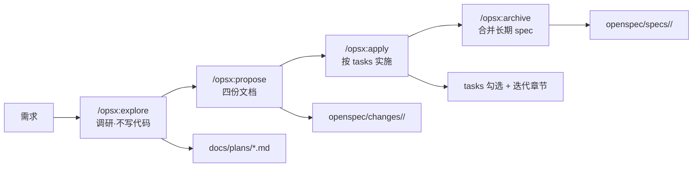

# OpenSpec 与 Spec-Driven 协作：学习笔记

> **一句话**：用 OpenSpec 把「改什么、为什么、怎么验收」在写代码前结构化落盘，降低与 AI 协作时的意图漂移与决策丢失。  
> 本文整理自真实多端 Monorepo 中的实践

---

## 1. 适用背景（匿名化）

**典型仓库形态**：多个宿主 App 内嵌 H5 + 小程序（或独立 H5）共存的 **pnpm workspaces + Turborepo** 类 Monorepo。

- **技术栈示例**：React、构建工具（如 Vite / Rspack 系）、轻量状态管理（如 Zustand）。
- **目录习惯**：`apps/<各端或各宿主壳>` + `packages/<pages, components, ui, platform, apis, stores, ...>`。
- **协作形态**：少量人类开发者 + **Claude Code**（或同类 AI 编码助手）日常结对实现。

**常见痛点**（与是否用 AI 无关，AI 会放大这些问题）：

1. **意图漂移**：从「迁移某页」滑向「顺手重构标题栏」，PR 膨胀、评审成本陡增。
2. **决策遗忘**：会话被压缩或清空后，「为何选 A 弃 B」的依据消失，下次重复踩坑。
3. **任务漏项**：手测与回归点散落在对话里，缺少清单则易漏。

**对策**：引入 [OpenSpec](https://github.com/Fission-AI/OpenSpec)，把一次成体系的改动建模为 **change**，用固定 markdown 产物承载契约与记忆。

---

## 2. OpenSpec 是什么

| 产物 | 作用 |
|------|------|
| `proposal.md` | Why / What Changes / Capabilities / Impact——对齐动机与范围 |
| `design.md` | Context、Goals / **Non-Goals**、Decisions、Risks——对齐做法与取舍 |
| `tasks.md` | 可勾选步骤 + 手测项 |
| `specs/<capability>/spec.md` | Requirements + Scenarios（Given-When-Then），归档后并入项目长期 spec |

归档（如 `/opsx:archive`）时：将 change 目录移入 `openspec/changes/archive/YYYY-MM-DD-<name>/`，并把 `ADDED` / `MODIFIED` 的 Requirements **合并**到 `openspec/specs/<capability>/spec.md`，形成**项目级长期记忆**。

---

## 3. 推荐工程纪律（写入 `CLAUDE.md` 等）

```markdown
## 研发流程

**任何代码改动前，必须存在对应的 OpenSpec change 提案。**

1. 提案：通过 `/opsx:propose` 描述要做什么，生成 proposal + tasks
2. 实现：通过 `/opsx:apply` 按任务逐步实施
3. 归档：完成后通过 `/opsx:archive` 归档

禁止：
- 未建提案直接写代码
- 任务未完成就标记为完成
- 在 `/opsx:explore` 模式下执行任何代码改动（explore 只做分析，不写代码）
```

**价值**：把「必须先有 change」写进助手入口指令后，助手会先推动立项，而不是默认直奔改代码。

---

## 4. 四阶段生命周期



| 阶段 | 要点 |
|------|------|
| **explore** | 搜调用链、读设计稿/适配层、列**已验证假设（附文件:行号）**与**待确认问题**；产出可放 `docs/plans/<change>.md` |
| **propose** | 落 `proposal` / `design` / `tasks` / `specs/*/spec.md`；**Non-goals** 与 **Alternatives** 必填 |
| **apply** | 严格按 `tasks.md`；方案错了先改文档再继续，忌「绕过文档直接改代码」 |
| **archive** | 移动目录 + 合并 spec，供后续会话快速恢复上下文 |

**explore 阶段表格示例**（教学用虚构路径）：

| 假设 | 验证 |
|------|------|
| 首页入口为 `IndexPage` | `apps/host-a/src/entry.tsx:10-20` |
| 详情页分享走宿主 `setTitleBar` | `packages/pages/.../Detail.tsx:100-120` |

作用：人类可在几分钟内判断助手是否**真读懂现状**，而非空想方案。

---

## 5. 综合案例（虚构名称，保留方法）

**场景**：某宿主内嵌 H5 **首页**的 **标题栏 + 搜索区** 按新设计改造（Logo 尺寸、分享入口、城市入口位置、与系统返回键避让等）。

### 5.1 explore

1. **grep**：发现标题栏/搜索条被多 Tab 或多页面复用 → 改动需 **prop 门控** 或拆分组件，避免隐性回归。
2. **设计稿**：若设计基准宽度与项目 rem/px 基准不一致，在 plan 里写明**换算系数**，避免视觉对不齐。
3. **平台适配**：确认各宿主对 `setTitleBar`、分享等 API 的实现差异；未实现端可 **静默降级** 并在 design 中写明。
4. **澄清清单**（写代码前闭环）：Logo 明暗资源、搜索框图标去留、某布局态下城市入口缺失是否可接受、分享卡片图占位策略等。

产出：一份给人读的 `docs/plans/<change-name>.md`（篇幅随复杂度变化）。

### 5.2 propose（摘录结构）

- **What Changes**：按 package 列改动面，并写清「**刻意不碰**」的模块（例如不直接改共享的 `TitleBarHome` 本体）。
- **design.md 的 Decision 模板**（保留「理由 + Alternatives」）：

```markdown
### 决策：复用通用 TitleBar 还是扩展现有首页专用条

**选择**：（示例）在通用 TitleBar 上增加可插槽区域承载首页 Logo

**理由**：
- 宿主 padding、分享 actions、状态栏主题等已在 TitleBar 收敛
- 不改共享的首页专用壳组件 → 其他 Tab 视觉零扰动

**Alternatives 考虑过**：
- 在专用壳内部包一层 TitleBar：可能改变其他 Tab，超范围
- 在 TitleBar 增加业务强耦合的 logoSrc：底层 UI 不宜绑业务名
- leftContent vs children：语义相近时优先符合团队 React 习惯的一种
```

- **spec.md**：用 `### Requirement: ... SHALL ...` + `#### Scenario: WHEN / THEN`，写到**可测、可定位**（组件名、大致路径、关键像素或 token），避免「用户可以点击按钮」式空话。

### 5.3 apply 与多轮迭代（纪律比细节重要）

- **第一轮反馈**：发现「在底层 TitleBar 上塞业务」耦合过重 → **回滚文档与实现**，抽出 `HomeTitleBar` 等业务组件；静态资源若属某宿主品牌，放到对应 `apps/<host>/` 并由页面 **props 注入**。
- **第二轮反馈**：主题资源用反、设计高度不足等 → 在 **tasks 新增章节**记录修改点（常量、样式防御性处理等）。
- **原则**：迭代用 **追加章节**，少覆盖历史 checkbox 叙述，便于日后「为何走到当前实现」考古。

### 5.4 archive

将 change 移入 `openspec/changes/archive/YYYY-MM-DD-<name>/`，并把 capability spec 合并进 `openspec/specs/...`，后续改同一能力时优先读项目级 spec。

---

## 6. 规模与篇幅（量级参考，非某仓库统计）

经验上（随团队与模块复杂度波动）：

- 单个 change 建议控制在 **约 1～3 天** 可交付；过大则拆分为 `feature-a`、`feature-a-v2` 等连续 change。
- 文档篇幅常见量级：**proposal** 数十行；**design** 可达百余行；**tasks** 数十行量级；**spec** 随验收条目增减。

项目级 capability 数量会随业务域增长；命名宜 **稳定、可检索**（如 `host-adapter`、`home-page-titlebar`），避免过于口语化。

---

## 7. 收益与注意点

### 收益

1. **Non-goals** 抑制「顺手重构」类范围蔓延。
2. **Decisions + Alternatives** 比单行 commit message 更适合长期复盘。
3. **tasks 手测章节** 强迫写出跨页面/跨 Tab 回归面。
4. **反馈章节追加** 保留决策链。
5. **合并后的 specs** 在会话重置后仍能快速恢复「当前契约」。

### 注意点

1. **explore 不写代码** 需写进助手规则，否则易「分析着分析着就改上了」。
2. **手测项** 应由人类实测后再勾选；规则中明确禁止虚报完成。
3. **spec 要具体**：组件、路径、API、可度量表现。
4. **change 粒度**：宁可多拆几个 change，避免单 PR 不可审。
5. **plan 与 proposal**：`docs/plans` 可作人类评审用的草稿，方向确认后再 `propose`，减少返工。

---

## 8. 最小落地步骤

1. 项目根执行 `npx openspec init`，得到 `openspec/{changes,specs,config.yaml}`。
2. 在 Claude Code（或你的环境）配置 **opsx** 类 skill：`explore` / `propose` / `apply` / `archive`（以你实际安装的命令名为准）。
3. 在 **`CLAUDE.md`（或 AGENTS.md）** 写入第三节的纪律条文。
4. 用 **1 小时内可完成** 的小需求走通全流程，形成肌肉记忆。

---

## 9. 结语

OpenSpec 的价值不在于「多填表」，而在于把对话里易失真的 **决策、边界、回归面、备选方案** 固化为仓库内资产，使人机协作从「一次性会话」变成 **可追溯、可继承** 的工程习惯。
