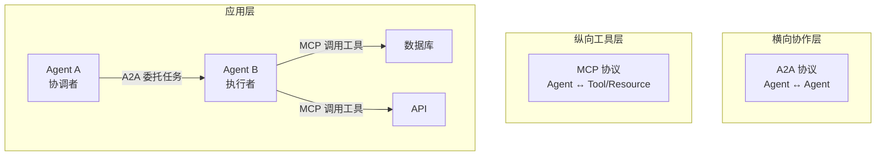
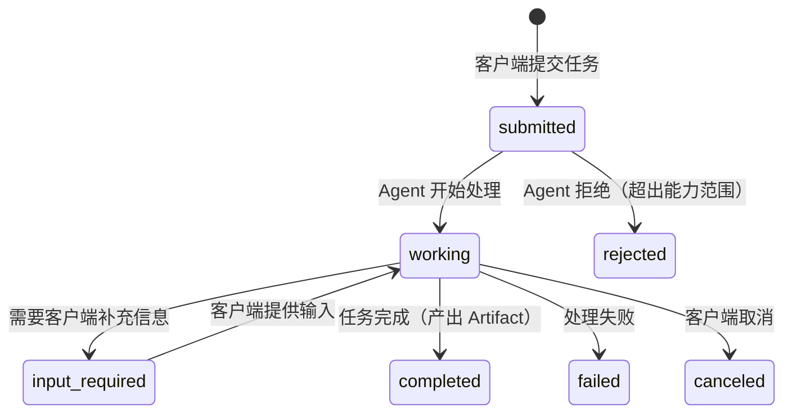
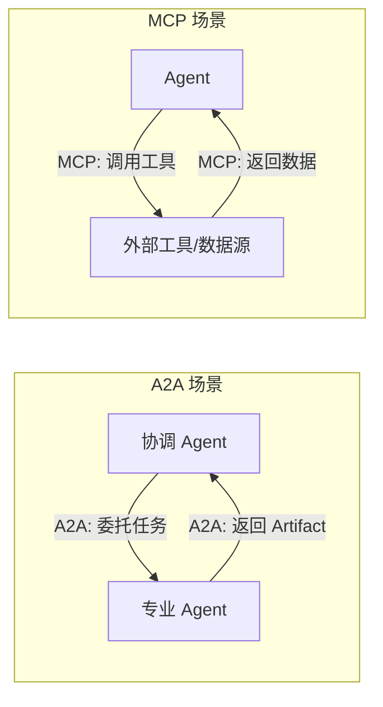
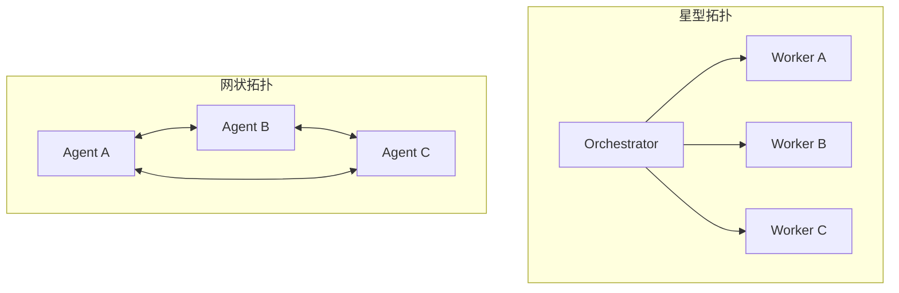

## A2A（Agent-to-Agent）协议

### 一句话总结

**A2A 是 Google 推出的开放协议，解决不同框架、不同厂商构建的 AI Agent 之间如何互相发现、通信和协作的问题。** 它让 Agent 不再是孤岛——一个 Agent 可以把任务委托给另一个 Agent，并追踪任务状态、获取结果产物。

### A2A 在 AI 协议栈中的位置



> **A2A 负责"谁来做"**——Agent 之间怎么分工协作；**MCP 负责"用什么做"**——Agent 怎么调用外部工具和数据。

### 核心机制

#### 1. Agent Card —— 能力名片

每个 A2A Agent 在 `/.well-known/agent.json` 发布一张 JSON 名片，描述自己是谁、能做什么、怎么连接。

```json
{
  "name": "Code Review Agent",
  "description": "Reviews pull requests for security vulnerabilities and code smells",
  "url": "https://code-review.example.com",
  "endpoint": "https://code-review.example.com/a2a",
  "capabilities": {
    "streaming": true,
    "pushNotifications": true
  },
  "skills": [
    { "id": "security_review", "name": "安全审查" },
    { "id": "code_smell", "name": "代码坏味检测" }
  ],
  "authentication": {
    "schemes": ["bearer", "oauth2"]
  }
}
```

| 字段 | 作用 |
|------|------|
| `name` / `description` | 身份标识，让调用方知道"这是谁" |
| `endpoint` | 通信地址 |
| `capabilities` | 支持的交互方式（streaming、push 通知等） |
| `skills` | 具体能执行的任务类型 |
| `authentication` | 认证方式（Bearer / OAuth2 / API Key） |

**作用**：调用方在发任务之前，可以先读 Agent Card 判断这个 Agent 能不能干这个活，实现**零配置动态发现**。

#### 2. Task —— 任务状态机

Task 是 A2A 的核心工作单元，每个任务有唯一 ID 和完整生命周期：



> **Task ≠ HTTP 请求**。Task 是有状态的、可以持续几分钟甚至几小时的协作单元。客户端可以随时查询进度、取消任务、或通过 SSE 实时接收状态更新。

#### 3. 四种通信模式

| 模式 | 方式 | 适用场景 | 示例 |
|------|------|---------|------|
| **同步请求-响应** | `message/send` | 短任务，立即返回结果 | "帮我翻译这段文字" |
| **流式** | `message/stream`（SSE） | 需要实时反馈的长任务 | "帮我生成一篇报告，我要看进度" |
| **异步推送** | `tasks/pushNotification/set` | 客户端无法保持连接 | "审完代码后发 Webhook 通知我" |
| **轮询** | `tasks/get` | 客户端不支持 SSE/Webhook | 定时查询任务状态 |

### A2A vs MCP：面试必考对比



| 维度 | A2A | MCP |
|------|-----|-----|
| **解决什么** | Agent ↔ Agent 协作 | Agent ↔ Tool/Resource 连接 |
| **发起方** | Google（2025.4） | Anthropic（2024.11） |
| **类比** | 公司部门之间的协作流程 | 员工使用的工具箱 |
| **通信内容** | 自然语言任务 + 结构化产物 | 函数调用 + 结构化数据 |
| **决策权** | 远端 Agent 自主决定怎么做 | 调用方 Agent 决定调用什么 |
| **状态管理** | 有状态（Task 生命周期） | 无状态（每次调用独立） |
| **传输协议** | JSON-RPC 2.0 + SSE / gRPC | JSON-RPC / Streamable HTTP |

> **一句话区分**：MCP 让你能**调工具**，A2A 让你能**分任务**。它们是互补关系，不是竞品。在真实系统中，协调 Agent 通过 A2A 把任务分给专业 Agent，专业 Agent 再通过 MCP 调工具完成具体工作。

### 常考面试题

#### Q1: A2A 和普通微服务调用有什么本质区别？

| 维度 | 微服务调用 | A2A |
|------|-----------|-----|
| **对端性质** | 确定性的函数/服务 | 自治的 AI Agent |
| **接口** | 固定 API 契约（入参/出参） | Agent Card 动态发现能力 |
| **调用语义** | 请求-响应 | 任务提交-状态追踪-产物获取 |
| **状态** | 通常无状态 | Task 有完整生命周期 |
| **交互** | 同步为主 | 同步/流式/异步推送/轮询 四种模式 |
| **中间状态** | 不暴露 | `input-required`（需要补充信息）、`working`（处理中） |

> **核心差异**：微服务调一个确定性的函数，A2A 委托一个能自主决策的 Agent。

#### Q2: 什么场景适合用 A2A？什么场景没必要？

**适合用 A2A**：
- 跨组织、跨厂商的 Agent 协作（如 Google Workspace Agent + Microsoft Copilot）
- 需要动态发现 Agent 能力的开放生态
- 长耗时任务需要异步追踪状态和产物
- 多框架 Agent 互操作（一个 LangChain Agent + 一个 ADK Agent）

**没必要用 A2A**：
- 单团队、单 runtime 的内部调用 → 直接函数调用即可
- 短、同步、确定性操作 → Tool Calling 更简单
- Agent 之间共享内存的紧密协作 → 不需要网络协议

#### Q3: A2A 的 Task 为什么要设计成有状态的？

因为 Agent 协作的核心不是"发一条消息"，而是**完成一件工作**。一件工作可能是：

- 花 30 秒搜索 + 5 分钟生成报告（需要进度反馈）
- 执行到一半需要人类确认（`input-required` 状态）
- 被取消后需要清理资源（`canceled` 状态）

这些都需要状态机来建模。HTTP 请求-响应模式无法表达"正在做、需要你补充信息、做完了这是产物"这些协作语义。

#### Q4: Orchestrator-Worker 模式和纯 A2A 网状拓扑怎么选？



| 维度 | 星型（Orchestrator） | 网状（纯 A2A） |
|------|---------------------|----------------|
| **适用场景** | 树形任务拆分、统一调度 | 动态多边协作 |
| **容错** | Orchestrator 统一处理 | 各方自主协商 |
| **全局视图** | 有（调度者知道全局） | 无（每个 Agent 只知道邻居） |
| **复杂度** | 低 | 高 |

> **实际系统通常是嵌套使用**：外层用 Orchestrator 做任务拆分和全局调度，执行层的 Agent 之间用 A2A 做点对点协作。

#### Q5: 企业级 A2A 落地有哪些关键挑战？

1. **身份与信任**：怎么验证对端 Agent 真的是它声称的那个？→ A2A 支持 OpenAPI 认证方案 + 短效 Token + v0.3 签名安全卡片
2. **数据最小化**：Agent 之间传什么数据？怎么避免泄露？→ 只传任务描述和必要上下文，不暴露内部记忆
3. **全链路追踪**：跨 Agent 调用链怎么排查问题？→ A2A 内置 Trace ID + OpenTelemetry 集成
4. **失败补偿**：一个 Agent 失败了，整个链怎么回滚？→ 需要业务层设计 Saga 或补偿事务

#### Q6: Artifact 和普通附件有什么区别？

Artifact 不是"附件"，而是**Agent 协作中持续演化的产出物抽象**：

- **版本化**：一个 Task 可以产出多个版本的 Artifact（草稿 → 终稿）
- **结构化**：每个 Artifact 包含 MIME 类型 + 元数据，不只是文件
- **可流式更新**：通过 SSE 实时推送 Artifact 的增量更新
- **协作用途**：下游 Agent 可以直接引用上游 Agent 的 Artifact 继续工作

### 答题模板（30 秒精简版）

> "A2A 解决的是 Agent 与 Agent 的协作问题。它把 Agent 看成有身份、有能力名片、有任务状态、有产出物的完整实体。核心机制包括 Agent Card 做能力发现、Task 状态机做异步长任务管理、Artifact 管理工作产物。它与 MCP 互补——MCP 向下接工具能力，A2A 横向协作 Agent。A2A 适合多 Agent、跨团队、跨组织和开放生态的协作场景。"
