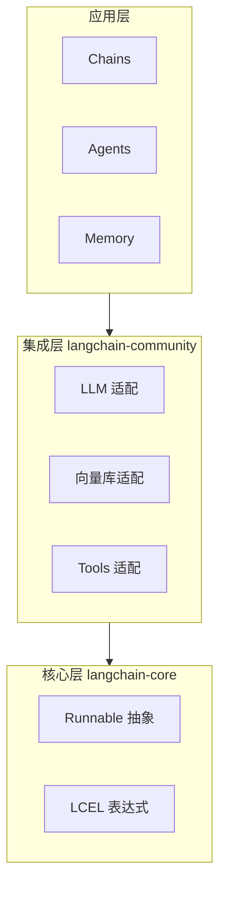
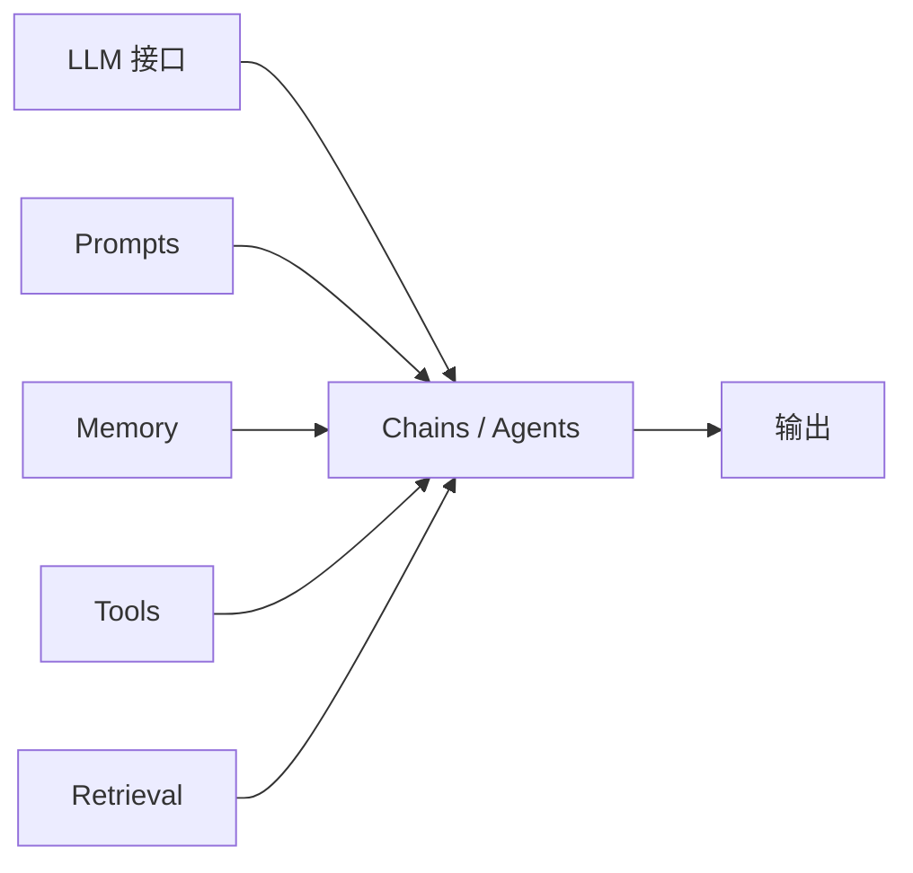
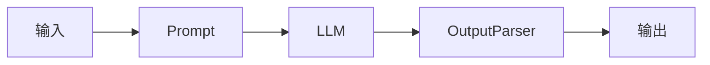
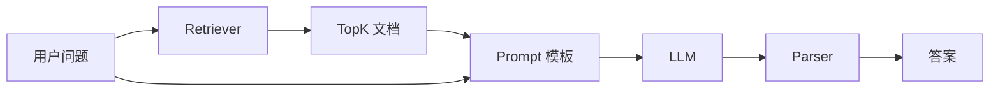
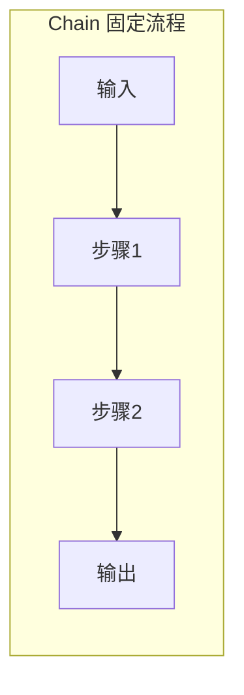
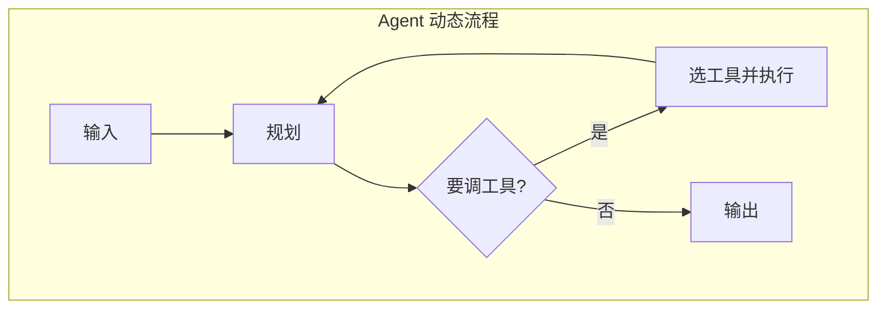
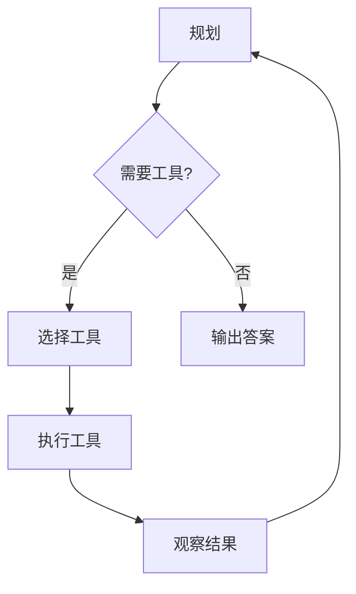

# LangChain 理解与原理

## 1. 一句话结论

- **LangChain 是什么**：面向 LLM 的应用编排框架，把「调用 LLM、检索、记忆、工具」等能力抽象成可组合单元，用声明式链式调用（LCEL）串联。
- **解决什么问题**：统一多模型/多工具接口，降低 RAG、Agent 的编排与流式/批处理代码量。

---

## 2. 整体架构

分层模块化：核心层定义抽象与表达式，集成层对接外部服务，应用层提供 Chain/Agent/Memory 等成品能力。



**模块划分**（与 RAG 服务端可对应）：



---

## 3. Runnable 与 LCEL（核心原理）

所有可执行单元（Prompt、LLM、解析器、工具）都是 **Runnable**；用 `|` 管道组合成链，自动支持 invoke/stream/batch/astream。

**数据流**：



**最小示例（LCEL 链）**：

```typescript
import { ChatOpenAI } from "@langchain/openai";
import { PromptTemplate } from "@langchain/core/prompts";
import { StringOutputParser } from "@langchain/core/output_parsers";

const prompt = PromptTemplate.fromTemplate("用一句话回答：{question}");
const llm = new ChatOpenAI({ model: "gpt-4o-mini" });
const parser = new StringOutputParser();

const chain = prompt.pipe(llm).pipe(parser);

const answer = await chain.invoke({ question: "什么是 LCEL？" });
console.log(answer);

for await (const chunk of await chain.stream({ question: "什么是 LCEL？" })) {
  process.stdout.write(chunk);
}
```

**调用方式**：

| 方法 | 说明 |
|------|------|
| `invoke(input)` | 单次同步调用 |
| `stream(input)` | 同步流式，逐 chunk 返回 |
| `batch(inputs)` | 批量调用 |
| `astream(input)` | 异步流式 |

---

## 4. Chains（链）

Chain 即多步骤工作流；LCEL 之前常用 SequentialChain/LLMChain，现在用 `|` 组合即可。常见链：LLMChain、RetrievalQAChain、ConversationChain。

**RetrievalQA 链与 RAG 对应**（检索 → 拼 Prompt → LLM → 解析）：



**示例（检索链思路）**：

```typescript
const retriever = vectorStore.asRetriever(3);
const chain = RunnableSequence.from([
  (input: { question: string }) => retriever.invoke(input.question),
  (docs) => ({
    context: docs.map((d) => d.pageContent).join("\n"),
    question: docs[0]?.metadata?.question ?? "",
  }),
  prompt.pipe(llm).pipe(parser),
]);
const result = await chain.invoke({ question: "年假怎么申请？" });
```

---

## 4.5 Chains 与 Agents：差异与拼装

### 差异（一句话 + 表格 + 图）

- **Chain**：步骤和顺序在写代码时就定死，每次请求都走同一条流水线（例如：检索 → 拼 Prompt → LLM → 解析）。
- **Agent**：步骤由模型根据当前输入**动态决定**，可能多次「规划 → 选工具 → 执行 → 再规划」再给出答案。

| 维度 | Chain | Agent |
|------|--------|--------|
| 步骤谁定 | 开发者写死 | 模型按输入决定 |
| 是否调工具 | 一般不直接调，或只在固定环节调 | 按需选工具、可多轮调用 |
| 执行形状 | 直线/固定 DAG | 带循环的 DAG（ReAct） |
| 典型场景 | RAG 问答、固定格式生成、标准化流程 | 需查天气/算数/搜网页等多步决策 |

**流程对比**：





### 能否拼装？

**可以。** Chain 和 Agent 在 LangChain 里都是 **Runnable**，同一套 `pipe`/`invoke`/`stream`，因此可以互相嵌套、组合。

常见拼装方式：

1. **Agent 的某个 Tool 内部是一条 Chain**  
   例如：工具「查知识库」内部 = 检索 + 拼 Prompt + LLM，对外只暴露一个 Tool 接口，Agent 在需要时调用。
2. **Chain 里某一「步」是一个 Agent**  
   例如：先跑一条检索链拿到文档，再把「文档 + 用户问题」交给 Agent，由 Agent 决定是否再调其他工具、最后生成答案。

**拼装示例（思路）**：

```typescript
// 方式 1：Agent 的工具 = 一条 RAG Chain
const ragTool = {
  name: "search_knowledge_base",
  description: "在内部知识库中检索并返回相关片段",
  func: async (query: string) => {
    const chain = prompt.pipe(llm).pipe(parser);
    const docs = await retriever.invoke(query);
    return await chain.invoke({ context: docs, question: query });
  },
};
const agent = createReactAgent({ llm, tools: [ragTool, calculatorTool] });

// 方式 2：Chain 中一步是 Agent（先检索，再交给 Agent 决策）
const retrievalStep = (input: { q: string }) => retriever.invoke(input.q);
const agentStep = (input: { docs: Doc[]; q: string }) =>
  agent.invoke({ context: input.docs, question: input.q });
const pipeline = retrievalStep.pipe(agentStep);
```

结论：Chain 负责「固定流程」，Agent 负责「何时用、用哪个工具」；两者可以互为子步骤，按业务拆成「链+智能体」组合。

---

## 5. Agents（智能体）原理

Agent = **规划 → 执行（调工具）→ 反思** 的循环；由 LangGraph 等做 DAG 调度与 ReAct。与 Chain 的对比与拼装方式见上一节 [4.5 Chains 与 Agents：差异与拼装](#45-chains-与-agents差异与拼装)。

**三阶段流程**：



**Agent + Tools 关系（伪代码）**：

```typescript
const tools = [new Calculator(), new SearchAPI()];
const agent = createReactAgent({ llm, tools });
const result = await agent.invoke({
  input: "北京今天气温多少度？再换算成华氏度",
});
```

工具注册：实现 `Tool` 接口（name、description、func），Agent 根据 description 与当前输入决定是否调用。

---

## 6. 与前端 / 面试的关联

- 前端通过**后端封装** LangChain 链/Agent，调用 RAG 或智能体（API 或 SSE 流式）；Node BFF 可用 `@langchain/langchainjs` 实现链并暴露 REST/SSE。
- 与 [前端能利用rag做什么](前端能利用rag做什么.md) 对应：RAG 服务端里的「检索 + 拼 Prompt + 调 LLM」可用 LangChain 的 RetrievalQA 链或自定义 LCEL 实现。

---

## 7. 生态与包划分

| 包 | 用途 |
|----|------|
| `langchain-core` | 核心 Runnable 接口、LCEL、基础抽象 |
| `langchain` | 高级 Chain/Agent/Memory 等组件 |
| `langchain-community` | 第三方 LLM、向量库、工具集成 |
| `langgraph` | 有状态工作流、DAG 调度、多步 Agent |
| `langserve` | 将 Runnable 部署为 REST API |
| `langsmith` | 可观测、追踪、评估与调试 |

面试可答：LangChain 已拆成多包，核心在 `langchain-core` 的 Runnable/LCEL，应用层用 `langchain`/`langgraph`，部署与观测用 `langserve`/`langsmith`。
