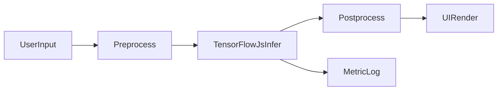

# TensorFlow.js 应用经验

## 一句话定位

TensorFlow.js 是在浏览器和 Node.js 跑机器学习模型的 JavaScript 库，适合低延迟、隐私敏感、离线可用的前端智能场景。

## 什么时候优先前端本地推理

- 结论：当你追求实时反馈、弱网可用、减少服务端成本时，优先本地推理。
- 不建议：模型很大、设备很弱、结果强依赖服务端知识库时，优先后端推理。

## 端上推理主流程（必须会讲）



最小话术：输入先做预处理，模型推理后做后处理，再渲染 UI，同时打点耗时和成功率。

## 面试高频场景（可直接举例）

- 图像分类：拍照后识别商品/物体大类，返回 Top-K 结果。
- 姿态识别：健身动作计数、姿态纠正提醒。
- 文本分类：投诉/工单意图分类，前端先分流再调用后端。
- 摄像头实时识别：边采集边推理，用于交互特效或轻量安防提示。

## 实战示例 1：图片分类（最小可讲链路）

结论：先把单张图跑通，再做批量和缓存优化。

```ts
import * as tf from '@tensorflow/tfjs';

class ImageClassifierService {
  private model: tf.GraphModel | null = null;

  async init(modelUrl: string): Promise<void> {
    // === 阶段 1：加载模型 ===
    // tf.loadGraphModel 从 URL 加载序列化后的 TF 模型（.json + .bin）
    // modelUrl 可以是本地路径或 CDN 地址，TF.js 会自动缓存到 IndexedDB
    this.model = await tf.loadGraphModel(modelUrl);

    // === 阶段 2：预热（warmup） ===
    // 首次推理时 WebGL 着色器编译 + 纹理初始化会产生明显耗时（可达数百毫秒）
    // 预热用一张全零张量走一遍推理流程，把这些固定成本提前消化
    // 预热结果被丢弃（不参与业务），只触发后端的初始化逻辑
    const warmup = tf.zeros([1, 224, 224, 3]); // [batch=1, height=224, width=224, channel=RGB]
    this.model.predict(warmup) as tf.Tensor;
    warmup.dispose(); // 释放预热张量，避免显存 / 内存泄漏
  }

  async infer(input: HTMLImageElement): Promise<number[]> {
    if (!this.model) throw new Error('Model not initialized');

    // === tf.tidy：自动清理中间张量，防止内存泄漏 ===
    // infer 执行完毕后，tidy 内部创建的所有临时张量会被自动释放
    // 这是 TF.js 中最重要的内存安全模式，必须与 async 推理配合使用
    const logits = tf.tidy(() => {
      // === 步骤 1：图片 -> 原始张量 ===
      // tf.browser.fromPixels 从  / <canvas> / Video 读取像素，默认为 RGBA uint8
      const raw = tf.browser.fromPixels(input);

      // === 步骤 2：缩放到模型输入尺寸 ===
      // 模型期望 224x224，过大或过小都会导致推理错误或异常慢
      // resizeBilinear 比 nearest 插值质量高、比 bicubic 速度快
      const resized = raw.resizeBilinear([224, 224]);

      // === 步骤 3：归一化到 [0, 1] ===
      // 像素值原本是 [0, 255]，除以 255 后方便模型处理
      // .toFloat() 先把 uint8 转为 float32，避免后续除法产生精度问题
      const normalized = resized.toFloat().div(255);

      // === 步骤 4：加 batch 维度 ===
      // 模型输入形状是 [batch, height, width, channel]
      // expandDims(0) 在最前面插入 batch=1
      const batched = normalized.expandDims(0);

      raw.dispose();  // 中间张量在 tidy 外手动释放，减少托管数量
      resized.dispose();
      normalized.dispose();

      // === 步骤 5：推理 ===
      // predict 返回原始 logits（未 softmax），形状为 [1, numClasses]
      return this.model!.predict(batched) as tf.Tensor;
    });

    // === 步骤 6：读取结果并清理 ===
    // logits.data() 是异步的，会把 GPU 数据拷贝回 CPU
    // Array.from 把 TypedArray 转成普通数组，方便后续业务处理
    const result = Array.from(await logits.data());
    logits.dispose(); // 用完显式释放，表明我们已经不再需要该张量
    // 返回模型输出的原始分数（未经 softmax），业务层可自行处理 Top-K
    return result;
  }
}
```

可讲重点：

- `tf.tidy`：自动释放推理过程中创建的临时张量，防止显存泄漏，整个推理链路都包在 tidy 里。
- `tensor.dispose()`：对 tidy 外部仍持有的张量（如 logits）手动释放，两者配合实现零泄漏。
- `warmup`：把 WebGL 着色器编译成本摊到页面加载期，而不是用户第一次点击时。
- `div(255)`：像素值从 [0,255] 归一化到 [0,1]，与训练时的预处理保持一致。

## 实战示例 2：摄像头实时推理（稳定帧率）

结论：不要每一帧都推理，要做节流和背压。

```ts
class FrameScheduler {
  // 推理进行中的标记，防止上一次还没完成就发起下一次
  private isBusy = false;
  // 两次推理之间的最小间隔（毫秒）
  // 设为 80ms 即最多约 12 FPS，完全能满足"流畅感"同时大幅降低 CPU/GPU 负载
  // 对姿态识别等场景，8~10 FPS 已足够
  private readonly minInterval = 80;
  private lastRun = 0;

  /**
   * 调度一次推理任务
   * @param task 异步推理函数（通常是 ImageClassifierService.infer）
   */
  async run(task: () => Promise<void>): Promise<void> {
    const now = performance.now(); // 精确计时，不受系统休眠影响

    // === 守卫条件：跳过不需要推理的帧 ===
    // isBusy=true  → 上一次推理还没结束（防止并发积压）
    // now - lastRun < minInterval → 距离上次推理时间太短，跳过
    if (this.isBusy || now - this.lastRun < this.minInterval) return;

    // 标记为忙碌，防止本轮期间再次触发
    this.isBusy = true;
    this.lastRun = now;

    try {
      // 等待本次推理完成后再解锁
      // 注意：推理本身是异步的（GPU → CPU 数据拷贝）
      // 用 await 而非 fire-and-forget，可捕获异常并做错误上报
      await task();
    } finally {
      // 无论成功还是异常，都必须解锁，确保调度器始终可用
      this.isBusy = false;
    }
  }
}
```

可讲重点：前端识别不追求满帧，追求"稳定 + 低功耗 + 可交互"。

### FrameScheduler 逐行解释

| 行 | 作用 |
|---|---|
| `isBusy` | 推理锁，防止上一次还没跑完又发起新一次 |
| `minInterval = 80` | 两次推理最小间隔 80ms → 约 12 FPS |
| `performance.now()` | 高精度计时，不受系统休眠影响 |
| `isBusy \|\| now - lastRun < minInterval` | 两个守卫条件同时满足才跳过 |
| `await task()` | 等待推理完成再解锁，确保异常可被捕获并上报 |

## 关键性能优化（面试必问）

- 模型体积：优先轻量模型（MobileNet），必要时做量化。
- 后端选择：优先 `webgl`，可用时评估 `webgpu`。
- 首次耗时：模型分片缓存 + 预热（warmup）。
- 帧率控制：节流、跳帧、异步队列，避免主线程卡顿。
- 内存管理：严格使用 `tf.tidy`、`tensor.dispose()`。
- 降级策略：设备性能差时切换到后端推理或关闭实时能力。

## 工程化与风险（能体现经验深度）

- 隐私：人脸/视频帧尽量本地处理，不上传原始数据。
- 合规：采集前弹窗授权，明确用途与存储策略。
- 可观测：埋点 `loadTime`、`inferTime`、`fps`、`errorRate`。
- 稳定性：模型加载失败要回退默认逻辑，不能阻塞主流程。
- 安全：模型文件可做混淆和签名校验，但无法绝对防止被逆向。

## TensorFlow.js vs ONNX Runtime Web（常见对比）

| 维度 | TensorFlow.js | ONNX Runtime Web |
| --- | --- | --- |
| 生态 | JS 生态成熟，教程多 | 跨框架模型兼容强 |
| 模型来源 | TF 生态转换顺滑 | ONNX 模型复用方便 |
| 前端体验 | API 直观，适合快速验证 | 性能在部分模型上更优 |
| 适用建议 | 前端快速落地、教学与原型 | 多端统一模型格式、工程化迁移 |

一句话答法：前端原型和快速迭代常用 TF.js，多端统一部署常优先 ONNX Runtime Web。

## 面试回答模板（可直接背）

- 我做过什么：在 `XX` 页面做了本地实时识别，目标是降低响应延迟并减少服务端压力。
- 我怎么做：用 TensorFlow.js 加载轻量模型，做预处理、推理、后处理，并加节流与内存回收。
- 效果怎样：首帧耗时从 `Xms` 降到 `Yms`，平均识别延迟 `Zms`，接口调用量下降 `N%`。
- 踩坑优化：遇到过移动端发热和卡顿，后续通过跳帧和降级策略稳定住体验。

## 高频追问与标准答法

### 为什么不用服务端推理

- 实时交互场景对 RTT 敏感，本地推理可减少网络往返。
- 隐私数据不出端，合规成本更低。
- 但复杂模型仍建议后端推理，前端只做轻量前置识别。

### 浏览器端模型安全如何处理

- 不能"完全防止"模型泄露，只能提高逆向成本。
- 实践上做：模型拆分、资源签名校验、按需下发、能力降级。

### 移动端性能瓶颈怎么解

- 降输入分辨率、降推理频率、减少后处理复杂度。
- 页面不可见时暂停推理，恢复时再 warmup 一次。
