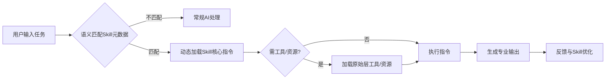

## agent skills

-   [官方文档](https://agentskills.io/specification)
-   [skill-ref,校验、结合模型工具](https://github.com/agentskills/agentskills/tree/main/skills-ref)
-   [openSkills 管理工具](https://github.com/numman-ali/openskills?tab=readme-ov-file#-creating-your-own-skills)

## 与 rules 规则区别

-   rules 规则是静态的规则集合，agent skills 是动态的技能集合

## 运行流程/原理

