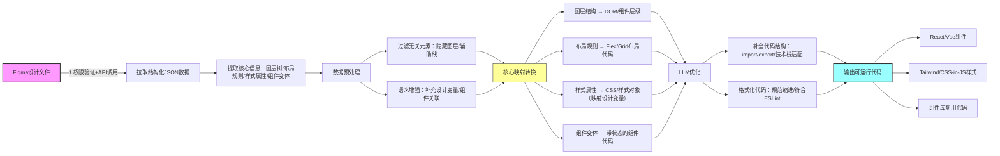

## Figma MCP 设计稿转代码完整流程

```mermaid
graph LR
    A[Figma设计文件] -->|1.权限验证+API调用| B[拉取结构化JSON数据]
    B --> B1[提取核心信息：图层树/布局规则/样式属性/组件变体]
    B1 --> C[数据预处理]
    C --> C1[过滤无关元素：隐藏图层/辅助线]
    C --> C2[语义增强：补充设计变量/组件关联]

    C1 & C2 --> D[核心映射转换]
    D --> D1[图层结构 → DOM/组件层级]
    D --> D2[布局规则 → Flex/Grid布局代码]
    D --> D3[样式属性 → CSS/样式对象（映射设计变量）]
    D --> D4[组件变体 → 带状态的组件代码]

    D1 & D2 & D3 & D4 --> E[LLM优化]
    E --> E1[补全代码结构：import/export/技术栈适配]
    E --> E2[格式化代码：规范缩进/符合ESLint]

    E1 & E2 --> F[输出可运行代码]
    F --> F1[React/Vue组件]
    F --> F2[Tailwind/CSS-in-JS样式]
    F --> F3[组件库复用代码]

    %% 样式标注（可选，增强可读性）
    style A fill:#f9f,stroke:#333,stroke-width:2px
    style F fill:#9ff,stroke:#333,stroke-width:2px
    style D fill:#ff9,stroke:#333,stroke-width:1px
```
