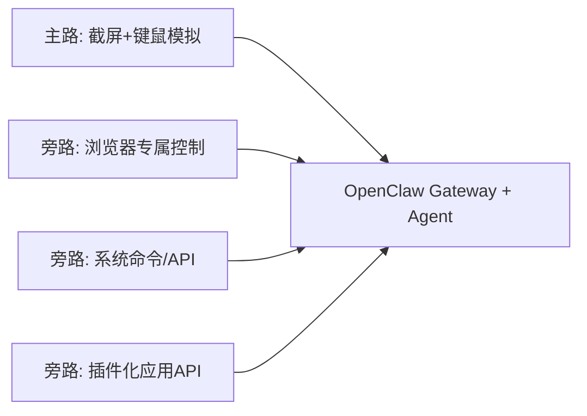
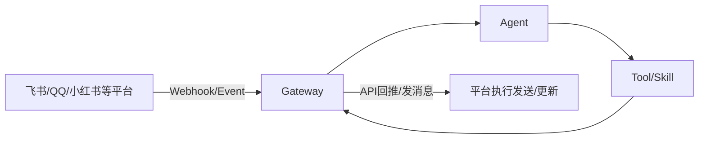
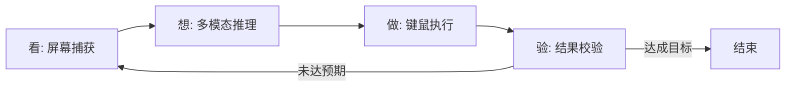
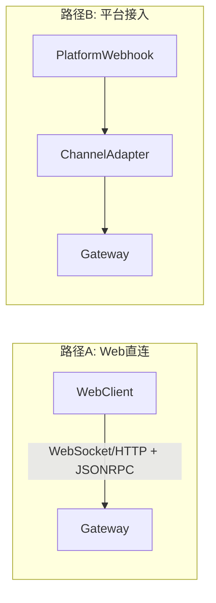

# OpenClaw 面试速记（重构版）
先记一句：`截屏+模拟鼠标/键盘` 是 OpenClaw 控制桌面 GUI 的主流方式，但不是唯一方式。

---

## 0. 核心结论（先立总论）
**一句话结论**：OpenClaw 的控制能力是“主路 + 旁路”模型：主路是视觉闭环，旁路是浏览器专控、系统命令/API、插件化 API。



| 结论点 | 面试可讲法 |
|------|------|
| 主流方式 | 桌面 GUI 场景默认走视觉识别 + 键鼠模拟，通用性最强。 |
| 非唯一方式 | 只要场景允许，优先走更确定性的 API/DOM/命令通道。 |
| 选型原则 | 能 API 就不点 UI；必须跨应用或无接口时再走视觉闭环。 |

---

## 1. 角色与边界（后续章节前置）
**一句话结论**：判断“谁是调用方”只看请求方向，判断“谁是执行目标”只看结果回推方向。



| 组件 | 只做什么 | 不做什么 |
|------|------|------|
| `Gateway` | 鉴权、路由、会话、任务编排入口 | 复杂业务推理 |
| `Agent` | 意图理解、步骤规划、工具选择 | 平台协议适配 |
| `ChannelAdapter` | 平台协议映射、验签、幂等去重 | 业务策略决策 |
| `Tool/Skill` | 执行浏览器/系统/API动作 | 上层路由治理 |

> 后续涉及执行机制时默认基于本节角色定义，不再重复解释。

---

## 2. GUI 主链路：截屏 + 模拟操作闭环
**一句话结论**：OpenClaw 在 GUI 场景走“看-想-做-验”闭环，动态识别替代固定坐标脚本。



| 环节 | 关键动作 | 价值 |
|------|------|------|
| 视觉观察 | 毫秒级截屏并识别 UI 元素与坐标 | 可适应窗口位置与尺寸变化 |
| 大脑决策 | 结合指令和当前界面规划下一步动作 | 支持异常分支处理 |
| 精准执行 | 调系统自动化能力执行键鼠动作 | 覆盖多数人工交互行为 |
| 反馈验证 | 再次观察并判断是否达成目标 | 形成自纠偏闭环 |

---

## 3. 其他控制方式（非截屏+键鼠）
**一句话结论**：当存在更确定的系统接口时，OpenClaw 会优先走非视觉通道以提升稳定性和效率。

| 控制方式 | 典型场景 | 相对 GUI 模拟的优势 |
|------|------|------|
| 浏览器专属控制（扩展中继 / 托管无头） | 网页自动化、登录态页面操作 | 直接操作 DOM，稳定性高、定位精确 |
| 系统命令行 / 原生 API | 启停应用、文件处理、系统配置 | 绕过 GUI，速度快、失败面更小 |
| 插件化应用 API（Skill） | Office、邮件、飞书/钉钉等开放接口应用 | 语义级调用，结果更可控、可审计 |

**简化选型口诀**：`能 API 不点 UI，能命令不拖拽，必须跨界面再走视觉闭环。`

---

## 4. 接入与通信最小模型（实现层）
**一句话结论**：接入只有两条主路径：Web 直连 Gateway，或平台 Webhook 经 `ChannelAdapter` 进入 Gateway。



### 最小通信示例（只保留请求/状态/回推）
**1) 任务请求（客户端/适配层 -> Gateway）**
```json
{
  "jsonrpc": "2.0",
  "id": "req-002",
  "method": "task.run",
  "params": {
    "traceId": "trace-20260315-001",
    "input": { "text": "帮我总结这周销售日报并生成待办" }
  }
}
```

**2) 任务状态（Gateway -> 调用方）**
```json
{
  "jsonrpc": "2.0",
  "method": "task.status",
  "params": {
    "taskId": "task_7a1",
    "status": "running",
    "stage": "tool_exec",
    "progress": 45
  }
}
```

**3) 结果回推（OpenClaw -> 平台）**
```json
{
  "platform": "feishu",
  "target": { "chatId": "oc_xxx" },
  "message": { "type": "text", "content": "纪要已生成..." },
  "meta": { "taskId": "task_991", "traceId": "trace-20260315-002" }
}
```

### 最小适配器示例（TypeScript）
```ts
type ChannelEvent = {
  platform: "feishu" | "qq" | "xiaohongshu";
  eventId: string;
  timestamp: number;
  sign: string;
  payload: Record<string, unknown>;
};

type TaskRunRequest = {
  source: { platform: string; eventId: string; idempotencyKey: string };
  input: { text: string };
};

interface ChannelAdapter {
  verify(event: ChannelEvent): Promise<void>;
  toTaskRequest(event: ChannelEvent): TaskRunRequest;
}

class FeishuChannelAdapter implements ChannelAdapter {
  async verify(event: ChannelEvent): Promise<void> {
    const nowSec = Math.floor(Date.now() / 1000);
    if (Math.abs(nowSec - event.timestamp) > 300) {
      throw new Error("timestamp window exceeded");
    }
    if (!event.sign.startsWith("sha256=")) {
      throw new Error("invalid signature format");
    }
  }

  toTaskRequest(event: ChannelEvent): TaskRunRequest {
    const text = String((event.payload as { text?: string }).text ?? "");
    return {
      source: {
        platform: event.platform,
        eventId: event.eventId,
        idempotencyKey: `${event.platform}:${event.eventId}`
      },
      input: { text }
    };
  }
}
```

---

## 5. 工程治理与权限前提（边界层）
**一句话结论**：OpenClaw 的能力边界由“治理策略 + 本地授权权限”共同决定。

| 治理项 | 最小要求 |
|------|------|
| 鉴权与验签 | 验签、时间窗校验、调用方身份校验 |
| 幂等与重试 | `idempotencyKey` 去重、指数退避重试 |
| 超时与限流 | 请求超时、并发上限、熔断降级 |
| 错误结构 | 标准化 `code/message/retryable/details` |

| 本地权限 | 作用 |
|------|------|
| 屏幕捕获权限 | 支撑视觉观察阶段 |
| 键鼠控制权限 | 执行 GUI 自动化动作 |
| 文件读写权限 | 处理本地数据与产物 |
| 终端执行权限 | 运行命令行与脚本 |

> 结论：OpenClaw 本质是运行在本地设备、基于用户授权执行的 AI 智能体网关；没有授权就没有对应能力。

---

## 6. 面试速答（30秒 + 高频追问）
### 30秒口述模板
OpenClaw 的核心是 `Gateway + Agent`，`ChannelAdapter` 负责平台协议适配。  
桌面 GUI 默认走“看-想-做-验”的视觉闭环，但这只是主流路径，不是唯一路径。  
在可用场景下会优先走浏览器专控、系统命令/API 或插件化 API，并通过鉴权、幂等、重试、限流和本地权限控制保障可用性与安全边界。

### 高频追问（一句话）
| 追问 | 一句话答法 |
|------|------------|
| 平台到底是调用方还是被调用方？ | 两者都可能：入口时是上游调用方，回推时是下游执行目标。 |
| 为什么要有 `ChannelAdapter`？ | 把平台差异收敛在边缘层，保护 Gateway 和 Agent 主链路稳定。 |
| `截屏+鼠标` 是不是唯一方案？ | 不是，它是 GUI 主流方案；有 API/DOM/命令通道时通常更优先。 |
| 系统怎么判断某个 App 动作是否支持？ | 走能力发现 -> 权限校验 -> 预检 -> 执行/降级的确定性流程。 |

### 动作支持判定最小伪代码
```ts
if (!toolRegistry.has("xiaohongshu.publish_note")) {
  return { code: "UNSUPPORTED_ACTION", retryable: false };
}
if (!credentialStore.hasScope(accountId, "note.publish")) {
  return { code: "MISSING_SCOPE", retryable: false };
}
const ok = await preflightCheck({
  accountId,
  action: "xiaohongshu.publish_note",
  payload
});
if (!ok) {
  return { code: "PRECHECK_FAILED", retryable: true };
}
return runTool("xiaohongshu.publish_note", payload);
```