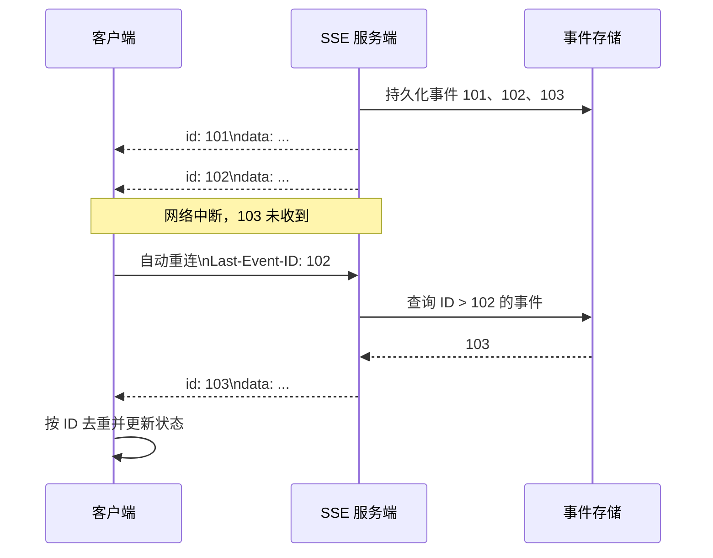

# SSE 怎么保证数据传输准确

> 一句话结论：SSE 依赖 TCP 保证单次连接内字节有序、完整到达；要应对断线后的丢失和重复，还需要 `id`、`Last-Event-ID`、服务端事件留存和客户端幂等处理，才能实现业务上的“至少一次 + 去重”。

## 传输链路



## 分层回答

| 层次 | 能保证什么 | 不能保证什么 |
| --- | --- | --- |
| TCP / HTTP | 校验、丢包重传、按序交付；不会把半个 TCP 包直接当成一条 SSE 事件 | 连接断开时，无法确认最后一条业务事件是否已被客户端处理 |
| SSE 协议 | 用空行划分事件；原生 `EventSource` 断线自动重连，并携带最后处理的 `Last-Event-ID` | 服务端不会自动保存历史事件，也没有内置 ACK |
| 业务层 | 事件留存、断点补发、按 ID 去重、最终状态校验 | 需要自行定义保存周期、幂等规则和异常恢复策略 |

## 最小协议示例

服务端先保存事件，再发送带单调递增 ID 的完整 SSE 帧：

```text
id: 102
event: order-status
data: {"orderId":"o-1","status":"accepted","version":3}

```

客户端成功解析该事件后，浏览器会记录它的 ID。连接断开后，原生 `EventSource` 重连请求会携带：

```http
Last-Event-ID: 102
```

服务端据此补发 `id > 102` 的事件。客户端仍要以 `id` 或业务键 `orderId + version` 去重，因为“事件已到达但连接随即断开”可能导致同一事件再次发送。

## 生产环境要点

1. **先存后发**：事件先写入 Redis Stream、消息队列或数据库，再写入 SSE 响应，保证重连时有数据可补。
2. **稳定 ID**：每条事件使用全局唯一或单调递增的 ID；重发时不能生成新 ID。
3. **断点续传**：读取 `Last-Event-ID`，补发缺失区间，再切换到实时事件流；补历史和订阅实时流要避免产生时间窗口。
4. **客户端幂等**：记录已处理 ID，重复事件直接忽略；状态类数据再带 `version`，只接受更高版本。
5. **正确解析流**：自定义 `fetch` 客户端要缓存残留字符串，按空行解析完整 SSE 事件，不能把每个网络 chunk 当成一条消息。
6. **心跳与超时**：定期发送注释帧 `: ping\n\n`，防止代理关闭空闲连接，并让客户端及时发现断线。
7. **最终校验**：金额、订单终态等关键数据不能只依赖 SSE；重连失败、历史过期或发现 ID 间隙时，通过普通 HTTP 接口拉取权威快照进行校准。

## 面试回答

> SSE 底层走 HTTP/TCP，所以同一条连接内的数据是可靠、有序的，但这不等于业务消息绝对不丢不重。断线可能发生在服务端已发送、客户端未处理的临界点，而 SSE 本身也没有 ACK。生产上我会给每个事件分配稳定 ID，先持久化再推送；客户端断线后通过 `Last-Event-ID` 续传，服务端补发后续事件，客户端按事件 ID 或业务版本做幂等去重。因此通常实现的是“至少一次投递 + 幂等消费”。对订单、金额等关键状态，还会用 HTTP 快照接口做最终一致性校验。如果一定要求明确的消费确认，则要额外设计 ACK 通道，或改用更合适的消息协议。

## 相关资料

- [SSE 底层原理](../../../网络与安全/计算机网络/sse/底层原理.md)
- [原生 SSE 与自定义 SSE](./sse原生vs自定义.md)
- [SSE 与 WebSocket 对比](./sse%20vs%20websocket.md)
