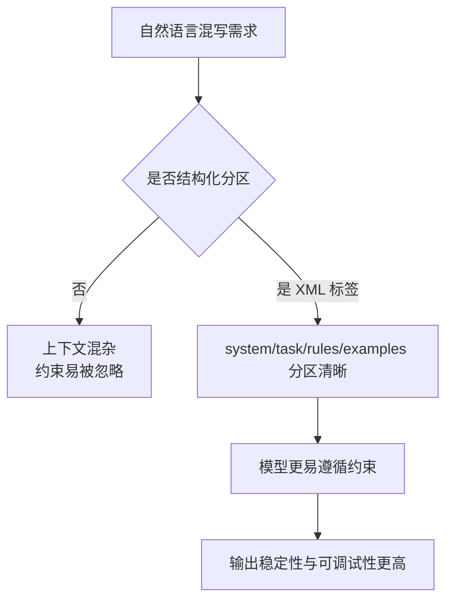

# 为什么 AI 用 XML 格式

一句话结论：在 Prompt 编排里，XML 更适合表达“层级结构 + 角色分区 + 可定位标签”，能降低指令歧义并提升可维护性。



## 选择 XML 的主要原因

-   **层级表达更自然**：多层任务（如 `context -> rules -> examples -> output`）可以直接嵌套表示。
-   **边界更清晰**：通过显式标签隔离系统指令、用户输入和示例，减少“串台”。
-   **可维护性更好**：新增规则时通常只追加节点，不需要重写整段自然语言。
-   **便于程序化处理**：工程侧可以按标签做注入、裁剪、审计与模板复用。
-   **调试成本更低**：线上问题可快速定位到具体标签块，而不是整段 prompt 逐句排查。

## 最小示例（可对照）

```xml
<prompt>
  <system>
    你是前端面试助手，回答要简洁、可执行。
  </system>
  <task>
    解释虚拟列表的原理，并给出一个实现思路。
  </task>
  <constraints>
    <item>先结论后展开</item>
    <item>不超过 5 个要点</item>
    <item>给 1 个性能优化建议</item>
  </constraints>
  <output_format>
    markdown
  </output_format>
</prompt>
```

## 什么时候不必用 XML

-   任务非常简单、一次性问答时，纯自然语言或 JSON 即可。
-   仅需严格机器解析且无复杂层级时，JSON 会更紧凑。
-   团队没有统一模板规范时，先定标签约定再推广 XML，避免“标签命名混乱”。
