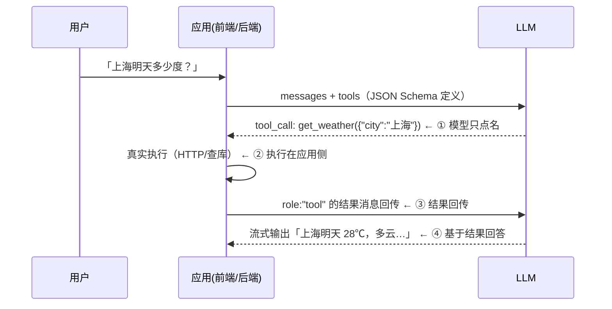

# 什么是 function call

> **一句话结论：** function calling（工具调用）= 模型以**结构化 JSON**「点名」要调哪个函数、参数是什么；**执行永远发生在应用侧**，应用把结果回传，模型再基于结果继续生成。模型全程不执行任何代码，它只是个「点菜的和指挥的」，厨房是你的程序。

## 问题背景：为什么需要它

LLM 有三个天生缺陷：知识有截止日期、不能联网/查库、算数和精确操作不可靠。一切「模型能力边界外」的动作（查天气、算账、下单、查知识库）都需要外部系统代劳——function calling 就是**模型 ↔ 外部系统的标准调用接口**。

## 四步循环（时序）



> 模型可能连续点名多个工具（先查日历再查天气），直到它认为信息够了才输出最终回答——这就是「Agent 循环」的骨架。

## 最小代码（OpenAI 格式，已是事实标准）

```ts
// ① 应用声明工具：name + 自然语言描述 + JSON Schema 参数
const tools = [{
  type: "function",
  function: {
    name: "get_weather",
    description: "查询指定城市天气",       // 模型靠这句语义判断何时调用，描述质量=准确率
    parameters: {
      type: "object",
      properties: { city: { type: "string" } },
      required: ["city"],
    },
  },
}];

// ② 第一轮响应：模型点名（finish_reason: "tool_calls"）
const r1 = await chat(messages, tools);
// r1.choices[0].message.tool_calls = [{ id: "call_abc", function: { name: "get_weather", arguments: '{"city":"上海"}' } }]

// ③ 应用执行真实函数，结果以 role:"tool" 回传（tool_call_id 串起一问一答）
const result = await fetchWeather("上海");
messages.push(r1.choices[0].message, {
  role: "tool", tool_call_id: "call_abc", content: JSON.stringify(result),
});

// ④ 再调一次，模型基于工具结果生成最终回答
const r2 = await chat(messages, tools);
```

## 前端视角的四个要点

1. **前端的三件活**：渲染调用过程（running → success 状态卡片，见 [cui-gui-demo](../../面经汇总/2026gap/面试/添科智能/demo/README.md) 的工具卡片）；执行「浏览器能干」的工具（查本地状态、调内部 API）；结果回传。
2. **流式场景的真实坑**：SSE 流里 `tool_calls` 的 `arguments` 是**分片到达**的（delta 里逐段追加），必须拼完整再 `JSON.parse`——半包解析和流式渲染那套在这里同样适用。
3. **插件系统 = function calling 工程化**：lobe-chat 插件市场的「插件」本质是 manifest（描述 + OpenAPI schema）——模型读描述决定用不用，前端按 schema 发请求（详见 [三大开源项目对比](../开源项目/dify、chatgpt-next-web、lobe-chat对比.md)）。
4. **安全三条**：工具白名单（只暴露声明过的）；参数按 Schema 校验（模型编的参数不可信）；高危操作人工确认——CUI+GUI 的「确认执行」卡片就是这道闸（防误删、防注入诱导）。

## 高频追问

| 追问 | 答案锚点 |
| --- | --- |
| 和 RAG 的区别 | RAG 是**把资料找来给模型看**（丰富上下文）；function call 是**让模型指挥你的程序干活**（扩展行动力）。常组合：工具负责检索，检索结果进上下文 |
| 模型怎么知道该调哪个 | 纯语义匹配 name + description——所以描述写得好坏直接决定调用准确率；无相关需求时模型会直接回答不调 |
| 模型不支持 function call 怎么办 | 退化到 ReAct：prompt 里约定「输出 JSON 格式的动作」，应用正则/解析抽取——老方案，function call 就是它的官方标准化 |
| 和 MCP 什么关系 | MCP 是工具的**发现与接入协议**（插上就能用一批工具）；function calling 是**调用那一刻的消息格式**——MCP 给模型供货，function call 是下单语言 |

## 关联

- 实操：[cui-gui-demo 工具调用卡片](../../面经汇总/2026gap/面试/添科智能/demo/README.md)（状态机 + 耗时展示）、lobe-chat 插件市场装天气插件看全流程 → [demo/README](../开源项目/demo/README.md)
- [skill vs mcp](./skill%20vs%20mcp.md)、[A2A 协议](./A2A%20协议.md)（工具之上的两层：技能封装、Agent 互联）
