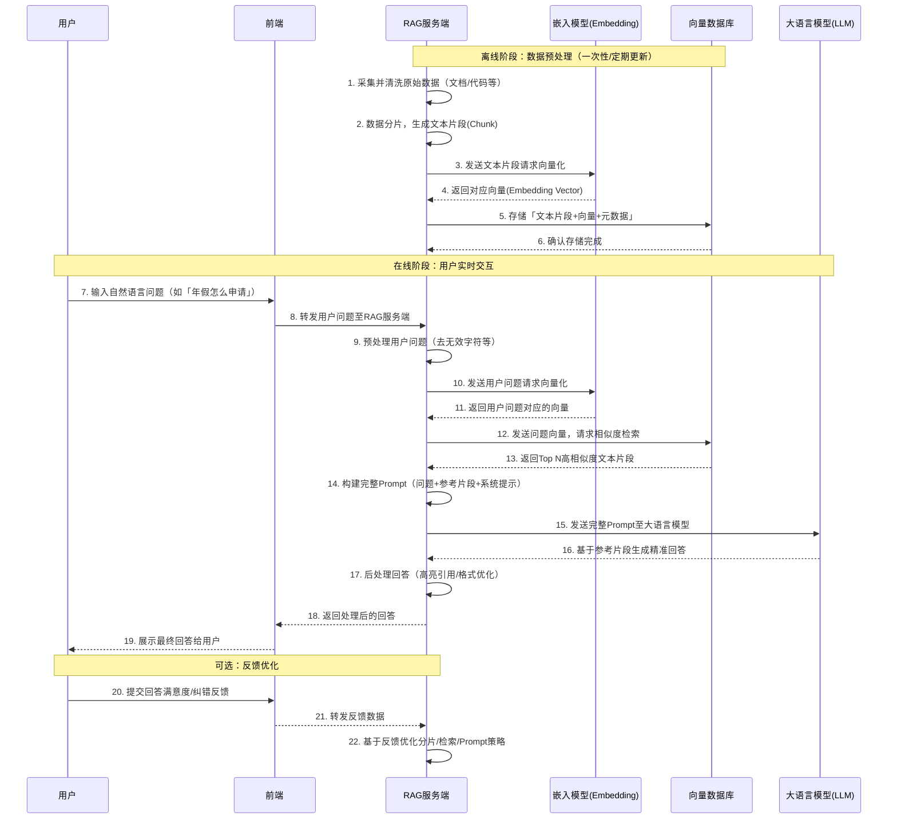

## 交互流程

```mermaid

sequenceDiagram
    participant User as 用户
    participant Frontend as 前端
    participant RAG_Service as RAG服务端
    participant Embedding_Model as 嵌入模型(Embedding)
    participant Vector_DB as 向量数据库
    participant LLM as 大语言模型(LLM)

    %% 离线数据预处理阶段（提前执行）
    note over RAG_Service,Vector_DB: 离线阶段：数据预处理（一次性/定期更新）
    RAG_Service->>RAG_Service: 1. 采集并清洗原始数据（文档/代码等）
    RAG_Service->>RAG_Service: 2. 数据分片，生成文本片段(Chunk)
    RAG_Service->>Embedding_Model: 3. 发送文本片段请求向量化
    Embedding_Model-->>RAG_Service: 4. 返回对应向量(Embedding Vector)
    RAG_Service->>Vector_DB: 5. 存储「文本片段+向量+元数据」
    Vector_DB-->>RAG_Service: 6. 确认存储完成

    %% 在线用户交互阶段（实时响应）
    note over User,LLM: 在线阶段：用户实时交互
    User->>Frontend: 7. 输入自然语言问题（如「年假怎么申请」）
    Frontend->>RAG_Service: 8. 转发用户问题至RAG服务端
    RAG_Service->>RAG_Service: 9. 预处理用户问题（去无效字符等）
    RAG_Service->>Embedding_Model: 10. 发送用户问题请求向量化
    Embedding_Model-->>RAG_Service: 11. 返回用户问题对应的向量
    RAG_Service->>Vector_DB: 12. 发送问题向量，请求相似度检索
    Vector_DB-->>RAG_Service: 13. 返回Top N高相似度文本片段
    RAG_Service->>RAG_Service: 14. 构建完整Prompt（问题+参考片段+系统提示）
    RAG_Service->>LLM: 15. 发送完整Prompt至大语言模型
    LLM-->>RAG_Service: 16. 基于参考片段生成精准回答
    RAG_Service->>RAG_Service: 17. 后处理回答（高亮引用/格式优化）
    RAG_Service-->>Frontend: 18. 返回处理后的回答
    Frontend-->>User: 19. 展示最终回答给用户

    %% 可选：用户反馈
    note over User,RAG_Service: 可选：反馈优化
    User->>Frontend: 20. 提交回答满意度/纠错反馈
    Frontend-->>RAG_Service: 21. 转发反馈数据
    RAG_Service->>RAG_Service: 22. 基于反馈优化分片/检索/Prompt策略

```

-   企业知识库
-   客服问答助手
-   团队技术知识库
