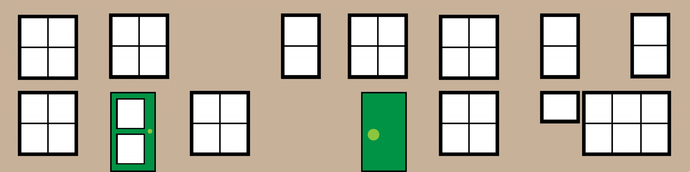

## 设置房子每个面的材料

在盒子的选项属性中，其中之一是 faceUV 和 Vector4s 数组。我们可以使用它来获取图像区域的一部分以应用于盒子的一个面

### 示例 1

将下面这张图片分成四部分，分别应用到正面、右面、背面、左面：



```javascript
const boxMat = new BABYLON.StandardMaterial("boxMat");
boxMat.diffuseTexture = new BABYLON.Texture(
    "https://assets.babylonjs.com/environments/cubehouse.png"
);

//options parameter to set different images on each side
const faceUV = [];
faceUV[0] = new BABYLON.Vector4(0.5, 0.0, 0.75, 1.0); //rear face
faceUV[1] = new BABYLON.Vector4(0.0, 0.0, 0.25, 1.0); //front face
faceUV[2] = new BABYLON.Vector4(0.25, 0, 0.5, 1.0); //right side
faceUV[3] = new BABYLON.Vector4(0.75, 0, 1.0, 1.0); //left side
// top 4 and bottom 5 not seen so not set

/**** World Objects *****/
const box = BABYLON.MeshBuilder.CreateBox("box", {
    faceUV: faceUV,
    wrap: true,
});
box.material = boxMat;
```


效果如下：


### 示例 2

将下面这张图片分成四部分，分别应用到正面、右面、背面、左面：


faceUV 可以使用 Vector4 对象做为参数：

-   vector (lower left x, lower left y, upper right x, upper right y)

```javascript
const boxMat = new BABYLON.StandardMaterial("boxMat");
boxMat.diffuseTexture = new BABYLON.Texture(
    "https://assets.babylonjs.com/environments/semihouse.png"
);

//options parameter to set different images on each side
const faceUV = [];
faceUV[0] = new BABYLON.Vector4(0.6, 0.0, 1.0, 1.0); //rear face
faceUV[1] = new BABYLON.Vector4(0.0, 0.0, 0.4, 1.0); //front face
faceUV[2] = new BABYLON.Vector4(0.4, 0, 0.6, 1.0); //right side
faceUV[3] = new BABYLON.Vector4(0.4, 0, 0.6, 1.0); //left side
// top 4 and bottom 5 not seen so not set

/**** World Objects *****/
const box = BABYLON.MeshBuilder.CreateBox("box", {
    width: 2,
    faceUV: faceUV,
    wrap: true,
});
box.material = boxMat;
```

效果如下：


