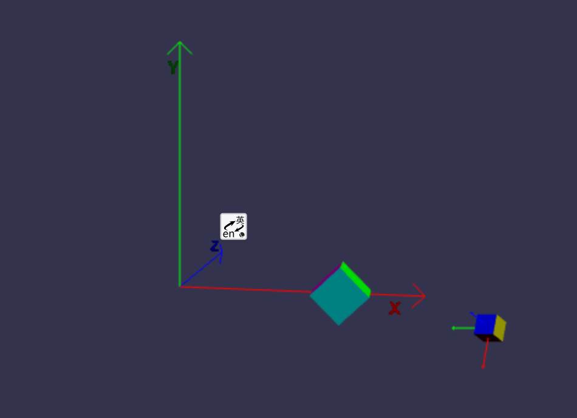

## 父子关系

我们将添加一辆非常简单的汽车来穿过村庄。

不管多么简单的汽车都需要轮子，我们必须将车体和轮子结合起来。


使用合并网格来组合它们会导致轮子无法旋转。相反，我们将车身设置为每个车轮的父级。

在构建我们的简单汽车之前，让我们先了解一下设置父级以及这意味着什么。

```javascript
meshChild.parent = meshParent;
```

**父级上任何位置、缩放和旋转的使用也将应用于子级。设置子级的位置是在父级空间中完成的，设置子级的旋转和缩放是在子级的本地空间中进行的。**

##实际例子


```javascript
const createScene = () => {
    const scene = new BABYLON.Scene(engine);

    const camera = new BABYLON.ArcRotateCamera(
        "camera",
        -Math.PI / 2.2,
        Math.PI / 2.5,
        15,
        new BABYLON.Vector3(0, 0, 0)
    );
    camera.attachControl(canvas, true);

    const light = new BABYLON.HemisphericLight(
        "light",
        new BABYLON.Vector3(0, 1, 0)
    );

    const faceColors = [];
    faceColors[0] = BABYLON.Color3.Blue();
    faceColors[1] = BABYLON.Color3.Teal();
    faceColors[2] = BABYLON.Color3.Red();
    faceColors[3] = BABYLON.Color3.Purple();
    faceColors[4] = BABYLON.Color3.Green();
    faceColors[5] = BABYLON.Color3.Yellow();

    const boxParent = BABYLON.MeshBuilder.CreateBox("Box", {
        faceColors: faceColors,
    });
    const boxChild = BABYLON.MeshBuilder.CreateBox("Box", {
        size: 0.5,
        faceColors: faceColors,
    });
    boxChild.setParent(boxParent);

    boxChild.position.x = 3;
    boxChild.position.y = 2;
    boxChild.position.z = 0;

    boxChild.rotation.x = Math.PI;
    boxChild.rotation.y = Math.PI / 4;
    boxChild.rotation.z = Math.PI / 4;

    boxParent.position.x = 4;
    boxParent.position.y = 0;
    boxParent.position.z = 0;

    boxParent.rotation.x = 0;
    boxParent.rotation.y = 0;
    boxParent.rotation.z = -Math.PI / 4;

    const boxChildAxes = localAxes(1, scene);
    boxChildAxes.parent = boxChild;
    showAxis(6, scene);
    return scene;
};

/***********Create and Draw Axes**************************************/
const showAxis = (size, scene) => {
    const makeTextPlane = (text, color, size) => {
        const dynamicTexture = new BABYLON.DynamicTexture(
            "DynamicTexture",
            50,
            scene,
            true
        );
        dynamicTexture.hasAlpha = true;
        dynamicTexture.drawText(
            text,
            5,
            40,
            "bold 36px Arial",
            color,
            "transparent",
            true
        );
        const plane = new BABYLON.MeshBuilder.CreatePlane(
            "TextPlane",
            { size, updateable: true },
            scene
        );
        plane.material = new BABYLON.StandardMaterial(
            "TextPlaneMaterial",
            scene
        );
        plane.material.backFaceCulling = false;
        plane.material.specularColor = new BABYLON.Color3(0, 0, 0);
        plane.material.diffuseTexture = dynamicTexture;
        return plane;
    };

    const axisX = BABYLON.MeshBuilder.CreateLines("axisX", {
        points: [
            new BABYLON.Vector3.Zero(),
            new BABYLON.Vector3(size, 0, 0),
            new BABYLON.Vector3(size * 0.95, 0.05 * size, 0),
            new BABYLON.Vector3(size, 0, 0),
            new BABYLON.Vector3(size * 0.95, -0.05 * size, 0),
        ],
    });
    axisX.color = new BABYLON.Color3(1, 0, 0);
    const xChar = makeTextPlane("X", "red", size / 10);
    xChar.position = new BABYLON.Vector3(0.9 * size, -0.05 * size, 0);

    const axisY = BABYLON.MeshBuilder.CreateLines("axisY", {
        points: [
            new BABYLON.Vector3.Zero(),
            new BABYLON.Vector3(0, size, 0),
            new BABYLON.Vector3(-0.05 * size, size * 0.95, 0),
            new BABYLON.Vector3(0, size, 0),
            new BABYLON.Vector3(0.05 * size, size * 0.95, 0),
        ],
    });
    axisY.color = new BABYLON.Color3(0, 1, 0);
    const yChar = makeTextPlane("Y", "green", size / 10);
    yChar.position = new BABYLON.Vector3(0, 0.9 * size, -0.05 * size);

    const axisZ = BABYLON.MeshBuilder.CreateLines("axisZ", {
        points: [
            new BABYLON.Vector3.Zero(),
            new BABYLON.Vector3(0, 0, size),
            new BABYLON.Vector3(0, -0.05 * size, size * 0.95),
            new BABYLON.Vector3(0, 0, size),
            new BABYLON.Vector3(0, 0.05 * size, size * 0.95),
        ],
    });
    axisZ.color = new BABYLON.Color3(0, 0, 1);
    const zChar = makeTextPlane("Z", "blue", size / 10);
    zChar.position = new BABYLON.Vector3(0, 0.05 * size, 0.9 * size);
};

/*********************************************************************/

/*******************************Local Axes****************************/
localAxes = (size, scene) => {
    const local_axisX = BABYLON.MeshBuilder.CreateLines(
        "local_axisX",
        {
            points: [
                new BABYLON.Vector3.Zero(),
                new BABYLON.Vector3(size, 0, 0),
                new BABYLON.Vector3(size * 0.95, 0.05 * size, 0),
                new BABYLON.Vector3(size, 0, 0),
                new BABYLON.Vector3(size * 0.95, -0.05 * size, 0),
            ],
        },
        scene
    );
    local_axisX.color = new BABYLON.Color3(1, 0, 0);

    local_axisY = BABYLON.MeshBuilder.CreateLines(
        "local_axisY",
        {
            points: [
                new BABYLON.Vector3.Zero(),
                new BABYLON.Vector3(0, size, 0),
                new BABYLON.Vector3(-0.05 * size, size * 0.95, 0),
                new BABYLON.Vector3(0, size, 0),
                new BABYLON.Vector3(0.05 * size, size * 0.95, 0),
            ],
        },
        scene
    );
    local_axisY.color = new BABYLON.Color3(0, 1, 0);

    const local_axisZ = BABYLON.MeshBuilder.CreateLines(
        "local_axisZ",
        {
            points: [
                new BABYLON.Vector3.Zero(),
                new BABYLON.Vector3(0, 0, size),
                new BABYLON.Vector3(0, -0.05 * size, size * 0.95),
                new BABYLON.Vector3(0, 0, size),
                new BABYLON.Vector3(0, 0.05 * size, size * 0.95),
            ],
        },
        scene
    );
    local_axisZ.color = new BABYLON.Color3(0, 0, 1);

    const local_origin = new BABYLON.TransformNode("local_origin");

    local_axisX.parent = local_origin;
    local_axisY.parent = local_origin;
    local_axisZ.parent = local_origin;

    return local_origin;
};
/*******************************End Local Axes****************************/
```
