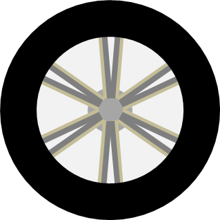
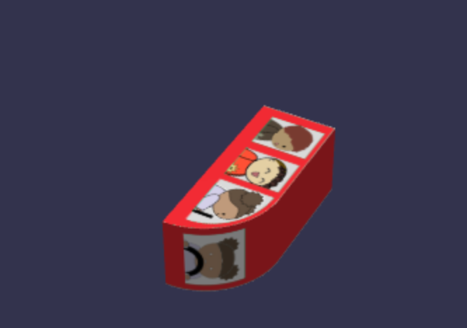

## 汽车材料

正如我们在盒子的不同面上使用不同的图像一样，类似的东西也可用于挤压多边形和圆柱体。对于车身，我们使用这张图片：


这个是用来装轮子的：



对于圆柱体，面 0 是底部，面 2 是顶部，面 1 是连接底部和顶部的边，对于挤压多边形，面 0 是顶部，面 2 是底部。请记住，目前车身及其车轮是平放的

车身的顶部和底部使用左上（几乎）四分之一的图像。边缘部分穿过底部、围绕前面、穿过顶部并向下穿过身体的后部，使用图像的下半部分。

车身顶部如您所料，由左下坐标 (0, 0.5) 到右上角坐标 (0.38, 1) 给出：

```javascript
faceUV[0] = new BABYLON.Vector4(0, 0.5, 0.38, 1);
```

车身底部使用相同的图像，但需要翻转以适合汽车的另一侧:

```javascript
faceUV[2] = new BABYLON.Vector4(0.38, 1, 0, 0.5);
```

边缘从 (0, 0) 延伸到 (1, 0.5)

```javascript
faceUV[1] = new BABYLON.Vector4(0, 0, 1, 0.5);
```


