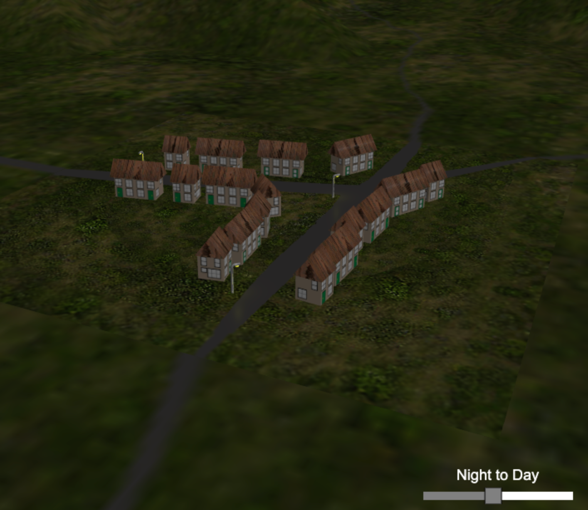

## 白天到晚上

将图形用户界面添加到场景的一种有用方法是 Babylon.js GUI。在虚拟现实中工作时，此 GUI 是必要的，因为它被设计为位于 Babylon.js 场景画布内且是其一部分，而不是 HTML 文档。该 GUI 已预先加载到 Playground 中，但它是一个额外的脚本，可以使用以下命令加载到您自己的项目中

```javascript
<script>https://cdn.babylonjs.com/gui/babylon.gui.min.js</script>
```

对于村庄世界，我们将使用一个 GUI 堆栈面板来包含两个 GUI 元素。标题的文本块和滑动条，可通过设置光的强度来改变白天和黑夜。

我们需要做的第一件事是创建一个特殊的纹理，称为 AdvancedDynamicTexture，GUI 元素将在其上绘制。

```javascript
const adt = BABYLON.GUI.AdvancedDynamicTexture.CreateFullscreenUI("UI");
```

对于我们的世界来说，GUI 将是一个基于全屏的 GUI。

我们创建容器面板来将其他元素放置在屏幕的右下角。然后将其添加到高级动态纹理中。

```javascript
const panel = new BABYLON.GUI.StackPanel();
panel.width = "220px";
panel.top = "-50px";
panel.horizontalAlignment = BABYLON.GUI.Control.HORIZONTAL_ALIGNMENT_RIGHT;
panel.verticalAlignment = BABYLON.GUI.Control.VERTICAL_ALIGNMENT_BOTTOM;
adt.addControl(panel);
```

接下来创建文本块并将其添加到面板中

```javascript
const header = new BABYLON.GUI.TextBlock();
header.text = "Night to Day";
header.height = "30px";
header.color = "white";
panel.addControl(header);
```

我们创建滑块并将其添加到面板中

```javascript
const slider = new BABYLON.GUI.Slider();
slider.minimum = 0;
slider.maximum = 1;
slider.borderColor = "black";
slider.color = "#AAAAAA";
slider.background = "#white";
slider.value = 1;
slider.height = "20px";
slider.width = "200px";
panel.addControl(slider);
```

我们需要向滑块添加一个可观察事件以改变光强度。

```javascript
slider.onValueChangedObservable.add((value) => {
    if (light) {
        light.intensity = value;
    }
});
```

现在我们可以控制村庄世界中的灯光了, [效果：](https://playground.babylonjs.com/#KBS9I5#95)

