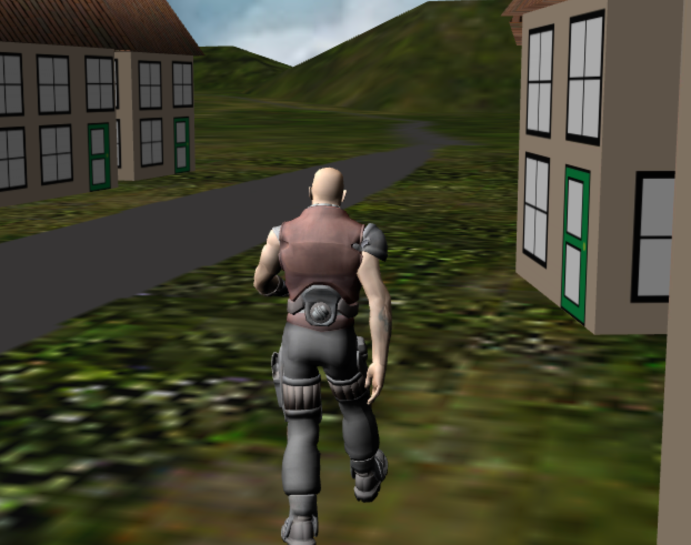

## [到处看看](https://doc.babylonjs.com/features/introductionToFeatures/chap8/camera)

目前我们正在使用 ArcRotateCamera，它可以让我们从远处绕村庄世界旋转。从村子里面看风景怎么样？让我们将镜头设置为在村庄里行走的角色，并对值进行一些调整，从他的肩膀上观察周围。 ArcRotateCamera 的创建有这样的形式:

```javascript
const camera = new BABYLON.ArcRotateCamera(
    "name",
    alpha_angle,
    beta_angle,
    radius,
    target_position
);
```

与所有相机一样，为了响应用户输入而移动它，我们需要将其附加到画布上。

```javascript
camera.attachControl(canvas, true);
```

可以将此相机视为绕其目标位置运行的相机，或者更富有想象力地视为绕地球运行的间谍卫星。它相对于目标（地球）的位置可以通过三个参数来设置，α（弧度）纵向旋转，β（弧度）纬度旋转和半径距目标位置的距离。

在我们的例子中，我们希望将相机作为角色的父级

```javascript
camera.parent = dude;
```

并且，由于该家伙的尺寸已按比例缩放，因此我们使用较大的半径，该半径作为该家伙的父级将按比例缩小。为了追踪他，我们使用：

```javascript
const camera = new BABYLON.ArcRotateCamera(
    "camera",
    Math.PI / 2,
    Math.PI / 2.5,
    150,
    new BABYLON.Vector3(0, 60, 0)
);
```

由于角色会瞬间转动，因此摄像机也会转动。为了使观看更流畅，需要为角色提供更平滑的轨迹。

[效果](https://playground.babylonjs.com/#KBS9I5#97)

