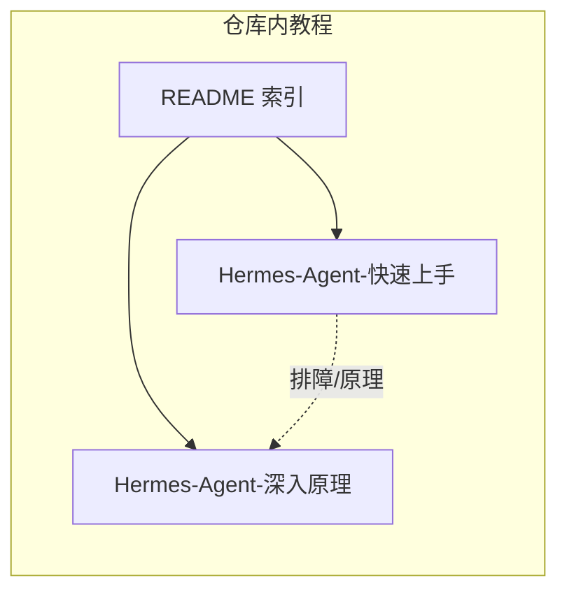
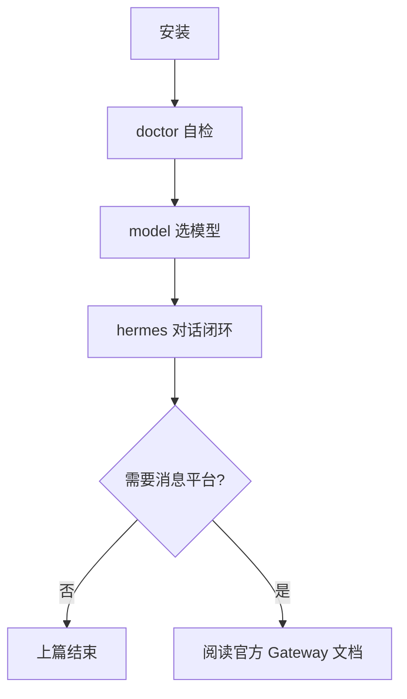
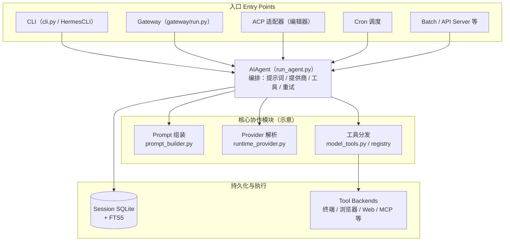
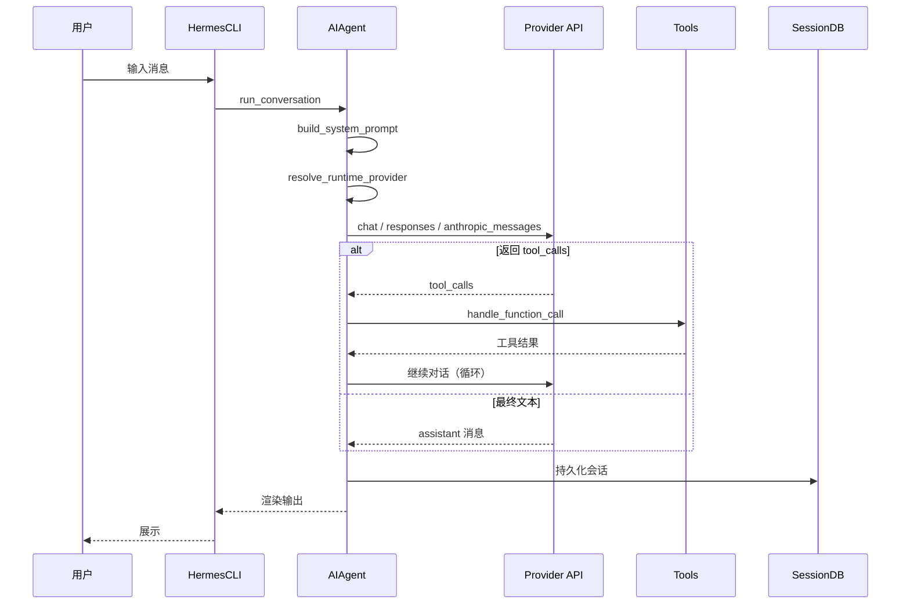

# Hermes Agent 学习文档 Implementation Plan

> **For agentic workers:** REQUIRED SUB-SKILL: Use superpowers:subagent-driven-development (recommended) or superpowers:executing-plans to implement this plan task-by-task. Steps use checkbox (`- [ ]`) syntax for tracking.

**Goal:** 在仓库 `AI/进阶应用/Hermes-Agent/` 下新增三份中文 Markdown：总索引、`Hermes-Agent-快速上手.md`、`Hermes-Agent-深入原理.md`，内容与结构对齐 `docs/superpowers/specs/2026-05-11-Hermes-Agent-learning-design.md`，并满足索引内相对链接可跳转、无真实密钥、安装步骤以官方 README 为权威。

**Architecture:** 方案 2（两篇 + 索引）；上篇结论先行 + 可勾选验收 + 官方一键安装命令引用；下篇以官方 Architecture / Agent Loop / Data Flow 为骨架压缩为中文 Mermaid 与跳转链接；全篇遵守仓库「图例与示例优先」的 Markdown 习惯。

**Tech Stack:** Markdown、Mermaid（GitHub / 常见预览器兼容语法）、Hermes Agent 官方文档与 GitHub README（安装与 CLI 行为以官方为准）。

**权威来源（实施时核对，若官方变更请同步更新正文中的命令与链接段落）：**

- 安装与 CLI：<https://raw.githubusercontent.com/NousResearch/hermes-agent/main/README.md>
- 架构总览：<https://hermes-agent.nousresearch.com/docs/developer-guide/architecture>
- Agent 循环：<https://hermes-agent.nousresearch.com/docs/developer-guide/agent-loop>
- 快速开始（用户向）：<https://hermes-agent.nousresearch.com/docs/getting-started/quickstart>

---

## File Structure

| 路径 | 职责 |
|------|------|
| `AI/进阶应用/Hermes-Agent/README.md` | 总索引：定义、读者、版本策略、两篇相对链接、官方文档表 |
| `AI/进阶应用/Hermes-Agent/Hermes-Agent-快速上手.md` | 上篇：安装、配置、验证、闭环、常见错误、与下篇跳转表 |
| `AI/进阶应用/Hermes-Agent/Hermes-Agent-深入原理.md` | 下篇：架构图、数据流、子系统、安全、扩展阅读、每章自测 |

---

### Task 1: 创建目录

**Files:**

- Create: `AI/进阶应用/Hermes-Agent/`（目录）

- [ ] **Step 1: 创建目录**

```bash
mkdir -p "/Users/ryanchen/Desktop/front-end-self-study/AI/进阶应用/Hermes-Agent"
```

Run: `test -d "/Users/ryanchen/Desktop/front-end-self-study/AI/进阶应用/Hermes-Agent" && echo OK`
Expected: `OK`

说明：Git 不跟踪空目录；**不要**为空目录单独 `--allow-empty` 提交。首个提交在 Task 2 写入 `README.md` 时产生。

---

### Task 2: 写入总索引 `README.md`

**Files:**

- Create: `AI/进阶应用/Hermes-Agent/README.md`

- [ ] **Step 1: 写入下列完整内容（覆盖创建文件）**

````markdown
# Hermes Agent 学习导航

**一句话：** Hermes Agent 是 Nous Research 开源、可自托管的 AI Agent：统一核心（`AIAgent`）对接 CLI / 消息网关 / 定时任务等入口，带持久会话与工具系统；适合希望「数据与运行环境在自己掌控下」的工程师。



## 读者与先决条件

- 会用终端、能自行申请并保管 **API Key**（文档中只用占位符）。
- 能接受阅读官方英文文档以核对细节。
- 安装与平台差异 **以官方 README 为准**；下文给出的命令为官方当前公开的一键安装形式，若官方调整请改文档并保留「以官方为准」声明。

## 版本策略

- 本教程**不替代**官方文档；命令行子命令与配置项可能随版本变化。
- 写作时对齐的公开入口：GitHub `NousResearch/hermes-agent` 的 `main` 分支 README 与 <https://hermes-agent.nousresearch.com/docs/>。
- 若你发现命令与官方不一致：**以官方为准**，并欢迎在本仓库提 PR 更新对应段落。

## 本仓库两篇教程

| 文档 | 适合谁 |
|------|--------|
| [Hermes-Agent-快速上手](./Hermes-Agent-快速上手.md) | 要先在本地跑通、完成最小闭环 |
| [Hermes-Agent-深入原理](./Hermes-Agent-深入原理.md) | 要理解架构、数据流、子系统与安全模型 |

## 官方入口（优先收藏）

| 主题 | 链接 |
|------|------|
| 项目介绍 | <https://hermes-agent.org/> |
| 文档首页 | <https://hermes-agent.nousresearch.com/docs/> |
| 快速开始（用户） | <https://hermes-agent.nousresearch.com/docs/getting-started/quickstart> |
| 架构（开发者） | <https://hermes-agent.nousresearch.com/docs/developer-guide/architecture> |
| Agent 循环 | <https://hermes-agent.nousresearch.com/docs/developer-guide/agent-loop> |
| 安全 | <https://hermes-agent.nousresearch.com/docs/user-guide/security> |
| 内存特性 | <https://hermes-agent.nousresearch.com/docs/user-guide/features/memory> |
| 工具与 toolsets | <https://hermes-agent.nousresearch.com/docs/user-guide/features/tools> |
| 环境变量参考 | <https://hermes-agent.nousresearch.com/docs/reference/environment-variables> |
| GitHub Issues | <https://github.com/NousResearch/hermes-agent/issues> |

## 可选：和本仓库其他 AI 教程的关系

- 若你熟悉本仓库的 **Superpowers / OpenSpec** 教程：可以把 Hermes 看作「运行时 Agent 产品」的学习对象；Superpowers 更偏「驱动 AI 完成任务的方法论与技能文件」。二者互补，不必二选一。

## 设计规格（仓库内）

- 结构与验收清单的权威说明：`docs/superpowers/specs/2026-05-11-Hermes-Agent-learning-design.md`
````

- [ ] **Step 2: 校验 README 内链接文本已写入**

```bash
cd /Users/ryanchen/Desktop/front-end-self-study
test -f "AI/进阶应用/Hermes-Agent/README.md" && grep -q 'Hermes-Agent-快速上手' "AI/进阶应用/Hermes-Agent/README.md" && echo OK
```

Expected: `OK`（目标文件存在性在 **Task 5** 用 `test -f` 三文件统一验证。）

- [ ] **Step 3: Commit**

```bash
cd /Users/ryanchen/Desktop/front-end-self-study
git add "AI/进阶应用/Hermes-Agent/README.md"
git commit -m "docs(hermes-agent): add learning index README"
```

---

### Task 3: 写入上篇《快速上手》

**Files:**

- Create: `AI/进阶应用/Hermes-Agent/Hermes-Agent-快速上手.md`

- [ ] **Step 1: 写入下列完整内容**

````markdown
# Hermes Agent 快速上手

> **权威声明：** 安装命令、Windows/Android 特例与「安装后」提示均摘自官方 README（`NousResearch/hermes-agent`）。若官方更新，请以 README 为准并同步修订本节命令块。

## 1. 目标与验收（建议逐项勾选）

完成本节学习后，你应能（在**你自己的机器**上）：

- [ ] 使用官方一键脚本完成安装，且 `hermes doctor` 能给出可读诊断输出。
- [ ] 使用 `hermes model`（或等价流程）为运行中的 Agent 选定至少一个可用模型提供商。
- [ ] 启动交互 CLI（`hermes`），完成 **至少一轮** 用户输入 → 模型回复 的闭环。
- [ ] 能说明「CLI 会话」与「消息网关 `hermes gateway`」在入口上的区别（一句话即可）。



## 2. 环境与依赖（概念层）

- **支持面（官方 README 摘要）：** Linux、macOS、WSL2、Termux 使用同一 bash 安装脚本；Windows 原生为 **early beta**（更稳的是 WSL2 内跑 Linux 脚本）；Android/Termux 有单独指南。
- **安装器会拉起的组件（官方描述）：** 如 `uv`、Python 3.11、Node.js、`ripgrep`、`ffmpeg` 等（以安装脚本实际行为为准）。
- **密钥：** 仅保存在本机配置或环境变量中；教程示例一律使用 `YOUR_API_KEY` 类占位符。

## 3. 安装（Linux / macOS / WSL2 / Termux）

在官方 README 中，一键安装为：

```bash
curl -fsSL https://raw.githubusercontent.com/NousResearch/hermes-agent/main/scripts/install.sh | bash
```

**如何确认这一步对了：**

- 安装脚本无致命错误退出；按 README 提示重新加载 shell 配置，例如：

```bash
source ~/.bashrc
```

若你使用 zsh：

```bash
source ~/.zshrc
```

## 4. Windows（原生 PowerShell，early beta）

官方 README 提供的命令为：

```powershell
irm https://raw.githubusercontent.com/NousResearch/hermes-agent/main/scripts/install.ps1 | iex
```

**如何确认这一步对了：**

- 安装结束后在新开 PowerShell 中可执行 `hermes --help` 或 `hermes doctor`（以你 PATH 生效方式为准）。若遇路径未生效，按官方 issue 区建议处理。

## 5. 安装后第一条命令

官方 README 建议：

```bash
hermes
```

在交互界面内，你可用官方文档中的 slash command（如 `/model`）管理模型；亦可在 shell 中运行：

```bash
hermes model
hermes tools
hermes config set
hermes setup
hermes doctor
hermes gateway
hermes update
```

**最小验证建议顺序：**

1. `hermes doctor` — 确认环境、依赖与配置无明显硬错误。
2. `hermes setup` — 需要一次性把密钥、人格、工作区等在向导里配齐时使用。
3. `hermes model` — 选择提供商与模型。
4. `hermes` — 进入 TUI，发送一条简单消息，确认有流式或完整回复。

## 6. 第一条完整闭环（CLI）

1. 终端执行 `hermes`。
2. 输入一句低风险问题（例如「用两句话介绍你能做什么」）。
3. 观察：是否有模型回复；若启用工具，是否出现工具调用提示（取决于你的 tool 配置）。

**成功长什么样：** 无未捕获栈追踪退出；你能看到模型对输入的针对性回复；若失败，终端或日志中有**可定位**的错误信息（提供商鉴权、网络、模型名等）。

## 7. 常见报错与定位方向（精简）

| 现象 | 可能原因 | 下一步 |
|------|-----------|--------|
| `hermes: command not found` | PATH 未加载 / 安装未完成 | 重开终端；`source ~/.zshrc`；再跑 `hermes doctor` |
| 模型调用报鉴权失败 | `API_KEY` 未配置或错误 | `hermes setup` 或按官方 Configuration 文档检查环境变量 |
| 工具执行失败 | 后端未安装（如浏览器依赖）或权限 | 对照官方 Tools / Security 文档逐项放开或关闭相关 toolset |

## 8. 与《深入原理》的跳转表

| 你现在的疑问 | 建议阅读 |
|--------------|-----------|
| `AIAgent` 如何串起一轮对话 | [深入原理 §2 Agent 循环](./Hermes-Agent-深入原理.md#2-agent-循环与数据流) |
| 网关如何把 Telegram/Discord 消息送进同一核心 | [深入原理 §1 总览架构](./Hermes-Agent-深入原理.md#1-总览架构与入口) |
| 会话/搜索/压缩在哪里发生 | [深入原理 §3 会话与持久化](./Hermes-Agent-深入原理.md#3-会话持久化与上下文) |
| 工具从注册到执行怎么走 | [深入原理 §4 工具系统与子代理](./Hermes-Agent-深入原理.md#4-工具系统与子代理) |
| 自托管要注意哪些攻击面 | [深入原理 §5 安全与自托管](./Hermes-Agent-深入原理.md#5-安全与自托管) |

## 9. 本章自测

1. 官方一键安装脚本 URL 主机与路径是什么？（见上文命令块）
2. `hermes doctor` 与 `hermes setup` 的职责差异是什么？
3. 为什么 Windows 原生路径被官方标为 early beta？
4. 若仅做本地实验，为什么通常**不必**立刻启动 `hermes gateway`？

**下一步：** 阅读 [Hermes-Agent-深入原理](./Hermes-Agent-深入原理.md)，并对照官方 [Architecture](https://hermes-agent.nousresearch.com/docs/developer-guide/architecture) 一页核对图中模块名。
````

- [ ] **Step 2: Commit**

```bash
cd /Users/ryanchen/Desktop/front-end-self-study
git add "AI/进阶应用/Hermes-Agent/Hermes-Agent-快速上手.md"
git commit -m "docs(hermes-agent): add quickstart guide"
```

---

### Task 4: 写入下篇《深入原理》

**Files:**

- Create: `AI/进阶应用/Hermes-Agent/Hermes-Agent-深入原理.md`

- [ ] **Step 1: 写入下列完整内容**

````markdown
# Hermes Agent 深入原理（学习者版）

> **读法：** 下图与数据流描述压缩自官方 [Architecture](https://hermes-agent.nousresearch.com/docs/developer-guide/architecture) 与 [Agent Loop Internals](https://hermes-agent.nousresearch.com/docs/developer-guide/agent-loop)。若与源码或官方文档冲突，以官方为准。

## 1. 总览架构与入口

**结论：** 多个入口（CLI、消息网关、批量任务、ACP 等）共享同一编排核心 `AIAgent`（`run_agent.py`），差异集中在「如何把用户输入送进来、如何把回复送出去」。



**依赖链（官方说明的直觉版）：** 工具在 `tools/*.py` 中自注册 → `tools/registry.py` 聚合 → `model_tools.py` 发现与分发 → `run_agent.py` 在对话循环中调用。详见官方 Architecture 页的 *File Dependency Chain*。

## 2. Agent 循环与数据流

**结论：** 一轮 CLI 会话可理解为：输入进入 `HermesCLI.process_input()` → `AIAgent.run_conversation()` → 组装 system prompt → 解析 `(provider, model)` → 调用对应 API 模式 → 若返回 tool_calls 则进入工具执行 → 写回会话存储 → 展示。



**Gateway 消息路径（摘要）：** 平台适配器 `on_message` → `GatewayRunner._handle_message()` → 鉴权与 session key → 构造带历史的 `AIAgent` → 同一 `run_conversation()` → 经适配器投递回复。（官方 Architecture *Gateway Message* 小节。）

## 3. 会话持久化与上下文

**结论：** 会话与状态落在 SQLite（含 FTS5 搜索）；另有压缩与 prompt caching 子系统用于长对话成本控制。

- **会话：** 官方文档 [Session Storage](https://hermes-agent.nousresearch.com/docs/developer-guide/session-storage) 说明 schema、会话谱系（压缩产生的父子关系）等。
- **上下文压缩 / 缓存：** 见 [Context Compression & Prompt Caching](https://hermes-agent.nousresearch.com/docs/developer-guide/context-compression-and-caching)。
- **用户向「内存」特性（MEMORY / USER 等）：** 见用户文档 [Memory](https://hermes-agent.nousresearch.com/docs/user-guide/features/memory)。

**备份直觉：** 任何涉及「换机 / 重装」的操作前，先确认官方文档对 `HERMES_HOME` 与配置目录的说明，再备份对应目录；细节以官方为准。

## 4. 工具系统与子代理

**结论：** 中央注册表维护 70+ 工具与多 toolset；终端类工具可挂多种后端（本地、Docker、SSH、Modal、Daytona 等）；另有 `delegate_tool` 用于子代理并行。

- **用户向功能说明：** [Tools & Toolsets](https://hermes-agent.nousresearch.com/docs/user-guide/features/tools)
- **开发者向运行时：** [Tools Runtime](https://hermes-agent.nousresearch.com/docs/developer-guide/tools-runtime)

**失败/超时/重试（学习视角）：** 把工具调用看成「带 UI 回调的副作用步骤」——官方强调 *Observable execution* 与 *Interruptible*：你应能在 CLI / 网关消息里看到进度，并可用中断类命令取消长任务（具体 slash command 以官方 CLI 指南为准）。

## 5. 安全与自托管

**结论：** 自托管的收益是数据可控；代价是你必须显式处理「谁可以驱动 Agent」「危险命令如何审批」「沙箱边界在哪里」。

- **必读：** [Security](https://hermes-agent.nousresearch.com/docs/user-guide/security)（命令审批、DM pairing、容器隔离等）。
- **设计原则速记（官方表格摘要）：** Prompt 稳定性、可观察执行、可中断、平台无关核心、Profile 隔离等（见 Architecture 页 *Design Principles*）。

## 6. 扩展阅读顺序（官方推荐 + 本教程补充）

1. [Architecture](https://hermes-agent.nousresearch.com/docs/developer-guide/architecture)（你已浏览过总览）
2. [Agent Loop Internals](https://hermes-agent.nousresearch.com/docs/developer-guide/agent-loop)
3. [Prompt Assembly](https://hermes-agent.nousresearch.com/docs/developer-guide/prompt-assembly)
4. [Provider Runtime Resolution](https://hermes-agent.nousresearch.com/docs/developer-guide/provider-runtime)
5. [Tools Runtime](https://hermes-agent.nousresearch.com/docs/developer-guide/tools-runtime)
6. [Session Storage](https://hermes-agent.nousresearch.com/docs/developer-guide/session-storage)
7. [Gateway Internals](https://hermes-agent.nousresearch.com/docs/developer-guide/gateway-internals)
8. Release notes：`https://github.com/NousResearch/hermes-agent/releases`

**读 Issue 的方法：** 先关键词（`gateway`, `tool`, `provider`, `windows`）+ 版本号；优先看是否已有官方回复或 workaround。

## 7. 各节自测与下一步

### §1 自测

1. 列出至少三个「入口」名称及其对应职责关键词。
2. `AIAgent` 与 `HermesCLI` 的分工边界是什么？

**下一步：** 打开官方 Agent Loop 文档，对照本节序列图找出你关心的一个分支（例如 tool_calls 分支）。

### §2 自测

1. 三种 API 模式的中文名称与适用场景是什么？（见官方 Agent Loop 文档表格。）
2. Gateway 路径比 CLI 路径多哪两类责任？（提示：鉴权、投递）

**下一步：** 在本地用 `hermes` 触发一次工具调用（若你已启用安全工具），观察日志与 UI 回调。

### §3–§5 自测

1. SQLite 会话库与「用户内存文档」分别解决什么问题？
2. 为什么工具注册发生在 import 时，而不是每次对话动态扫描全盘？
3. 自托管场景下，你至少会检查哪三类配置以降低误用风险？

**下一步：** 回到 [快速上手](./Hermes-Agent-快速上手.md)，把「闭环验收」与「安全文档」中的检查项合成你自己的上线前清单（即便只是个人 VPS）。
````

- [ ] **Step 2: Commit**

```bash
cd /Users/ryanchen/Desktop/front-end-self-study
git add "AI/进阶应用/Hermes-Agent/Hermes-Agent-深入原理.md"
git commit -m "docs(hermes-agent): add internals guide"
```

---

### Task 5: 全量校验与收尾提交

**Files:**

- Modify: 无（若 Task 2 的 grep 因顺序未执行，在此统一校验）

- [ ] **Step 1: 三文件存在且相对链接可解析**

```bash
cd /Users/ryanchen/Desktop/front-end-self-study
for f in \
  "AI/进阶应用/Hermes-Agent/README.md" \
  "AI/进阶应用/Hermes-Agent/Hermes-Agent-快速上手.md" \
  "AI/进阶应用/Hermes-Agent/Hermes-Agent-深入原理.md"; do
  test -f "$f" || { echo "MISSING $f"; exit 1; }
done
grep -E '\]\(\./Hermes-Agent-(快速上手|深入原理)\.md' "AI/进阶应用/Hermes-Agent/README.md" >/dev/null && echo README_links_OK
grep -E '\]\(\./Hermes-Agent-深入原理\.md#' "AI/进阶应用/Hermes-Agent/Hermes-Agent-快速上手.md" >/dev/null && echo Quick_jump_OK
grep -E '\]\(\./Hermes-Agent-快速上手\.md' "AI/进阶应用/Hermes-Agent/Hermes-Agent-深入原理.md" >/dev/null && echo Deep_back_OK
```

Expected: 依次打印 `README_links_OK`、`Quick_jump_OK`、`Deep_back_OK`（若锚点 `#` 与标题 slug 不一致导致你手动改过标题，请同步更新上篇跳转表中的锚点片段）。

- [ ] **Step 2: 确认无真实密钥样式**

```bash
cd /Users/ryanchen/Desktop/front-end-self-study
if rg -n "sk-[A-Za-z0-9]{10,}" "AI/进阶应用/Hermes-Agent" 2>/dev/null; then echo FAIL_secret_pattern; exit 1; else echo NO_sk_pattern; fi
```

Expected: `NO_sk_pattern`（或 `rg: command not found` 时改用 `grep`：`grep -R "sk-" "AI/进阶应用/Hermes-Agent"` 并人工确认仅为示例文本）。

- [ ] **Step 3: 若仅有未提交变更则提交**

```bash
cd /Users/ryanchen/Desktop/front-end-self-study
git status --short
# 若有未提交修改：
# git add AI/进阶应用/Hermes-Agent
# git commit -m "docs(hermes-agent): finalize learning bundle checks"
```

---

## Plan self-review

**1. Spec coverage（对照 `2026-05-11-Hermes-Agent-learning-design.md`）**

| 规格章节 | 对应任务 |
|-----------|-----------|
| 交付物三文件路径 | Task 1–4 锁定 `AI/进阶应用/Hermes-Agent/` 下三文件 |
| 索引必含：定义/读者/版本/阅读路径/官方表 | Task 2 README 全文 |
| 上篇六段顺序 + 验收清单 + 跳转表 + 占位密钥 | Task 3 全文 |
| 下篇六段 + 两张 Mermaid + 中英术语脚注策略 | Task 4（图内英文文件名作脚注式标注） |
| 每章自测与下一步 | Task 3 §9；Task 4 §7 分节 |
| 实施后验收（断链/密钥） | Task 5 |

**2. Placeholder scan：** 已避免 TBD/TODO；安装命令与官方 README 一致（截至计划编写时所抓取的 raw README）。

**3. Consistency：** 相对路径 `./Hermes-Agent-*.md` 与 Task 5 grep 一致；锚点采用 GitHub 常见 slug（中文标题）— 若预览器 slug 规则不同，以 Task 5 实际点击结果为准调整锚点字符串。

---

## Execution handoff

Plan complete and saved to `docs/superpowers/plans/2026-05-11-hermes-agent-learning-docs.md`. Two execution options:

**1. Subagent-Driven (recommended)** — dispatch a fresh subagent per task, review between tasks, fast iteration.

**2. Inline Execution** — execute tasks in this session using executing-plans, batch execution with checkpoints.

Which approach?
