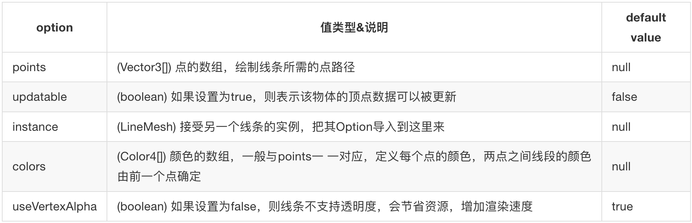

## 线条 Lines

在 3D 世界中，线条由一系列分割的线段组成，它们首尾相连的排列在一起。从具体创建上来说，线条是由一系列的点组成。
例如 (0, 0, 0), (0, 1, 1), (0, 1, 0) 这三个点会形成 2 条线段，把线段进行首尾相连，最后会形成一个弯折的线条。
在 Babylon 中，这些点由是三维向量表示，会由 BABYLON.Vect3 对象进行初始化，然后把初始化好的点按顺序形成数组，最后传递给 CreateLines 进行线条的绘制。

```javascript
//可以先初始化一个数据
var myPoints = [];
//然后初始化三个点，push到数组里
var point1 = new BABYLON.Vector3(0, 0, 0);
myPoints.push(point1);
var point2 = new BABYLON.Vector3(0, 1, 1);
myPoints.push(point2);
var point3 = new BABYLON.Vector3(0, 1, 0);
myPoints.push(point3);

//创建一个线条
var lines = BABYLON.MeshBuilder.CreateLines('lines', { points: myPoints }, scene);
```

你也可以用 **CreateDashedLines** 创建一条虚线，它比创建普通线条多出了三个选项：dashNb、dashSize、gapSize，可以定制虚线的样式。

CreateLines 方法的 options 参数说明如下：

