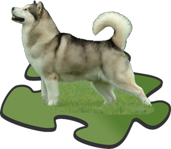
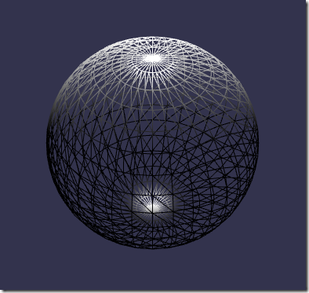

## 材质 material 是什么
材质被用来覆盖在你的物体上，用来给物体上色或者贴图，要注意一般来说材质要配合灯光才能显示出效果，同一个材质是可以应用到多个物体上面去的。

 ## 材质对光的反应
无论是使用颜色还是纹理贴图来设置材质，它对光线的反射都有着不同的表现。

- 漫反射 - 在灯光下看到的材质基本颜色或纹理
- 镜面反射 - 在灯光照射下，高光给与材质的效果
- 自发光 - 材质的颜色或纹理就像一个灯光那样可以对外发出效果
- 环境 - 环境背光所照射出来的材质颜色或纹理

要看到漫反射和镜面反射的材质效果，必须要求创建至少一个光源。

要让环境背光照射出材质的环境颜色效果，还需要为场景设置一个环境颜色，如下所示：

```javascript
scene.ambientColor = new BABYLON.Color3(1, 1, 1);
```
材质还可以设置一个透明度，会产生一个半透明的效果，通过设置材质的alpha属性来实现，取值范围是[0, 1]。

## 颜色 color
可以通过如下代码创建一个材质：
```javascript
//第一个参数是材质名称，第二个是场景实例
var myMaterial = new BABYLON.StandardMaterial("myMaterial", scene);
```
接下来我们可以使用漫反射颜色diffuseColor、镜面颜色specularColor、自发光颜色emissiveColor以及环境颜色ambientColor来设置材质颜色，这四个颜色可以同时设置也可以只设置其中某一个。再次强调，仅当场景的环境颜色已设置时，环境颜色才能看到效果。设置材质颜色的案例如下：
```javascript
var myMaterial = new BABYLON.StandardMaterial("myMaterial", scene);//创建一个材质

myMaterial.diffuseColor = new BABYLON.Color3(1, 0, 1);//漫反射颜色
myMaterial.specularColor = new BABYLON.Color3(0.5, 0.6, 0.87);//镜面颜色
myMaterial.emissiveColor = new BABYLON.Color3(1, 1, 1);//自发光颜色
myMaterial.ambientColor = new BABYLON.Color3(0.23, 0.98, 0.53);//环境光颜色

mesh.material = myMaterial;//mesh是之前创建的物体
```

### 漫反射光示例
todo

### 环境颜色示例
todo

### 透明度示例
通过将材质的alpha属性设置为0（不可见）到1（不透明）可以实现透明度。

```javascript
myMaterial.alpha = 0.5;
```

## 纹理贴图 Texture
可以使用一张图片来生成纹理，纹理必须配合材质来使用，首先新建一个材质：
```javascript
var myMaterial = new BABYLON.StandardMaterial("myMaterial", scene);
```
然后可以使用漫反射纹理diffuseTexture、镜面反射纹理specularTexture、自发光纹理emissiveTexture以及环境纹理ambientTexture来设置材质纹理贴图，这四个纹理可以同时设置也可以只设置其中某一个。注意：如果没有设置场景的环境颜色，环境纹理将没有效果。设置材质纹理的案例如下：
```javascript
var myMaterial = new BABYLON.StandardMaterial("myMaterial", scene);
//PATH TO IMAGE，表示图片的路径，其实也可以使用base64格式的图片。
myMaterial.diffuseTexture = new BABYLON.Texture("PATH TO IMAGE", scene);
myMaterial.specularTexture = new BABYLON.Texture("PATH TO IMAGE", scene);
myMaterial.emissiveTexture = new BABYLON.Texture("PATH TO IMAGE", scene);
myMaterial.ambientTexture = new BABYLON.Texture("PATH TO IMAGE", scene);

mesh.material = myMaterial; //记得设置物体的材质属性
```

### 透明纹理示例
和上面颜色的透明度讲到的一样，都是设置alpha。如下所示：
```javascript
myMaterial.alpha = 0.5;
```

另外，用于创建纹理的图片本身可能已经有透明度了，例如Wikimedia Commons的这张狗的png图片就具有透明背景



在这种情况下，我们将纹理的hasAlpha属性设置为true，就能把图片本身带有的透明给体现出来了。

```javascript
myMaterial.diffuseTexture.hasAlpha = true;
```

## 背面消除

正常情况下，为了节省计算资源，3D世界对于被遮挡的东西都是做隐藏处理的。但是一个当立方体设置了带有透明png图片的纹理时，默认是认为被图片遮挡的部分是隐藏的，不管你透不透明，所以为了处理这种情况我们要了解一下 背面消除backFaceCulling 这个设置。

现在请看下面的图片，当材质的backFaceCulling属性设置为true时，你可以看到狗周围的透明区域仍然是透明的。无法看到背面的图像，因为它们已被默认消除了。 如果backFaceCulling为false，则在3D渲染过程中不会删除背面，因此我们可以通过正面的透明区域看到背面的内容。


## 线框WireFrame
如果要下图那样呈现物体，我们可以设置材质的线框WireFrame属性：
```javascript
materialSphere1.wireframe = true;
```


## 纹理打包程序Texture Packer
babylon内置了一个很强大的功能：纹理打包程序Texture Packer，一些复杂的场景需要包含大量的纹理，这意味着要加载很多图片。

一个材质常常会使用到3个或者更多的纹理，为了优化载入过程避免过多的请求，我们可以把来自于多个材质的纹理打包成为一系列图片，这个类似于css sprite雪碧图。

但需要权衡的是，每个纹理都将按比例缩放到固定的大小，并可能导致一些纹理图片的相互混淆，webGL的限制也可能会成为一个瓶颈。打包程序将为纹理创建一系列的帧，这个纹理是所有材质所对应的纹理通道的集合，且是唯一的；然后再为被打包材质对应的每个通道生成一张图片；

最后，通过修改物体的目标UV＃，以使其与打包程序生成的纹理对应帧匹配，这个UV值是通过物体构造函数进行传递的。打包程序假定所有纹理都是一个正方形，即使不是，程序也会把这个纹理贴图放到正方形的框内。

我们通过以下代码进行纹理打包：
```javascript
let pack = new BABYLON.TexturePacker(name, targetMeshes, options, scene);
pack.processAsync().then(success).catch(error);
```
纹理打包虽然很强大，但是你也必须了解它的一些使用限制，包括：纹理体积限制、透明度、反射和折射材质等。