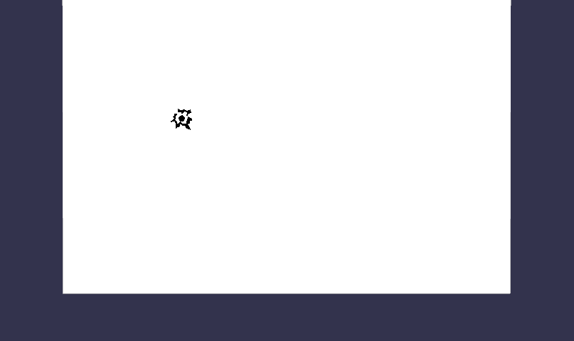

## 鼠标选中碰撞

看一个开枪射击的例子，由此来学习如何在 3D 场景中得到一个变换后的鼠标位置。


首先，创建一个代表墙壁的平面，再准备一个代表击中墙壁的弹痕，然后需要检测到用户对屏幕的点击事件。一旦点击事件被触发，使用一个 pick 函数，就能够获取到有关单击事件和场景之间关系的完整信息。

```javascript
//当点击事件被触发时
window.addEventListener('click', function() {
    // We try to pick an object
    var pickResult = scene.pick(scene.pointerX, scene.pointerY);
});
```

结果对象 pickResult 主要由 4 个信息部分组成：

-   hit（bool）：如果点击击中了场景中的一个对象，则为 true。
-   distance（float）：当前活动相机与命中点之间的距离（如果未命中任何物体，则为 infinite 无限）。
-   pickMesh（BABYLON.Mesh）：如果击中一个物体，则这就是这个物体的实例对象。 如果不是，则为空。
-   pickPoint（BABYLON.Vector3）：单击的点，已经转换为 3D 坐标，具体取决于单击的对象。 如果未命中，则为 Null。

现在，构建示例场景所需的数据已经齐全。 当用户单击墙平面时，我们只需要放置弹痕图片即可：

```javascript
// 假如点击了墙体对象，就改变弹痕图片impact的位置即可
if (pickResult.hit) {
    impact.position.x = pickResult.pickedPoint.x;
    impact.position.y = pickResult.pickedPoint.y;
}
```

## 选中功能的高级应用

pickResult 对象还可以提供更多的信息，如下所示：

-   faceId：关于所选物体的面的索引数据，这个索引数据是该面在物体面数组中的位置。可以这样访问：

```javascript
//得到物体的顶点信息
var indices = pickResult.pickedMesh.getIndices();
//因为3d物体的面facet是一个三角形，所以由3个顶点决定。
var index0 = indices[pickResult.faceId * 3];
var index1 = indices[pickResult.faceId * 3 + 1];
var index2 = indices[pickResult.faceId * 3 + 2];
```

-   submeshId: 选中物体如果存在子物体，则这个参数就是子物体的索引。
-   bu 和 bv 属性：这是在物体的面上，所拾取点的重心坐标。 选取的面 facet 是由 3 个顶点组成的三角形，选取的点是这 3 个顶点的重心，其权重如下：


        1 - bu - bv ：第 N 个面 Facet 的第 1 个顶点坐标
        bu ： 第 N 个面 Facet 的第 2 个顶点坐标
        bv ： 第 N 个面 Facet 的第 3 个顶点坐标

-   getTextureCoordinates(): 计算选取点的纹理坐标；将返回在纹理空间中的 Vector2 坐标，坐标值将在 0 到 1 之间。

以上功能可能的用途包括：

-   根据选择纹理坐标，使用 DynamicTexture 绘制一个新的纹理
-   修改被选中的面（删除、移动顶点、更改颜色等），如果可能的话，可以造一个 web 建模工具哦
-   更改子物体的材质，例如一把枪，单独更改瞄准镜的材质
-   ...
