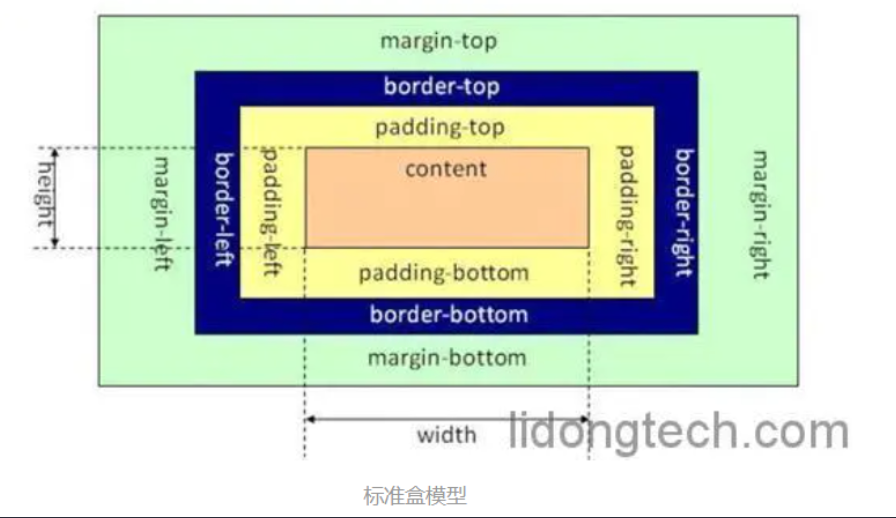
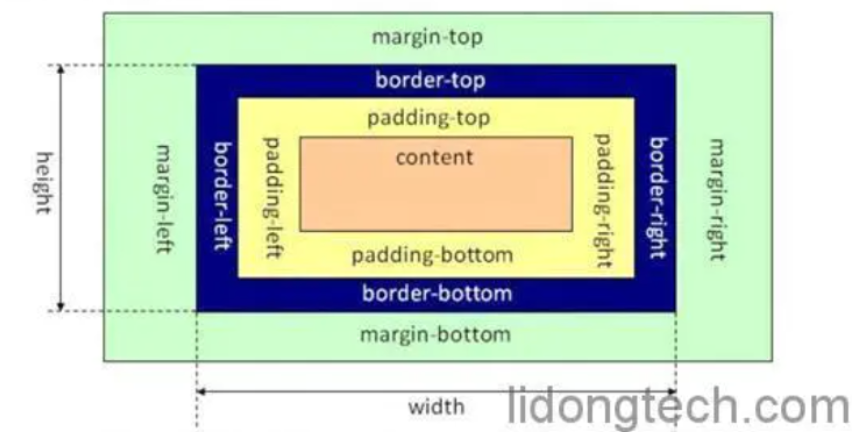

## 讲一下盒子模型

盒子模型一般就分标准的盒模型（content-box）和替代/IE 盒模型（border-box）：

content-box 的 width 不包含 padding 和 border

border-box 的 width 则包含 padding 和 border

盒子模型可以通过 box-sizing 切花， 有三个属性：content-box 丨 border-box 丨 inherit 分别对应标准的盒子模型、IE/替代盒子模型，继承父类的 box-sizing 属性。
