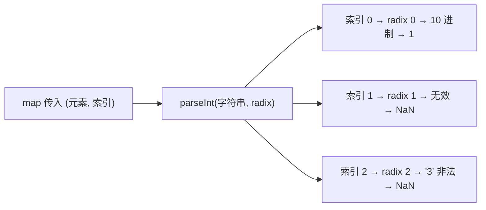

## map 与 parseInt

### 结果与核心原因
`['1','2','3'].map(parseInt)` 的执行结果是：`[1, NaN, NaN]`。

这个结果的核心原因是 **map 回调函数的参数规则** 和 **parseInt 的参数规则不匹配**，新手很容易忽略这两个函数的参数细节，导致理解偏差。

---

### 分步拆解原因



#### 1. 先明确两个函数的参数规则
- **Array.prototype.map()**：map 方法会给传入的回调函数传递 **三个参数**：
  `当前元素值`、`当前索引`、`原数组`（我们只关注前两个，第三个不影响）。
  即每次调用回调函数的格式是：`回调函数(元素, 索引, 数组)`。

- **parseInt()**：parseInt 接收 **两个参数**（第二个可选）：
  `要解析的字符串`、`进制数(radix)`（范围 2~36）。
  规则：
  - 若 radix 为 0 / 未传，默认按 10 进制解析（特殊情况：字符串以 `0x` 开头则按 16 进制）；
  - 若 radix < 2 或 > 36，返回 NaN；
  - 若字符串包含进制外的字符，只解析前半部分有效字符（如 `parseInt('3',2)`，二进制只有 0/1，直接返回 NaN）。

#### 2. 逐次执行分析
`['1','2','3'].map(parseInt)` 等价于依次执行：
```javascript
// 第1次：元素'1'，索引0
parseInt('1', 0); // radix=0 → 按10进制解析 → 结果1

// 第2次：元素'2'，索引1
parseInt('2', 1); // radix=1 < 2 → 无效进制 → 结果NaN

// 第3次：元素'3'，索引2
parseInt('3', 2); // radix=2（二进制），但'3'不是二进制有效字符 → 结果NaN
```

#### 3. 验证代码
你可以直接运行以下代码验证结果：
```javascript
const result = ['1','2','3'].map(parseInt);
console.log(result); // 输出：[1, NaN, NaN]

// 手动模拟每一步，更直观
console.log(parseInt('1', 0)); // 1
console.log(parseInt('2', 1)); // NaN
console.log(parseInt('3', 2)); // NaN
```

---

### 如何得到预期的 [1,2,3]？
如果你的目标是把数组里的字符串转成数字，正确的写法是：
```javascript
// 方式1：用Number函数（只接收1个参数，不会受map索引影响）
['1','2','3'].map(Number); // [1,2,3]

// 方式2：自定义回调函数，只传元素给parseInt
['1','2','3'].map(item => parseInt(item)); // [1,2,3]
```

---

### 总结
1. `map` 给回调函数传 **元素、索引、原数组** 三个参数，而 `parseInt` 接收 **字符串、进制** 两个参数；
2. 执行时 parseInt 误将 map 的「索引」当作「进制数」，导致第2、3次调用进制无效/字符非法，返回 NaN；
3. 若想将字符串数组转数字数组，优先用 `map(Number)` 或自定义回调函数（避免 parseInt 接收多余参数）。
