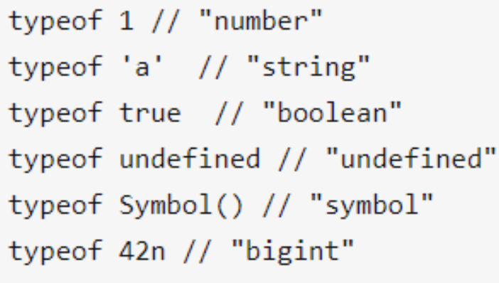
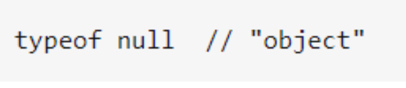
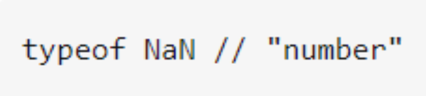
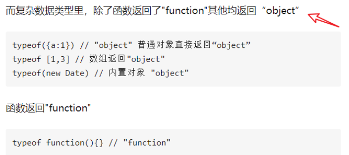
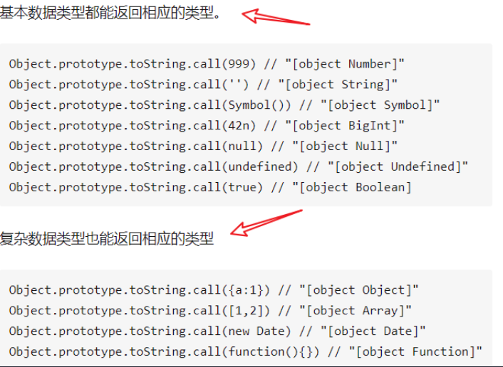
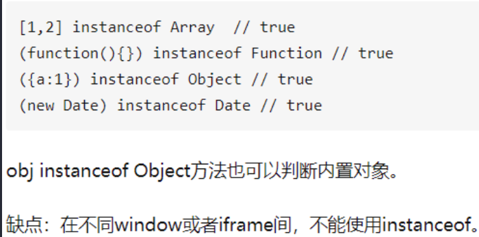

## 数据类型判断

### typeof

### Object.prototype.toString.call

tips：这个方法可以返回内置类型

为什么只能通过 Object.prototype.toString.call 的方式去判断数据类型？不能就直接调用 toString？因为 Number，Boolean，String 身上的 toString 方法是被改写的，他们的 toString 方法是无法返回数据类型的，而只有 object.prototype.toSring 的方法可以，也是为什么对象就可以直接通过.toString 的方式去获取到数据类型

### obj instanceOf Object

tips：左边放你要判断的内容，右边放类型来进行 JS 类型判断，**只能用来判断复杂数据类型,因为 instanceof 是用于检测构造函数（右边）的 `prototype` 属性是否出现在某个实例对象（左边）的原型链上。**

### 总结

-   typeof `null` 为 `object`、`NaN` 为 `number`、引用类型除了 `funciton` 为 `function` 外其他都为 `object`
-   object.prototype.toString.call 都能返回相应类型，格式为 `[object type]`
-   instanceOf 判断原型，只能判断复杂类型
