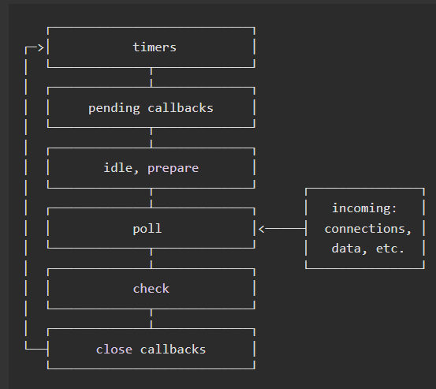

## Nodejs 中的事件循环机制理解


执行同步代码后会执行异步模块（process.nextTrick、微任务队列/microTask)、然后进入事件循环六个阶段，



1、**timers** 阶段：这个阶段执行 timer（setTimeout、setInterval）的回调
2、**pedding callbacks** 阶段： (执行延迟到下一个循环迭代的 I/O 回调)

这个阶段主要是执行一些系统操作，比如说 TCP 连接错误后的错误回调


3、**idle，prepare**：阶段(闲置阶段，仅供系统内部调用)
4、**poll** 阶段：

-   检查是否有 I/O 事件等待处理：如果有，会执行相应的回调函数并将其添加到事件队列中，以便在下一个循环中执行。这些 I/O 事件可以是文件读写、网络请求、数据库查询等异步操作。

-   如果没有 I/O 事件等待处理，会执行以下操作：

-   如果存在 setImmediate() 回调函数，将其添加到事件队列中，并在下一个循环中执行。
-   如果没有 setImmediate() 回调函数，会等待一段时间，直到有新的事件被触发或者定时器到期。
-   当定时器到期时，定时器事件的回调函数会被添加到事件队列中，并在下一个循环中执行。

5、**check** 阶段：setImmediate() 回调函数在这里执行
6、**close callbacks** ：关闭事件相关的回调，如数据库、socket 的 close 事件回调

注：除了上述 6 个阶段，还存在 process.nextTick，其不属于事件循环的任何一个阶段，它属于该阶段与下阶段之间的过渡, 即本阶段执行结束, 进入下一个阶段前, 所要执行的回调，类似插队

## 题目

```javascript
async function async1() {
    console.log("async1 start");
    await async2();
    console.log("async1 end");
}

async function async2() {
    console.log("async2");
}

console.log("script start");

setTimeout(function() {
    console.log("setTimeout0");
}, 0);

setTimeout(function() {
    console.log("setTimeout2");
}, 300);

setImmediate(() => console.log("setImmediate"));

process.nextTick(() => console.log("nextTick1"));

async1();

process.nextTick(() => console.log("nextTick2"));

new Promise(function(resolve) {
    console.log("promise1");
    resolve();
    console.log("promise2");
}).then(function() {
    console.log("promise3");
});

console.log("script end");
```

分析过程：

-   先找到同步任务，输出 script start

-   遇到第一个 setTimeout，将里面的回调函数放到 timer 队列中

-   遇到第二个 setTimeout，300ms 后将里面的回调函数放到 timer 队列中

-   遇到第一个 setImmediate，将里面的回调函数放到 check 队列中

-   遇到第一个 nextTick，将其里面的回调函数放到本轮同步任务执行完毕后执行

-   执行 async1 函数，输出 async1 start

-   执行 async2 函数，输出 async2，async2 后面的输出 async1 end 进入微任务，等待下一轮的事件循环

-   遇到第二个，将其里面的回调函数放到本轮同步任务执行完毕后执行

-   遇到 new Promise，执行里面的立即执行函数，输出 promise1、promise2

-   then 里面的回调函数进入微任务队列

-   遇到同步任务，输出 script end

-   执行下一轮回到函数，先依次输出 nextTick 的函数，分别是 nextTick1、nextTick2

-   然后执行微任务队列，依次输出 async1 end、promise3

-   执行 timer 队列，依次输出 setTimeout0

-   接着执行 check 队列，依次输出 setImmediate

-   300ms 后，timer 队列存在任务，执行输出 setTimeout2

-   执行结果如下：
    

最后有一道是关于 setTimeout 与 setImmediate 的输出顺序

```javascript
setTimeout(() => {
    console.log("setTimeout");
}, 0);

setImmediate(() => {
    console.log("setImmediate");
});
```

可能输出情况如下：

```javascript
情况一：
setTimeout
setImmediate

情况二：
setImmediate
setTimeout
```

分析：
1、遇到 setTimeout，虽然设置的是 0 毫秒触发，但实际上会被强制改成 1ms，时间到了然后塞入 times 阶段
2、遇到 setImmediate 塞入 check 阶段
3、这里的关键在于这 1ms，如果同步代码执行时间较长，进入 Event Loop 的时候 1 毫秒已经过了，setTimeout 先执行，如果 1 毫秒还没到，就先执行了 setImmediate，setTimeout 会在下个事件循环执行
