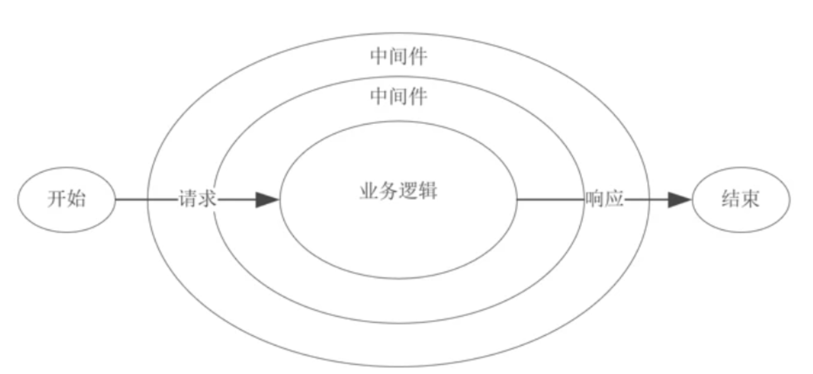

## 是什么

在 NodeJS 中，中间件主要是指封装请求细节处理的方法，例如在 express、koa 等 web 框架中，中间件的本质为一个回调函数，参数包含 ctx(请求对象、响应对象)和 next(执行下一个中间件的函数)

在这些中间件函数中，我们可以执行业务逻辑代码，修改请求和响应对象、返回响应数据等操作

## 示例

token 校验中间件

```javascript
module.exports = (options) => async (ctx, next) {
  try {
    // 获取 token
    const token = ctx.header.authorization
    if (token) {
      try {
          // verify 函数验证 token，并获取用户相关信息
          await verify(token)
      } catch (err) {
        console.log(err)
      }
    }
    // 进入下一个中间件
    await next()
  } catch (err) {
    console.log(err)
  }
}
```

## 使用场景

封装一些通用逻辑，如日志上报、token 校验、cookie、csp 设置等等
