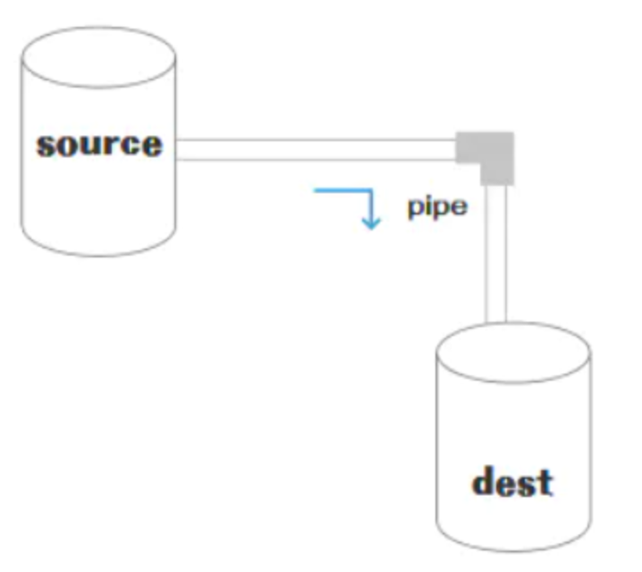

## 一、是什么

1、stream 的独特之处在于，它不像传统程序那样 **一次性** 将文件读入内存，而是`逐块读取数据块，处理其内容而不会将其全部保存在内存中。`

2、让我们以 Youtube 或 Netflix 等 ”流媒体“ 服务为例：这些服务不会让你一次性下载整个视频和音频。相反，你的浏览器会接收到连续不断的视频片段，让接收人立即开始观看。

3、流可以分成三部分：source(来源)、dest(目的地)、pipe(管道)，它的基本语法是 source.pipe(dest)，source 和 dest 就是通过 pipe 连接，让数据从 source 流向了 dest，如下图所示：

<div align="center">

</div>

## 二、种类

在 NodeJS，几乎所有的地方都使用到了流的概念，分成四个种类：

1、可写流：可写入数据的流。例如 fs.createWriteStream() 可以使用流将数据写入文件

2、可读流： 可读取数据的流。例如 fs.createReadStream() 可以从文件读取内容

3、双工流： 既可读又可写的流。例如 net.Socket

4、转换流： 可以在数据写入和读取时修改或转换数据的流。例如，在文件压缩操作中，可以向文件写入压缩数据，并从文件中读取解压数据

在 NodeJS 中 HTTP 服务器模块中，request 是可读流，response 是可写流。还有 fs 模块，能同时处理可读和可写文件流

可读流和可写流都是单向的，比较容易理解，而另外两个是双向的

## 应用场景

### 可写流

将数据写入文件

```javascript
const fs = require("fs");

const writeStream = fs.createWriteStream("output.txt", "utf8");

writeStream.write("Hello, World!\n");
writeStream.write("This is a test.");

writeStream.end(() => {
    console.log("数据写入完成");
});
```

在这个示例中，我们使用 fs.createWriteStream 创建一个可写流来写入文件。通过 write 方法，我们可以将数据块写入流中。最后，通过调用 end 方法来结束写入并触发 "finish" 事件。

### 可读流：

get 请求返回文件给客户端：使用 stream 流返回文件，res 也是一个 stream 对象，通过 pipe 管道将文件数据返回

```javascript
const server = http.createServer(function(req, res) {
    const method = req.method; // 获取请求方法
    if (method === "GET") {
        // get 请求
        const fileName = path.resolve(__dirname, "data.txt");
        let stream = fs.createReadStream(fileName);
        stream.pipe(res); // 将 res 作为 stream 的 dest
    }
});
server.listen(8000);
```

### 转换流

使用转换流进行数据压缩：

```javascript
const fs = require("fs");
const zlib = require("zlib");

const readStream = fs.createReadStream("data.txt", "utf8");
const writeStream = fs.createWriteStream("compressed.gz");

const gzip = zlib.createGzip();

readStream.pipe(gzip).pipe(writeStream);

writeStream.on("finish", () => {
    console.log("数据压缩完成");
});
```

### 双工流

以下是一个示例，展示了如何在双工流中读取和写入数据：

```javascript
const { Duplex } = require("stream");

// 创建一个双工流
const duplexStream = new Duplex({
    read(size) {
        // 从可读端读取数据
        const data = this.read(size);
        console.log("读取到的数据:", data.toString());
    },
    write(chunk, encoding, callback) {
        // 处理从可写端写入的数据
        console.log("接收到数据:", chunk.toString());
        callback();
    },
});

// 向双工流写入数据
duplexStream.write("Hello, World!", "utf-8", () => {
    console.log("数据写入完成");
});

// 从双工流读取数据
duplexStream.push("Hello, Stream!");
duplexStream.push(null); // 表示数据读取完毕

duplexStream.on("end", () => {
    console.log("数据读取完成");
});
```
