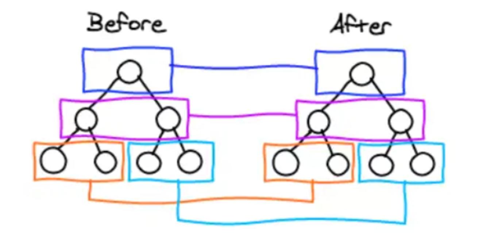

## react diff 原理

其实就是新旧虚拟 dom 的比对过程：

本质就是树的比对过程：
1、会插入、移动、删除这几个操作
2、然后在比对的过程如果有 key 的话可以减少删除、创建节点的开销，因为会用相同 key 去判别是否两者为同个元素

从树的层级看它不会跨层级比对

注：结合实际的场景看，如果父级的节点不一样了，说明这都不是一个组件了，跨层级让父级和子级去比对也就没有了意义
