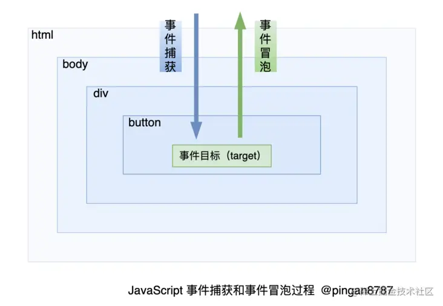
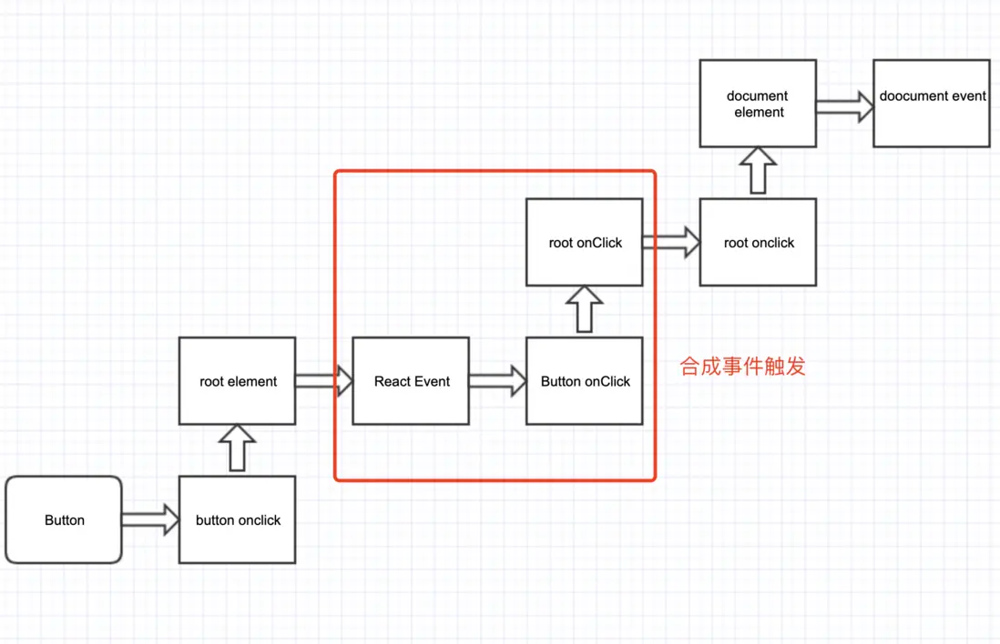

## react 事件机制

### 原声的事件流



1. 事件捕获
   当某个元素触发某个事件（如  onclick ），顶层对象  document  就会发出一个事件流，随着 DOM 树的节点向目标元素节点流去，直到到达事件真正发生的目标元素。在这个过程中，事件相应的监听函数是不会被触发的。
2. 事件目标
   当到达目标元素之后，执行目标元素该事件相应的处理函数。如果没有绑定监听函数，那就不执行。
3. 事件冒泡
   从目标元素开始，往顶层元素传播。途中如果有节点绑定了相应的事件处理函数，这些函数都会被触发一次。如果想阻止事件起泡，可以使用  e.stopPropagation()  或者  e.cancelBubble=true（IE）来阻止事件的冒泡传播。

总结：捕获 -> 执行 -> 冒泡

### react 事件流

1、事件委托
简单理解就是将一个响应事件委托到另一个元素。
当子节点被点击时，click 事件向上冒泡，父节点捕获到事件后，我们判断是否为所需的节点，然后进行处理。其优点在于减少内存消耗和动态绑定事件。

2、执行顺序


3、代码示例

```javascript
import React from "react";

class App extends React.Component<any, any> {
    parentRef: any;
    childRef: any;
    constructor(props: any) {
        super(props);
        this.parentRef = React.createRef();
    }
    componentDidMount() {
        this.parentRef.current?.addEventListener("click", (e) => {
            console.log("阻止原生事件冒泡~");
            e.stopPropagation();
        });
        document.addEventListener("click", () => {
            console.log("原生事件：document DOM 事件监听！");
        });
    }
    parentClickFun = (e: any) => {
        console.log("阻止合成事件冒泡~");
    };
    render() {
        return (
            <div ref={this.parentRef} onClick={this.parentClickFun}>
                点击测试“合成事件和原生事件是否可以混用”
            </div>
        );
    }
}
export { App };
// 结果： 阻止原生事件冒泡~
```

```javascript
import React from "react";

class App extends React.Component<any, any> {
    parentRef: any;
    childRef: any;
    constructor(props: any) {
        super(props);
        this.parentRef = React.createRef();
    }
    componentDidMount() {
        this.parentRef.current?.addEventListener("click", (e) => {
            console.log("阻止原生事件冒泡~");
        });
        document.addEventListener("click", () => {
            console.log("原生事件：document DOM 事件监听！");
        });
    }
    parentClickFun = (e: any) => {
        e.stopPropagation();
        console.log("阻止合成事件冒泡~");
    };
    render() {
        return (
            <div ref={this.parentRef} onClick={this.parentClickFun}>
                点击测试“合成事件和原生事件是否可以混用”
            </div>
        );
    }
}
export { App };
/**
 * 结果：
 * 阻止原生事件冒泡~
 * 阻止合成事件冒泡~
 * 原生事件：document DOM 事件监听！
 * */
```

总结: react 的事件都会被绑定在 document(react16)/根节点(react17) 上，在冒泡阶段触发

### 想要阻止冒泡同时阻止绑定在同个元素后面的事件继续执行

1、调用 e.nativEvent.stopImmediatePropagation();

2、代码示例

```javascript
<!DOCTYPE html>
<html>
    <head>
        <style>
            p {
                height: 30px;
                width: 150px;
                background-color: #ccf;
            }
            div {
                height: 30px;
                width: 150px;
                background-color: #cfc;
            }
        </style>
    </head>
    <body>
        <div>
            <p>paragraph</p>
        </div>
        <script>
            const p = document.querySelector("p");
            p.addEventListener(
                "click",
                (event) => {
                    alert("我是 p 元素上被绑定的第一个监听函数");
                },
                false
            );

            p.addEventListener(
                "click",
                (event) => {
                    alert("我是 p 元素上被绑定的第二个监听函数");
                    event.stopImmediatePropagation();
                    // 执行 stopImmediatePropagation 方法，阻止 click 事件冒泡，并且阻止 p 元素上绑定的其他 click 事件的事件监听函数的执行。
                },
                false
            );

            p.addEventListener(
                "click",
                (event) => {
                    alert("我是 p 元素上被绑定的第三个监听函数");
                    // 该监听函数排在上个函数后面，该函数不会被执行
                },
                false
            );

            document.querySelector("div").addEventListener(
                "click",
                (event) => {
                    alert("我是 div 元素，我是 p 元素的上层元素");
                    // p 元素的 click 事件没有向上冒泡，该函数不会被执行
                },
                false
            );
        </script>
    </body>
</html>

```

### 为什么能减少内存消耗

React 的事件机制可以减少内存消耗的主要原因有以下几点：

1、事件委托：React 使用了事件委托的机制，将事件监听器绑定在父级元素上而不是每个子元素上。这样一来，只需要绑定一次事件监听器，就可以处理多个子元素上的事件。这减少了事件监听器的数量，从而减少了内存消耗。

2、合成事件：React 的合成事件是对原生事件的封装，它提供了一种高效的事件处理方式。合成事件是基于事件池的概念，每次触发事件时，React 会从事件池中复用事件对象，而不是每次都创建新的事件对象。这样可以减少内存分配和垃圾回收的开销。

3、事件回收：React 会在组件卸载时自动回收事件监听器和合成事件对象，防止内存泄漏。当组件被销毁时，React 会自动清理事件监听器和合成事件对象，释放相关的内存资源。

综上所述，React 的事件机制通过事件委托、合成事件和事件回收等方式，有效地减少了内存消耗。它通过复用事件对象、减少事件监听器的数量，并及时清理不再需要的事件对象和监听器，提高了性能和内存利用率
