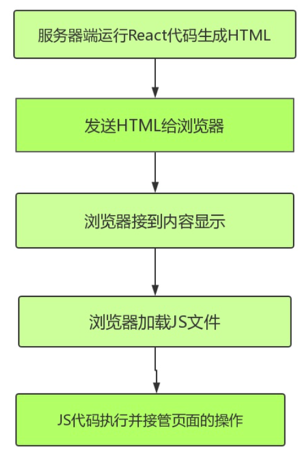
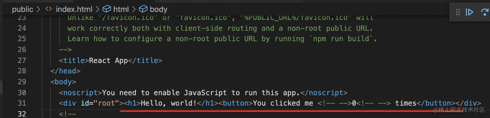

## react 服务端渲染

### 是什么

在 SSR 中 (opens new window)，我们了解到 Server-Side Rendering ，简称 SSR，意为服务端渲染

指由服务侧完成页面的 HTML 结构拼接的页面处理技术，发送到浏览器，然后为其绑定状态与事件，成为完全可交互页面的过程

其解决的问题主要有两个：

-   SEO，由于搜索引擎爬虫抓取工具可以直接查看完全渲染的页面
-   加速首屏加载，解决首屏白屏问题

### 原理



服务端渲染组件为 string，拼接成 html 返回，浏览器渲染出返回的 html，然后执行 hydrate，把渲染和已有的 html 标签关联。

比如这样一个组件：

```javascript
import { useState } from "react";

export default function App() {
    return (
        <>
            <h1>Hello, world!</h1>
            <Counter />
        </>
    );
}

function Counter() {
    const [count, setCount] = useState(0);
    return (
        <button onClick={() => setCount(count + 1)}>
            You clicked me {count} times
        </button>
    );
}
```

在服务端渲染是这样的：

```javascript
import { renderToString } from "react-dom/server";
import App from "./App";

console.log(renderToString(<App />));
```

服务端返回的 SSR 出的 html：

现在浏览器接收到它后，要再次渲染：

```javascript
import React from "react";
import { hydrateRoot } from "react-dom/client";
import "./index.css";
import App from "./App";

hydrateRoot(document.getElementById("root"), <App />);
```

注入事件、路由等

### 资源

(说说 React 服务端渲染怎么做？原理是什么？)[https://vue3js.cn/interview/React/server%20side%20rendering.html#%E4%BA%8C%E3%80%81%E5%A6%82%E4%BD%95%E5%81%9A]
