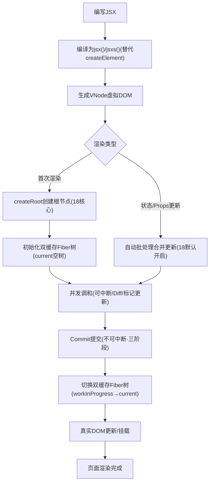

## react 渲染流程

我们就入口流程开始说起：

-   我们创建一个 React 应用 ReactDom.render(<App />, document.getElementById('root'))
-   v18 是 const root = ReactDom.createRoot(document.getElementById('root')) root.render();
-   这里的 App 本质返回的是虚拟 dom，jsx 会经过 babel/preset-react 编译成 function app () { ... retrun React.createElement()}
-   在 render 方法里会基于虚拟 dom 执行构建 reconcileRootFiber 树（根协调阶段，可中段），第一次渲染会直接 commit 挂载到页面上，副作用是 placement(挂载)
-   后续更新状态如果是通过 setState 会做局部协调 recocilieChildFiber，比对新旧 fiber 树标识出变更的副作用如 update、delete
-   比对结束后会 commit 副作用，其实就是遍历 fiber 把副作用转换为真实的 dom 操作

**核心节点备注:**

1. jsx()/jsxs()：React 18+ JSX 编译默认产物，比 React.createElement 更轻量，内置性能优化；
2. createRoot：18 强制推荐的根节点创建方式，是开启并发渲染的唯一入口，废弃 ReactDOM.render；
3. 自动批处理：18 核心优化，所有场景（定时器 / 异步 / Promise / 原生事件）的更新都会自动合并，减少渲染次数；
4. 并发调和（其实就是可中断）：调和过程可被高优先级任务（如点击 / 输入）中断 / 恢复，避免页面卡顿，是 18 体验提升的核心；
5. 双缓存 Fiber 树：始终维护 current（当前页面渲染的树）和 workInProgress（构建中的树），提交后直接切换，无 DOM 闪烁；
6. Commit 三阶段：极简记核心作用即可，无需记细枝末节
    - before mutation：读 DOM 状态；
    - mutation：改真实 DOM + 清理副作用；
    - layout：执行副作用（useEffect）+ 更新组件实例状态。
